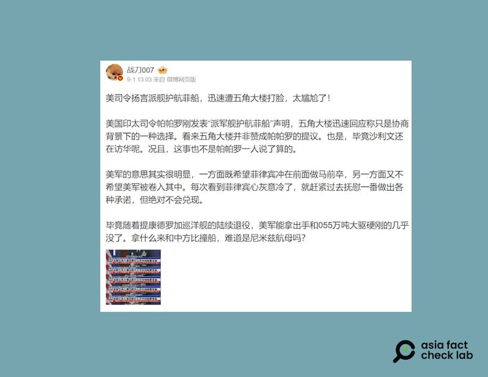
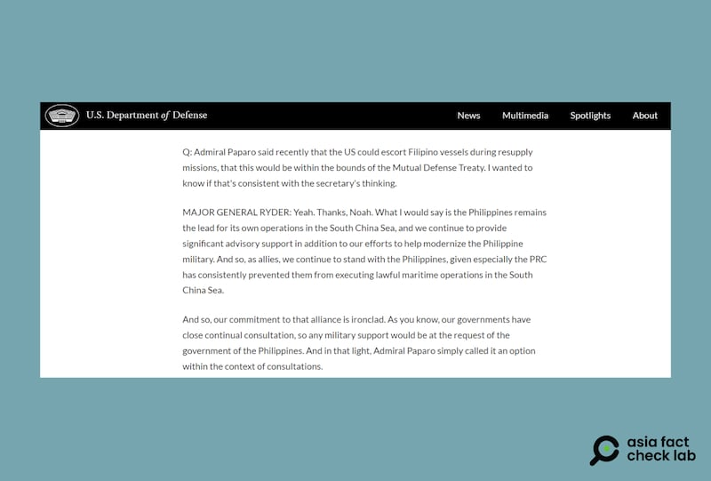

# Did the Pentagon condemn the US Indo-Pacific Command head over his remarks?

## Verdict: Misleading

By Zhuang Jing for Asia Fact Check Lab

2024.09.09

Tapei, Taiwan

## A claim emerged in Chinese-language social media posts that the Pentagon criticized the commander of United States Indo-Pacific Command over remarks that the  U.S. navy is open to the possibility of escorting Philippine ships.

## But the claim is misleading. The Pentagon did not criticize the commander’s remarks. Instead, it released a statement that echoed his sentiments.

The claim was [shared](https://m.weibo.cn/detail/5073780414353173) on Weibo on Sep. 1, 2024.

“U.S. Commander’s threat to send ships to escort Filipino ships was quickly and embarrassingly met with a slap in the face by the Pentagon!” the claim reads in part.

“The U.S. Indo-Pacific Commander, Samuel Paparo, has just made a statement about ‘sending warships to escort Philippine ships’, to which the Pentagon quickly responded by saying that it was only an option in the context of the consultation. It seems that the Pentagon is not in favor of Paparo's proposal,” it reads further.

Chinese influencers claimed that Paparo received backlash from the Pentagon over his public statements. (Screenshot/Weibo)

The claim came after the U.S. Indo-Pacific Commander,Samuel Paparo, attended a conference in Manila with the Philippine military chief, Romeo Brawner in late August. According to media reports, Paparo was talking to reporters on the sidelines of a military forum organized by the Indo-Pacific Command.

At the conference, Paparo responded to a question about the possibility of U.S. convoys accompanying Philippine ships.

Confrontations between the Philippines and China over territorial disputes in the South China Sea have recently intensified, with the two sides trading blame for several ship collisions.

In a statement [released](https://www.state.gov/u-s-support-for-the-philippines-in-the-south-china-sea-12/) in late August, the U.S. Department of State condemned Chinese maneuvers in the sea and reaffirmed its commitment to assist the Philippines in the event of an armed attack from another nation in the area.

But the claim about the Pentagon criticizing Paparo is misleading.

## Paparo’s remarks

Keyword searches found several media reports of Paparo's remarks in August [here](https://www.reuters.com/world/asia-pacific/philippines-says-china-is-biggest-disruptor-peace-region-2024-08-27/), [here](https://www.voanews.com/a/7758497.html) and [here](https://www.scmp.com/week-asia/politics/article/3276405/us-offer-escort-philippines-ships-south-china-sea-risks-clashes-beijing).

"Escort of one vessel to the other is an entirely reasonable option within our Mutual Defense Treaty," Paparo told reporters, as [cited](https://www.reuters.com/world/asia-pacific/philippines-says-china-is-biggest-disruptor-peace-region-2024-08-27/) by Reuters, in response to a query whether Washington would consider providing escorts to ships from the Philippines taking supplies to disputed geographical features in the waterway.

“I mean certainly, within the context of consultations,” Paparo added.

## Defense ministry reaction

Pentagon press secretary Pat Ryder [responded](https://www.defense.gov/News/Transcripts/Transcript/Article/3886761/pentagon-press-secretary-air-force-maj-gen-pat-ryder-holds-a-press-conference/) to a question about Paparo's comment at a press conference on Aug. 27 that while the Philippines leads its own operations, the U.S. would consider convoying Philippine ships if requested to do so.

Pentagon press secretary Ryder responds to claims that the U.S. may escort Philippine ships during an Aug. 27 press conference. (Screenshot /U.S. Department of Defense)

Ryder and Paparo’s statements both emphasized that while the U.S. Navy could possibly convoy Philippine ships, such a move would first be forwarded by bilateral consultations.

## *Translated by Shen Ke. Edited by Shen Ke and Taejun Kang.*

*Asia Fact Check Lab (AFCL) was established to counter disinformation in today's complex media environment. We publish fact-checks, media-watches and in-depth reports that aim to sharpen and deepen our readers' understanding of current affairs and public issues. If you like our content, you can also follow us on*   [*Facebook*](https://www.facebook.com/asiafactchecklabcn)  *,*   [*Instagram*](https://www.instagram.com/asiafactchecklab/)   *and*   [*X*](https://twitter.com/AFCL_eng)  *.*

[Original Source](https://www.rfa.org/english/news/afcl/afcl-pentagon-indo-pacific-command-09092024042030.html)