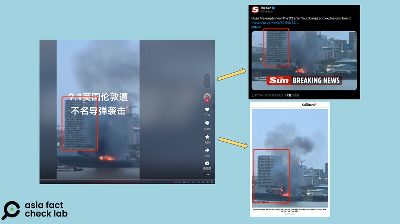

# Was London hit by a surprise missile attack in September?

## Verdict: False

By Dong Zhe for Asia Fact Check Lab

2024.09.13

Taipei, Taiwan

## A video of an explosion has been repeatedly shared in Chinese-language social media posts that claim it shows London being hit by a missile in September.

## But the claim is false. The clip shows a planned explosion on a film set in London, not a missile attack.

The video was shared on [Douyin](https://www.douyin.com/user/MS4wLjABAAAAgR6V9QuyVyLi7QQOH1zN-TMOat219pYaD7ptBrERnMzaORBxCDrYNZT_HLb4phI4?from_tab_name=main&modal_id=7409574549861256474), a Chinese version of TikTok, on Sept. 5.

The 10-second video captures a building engulfed in flames, with smoke billowing out.

“The footage shows the aftermath of a surprise missile attack against London in the early morning of Sept. 1 – first such air attack against the U.K in 80 years,” the claim reads.

Chinese influencers recently claimed that London was hit by a missile attack. (Screenshots/Douyin and Weibo)

Many online users connected the claim of a missile attack in London to the Russian-Ukrainian war, sparking fears that it could herald World War III.

According to a 2022 report by *The Independent*, Andrey Gurulyov, a member of Vladimir Putin's United Russia party, stated on Russian state television that London would be the first NATO strategic target for Russian missiles if a conflict between NATO and Russia broke out.

In May 2023, the U.K. confirmed it would supply Storm Shadow missiles to Ukraine to help repel Russian forces "in Ukraine."

A July report by the Chinese edition of Russia’s state-run media, Sputnik, cited the Kremlin criticizing the British decision as irresponsible.

But the claim about the missile attack in London is false.

## A film set

A combined keyword search and reverse image search found the same clip shared in media reports, including the  [*Evening Standard*](https://www.standard.co.uk/news/london/o2-fire-explosion-greenwich-paedophile-film-set-bbc-london-b1179504.html)  *,*  [*Daily Mail*](https://www.dailymail.co.uk/news/article-13802231/explosion-london-o2-naked-paedophile-mastermind.html)  and  [*The Sun*](https://www.thesun.co.uk/news/30190733/london-fire-o2-arena-blaze-thames-smoke/?utm_medium=Social&utm_campaign=sunmaintwitter&utm_source=Twitter#Echobox=1725132150-4) , and the [BBC](https://www.bbc.com/news/articles/c74jv94ggl0o).

Comparison between the video spread by Chinese influencers and the footage reported by the British media. (Screenshots/Douyin, The Sun and Standard)

"A HUGE fire has erupted near The O2 after a planned explosion at a film set 'spread out of control' and sent black smoke into the sky," *The Sun* reported on Aug. 31.

The O2 is a multi-purpose indoor arena in southeast London.

"The controlled explosion was right on the river's edge at a Silvertown commercial site with locals nearby catching it on video and hearing loud cracks," *The Sun* reported.

## *Translated by Shen Ke. Edited by Shen Ke and Taejun Kang.*

*Asia Fact Check Lab (AFCL) was established to counter disinformation in today's complex media environment. We publish fact-checks, media-watches and in-depth reports that aim to sharpen and deepen our readers' understanding of current affairs and public issues. If you like our content, you can also follow us on*   [*Facebook*](https://www.facebook.com/asiafactchecklabcn)  *,*   [*Instagram*](https://www.instagram.com/asiafactchecklab/)   *and*   [*X*](https://twitter.com/AFCL_eng)  *.*

[Original Source](https://www.rfa.org/english/news/afcl/afcl-london-missile-attack-09132024013935.html)