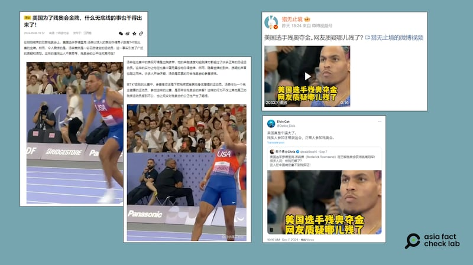

# Was a US athlete ineligible to compete in the Paralympics?

## Verdict: False

By Zhuang Jing for Asia Fact Check Lab

2024.09.16

Taipei, Taiwan

## A video of the American athlete Roderick Townsend has been shared in Chinese-language social media posts alongside a claim that he was ineligible to participate in the 2024 Paris Paralympics because he does not have any disabilities.

## But the claim is false. According to the International Paralympic Committee, Townsend was born with permanent nerve damage to his right arm and shoulder, making him eligible to compete in the Paralympic Games.

The video of Townsend was [shared](https://x.com/Dafoo_Elvis/status/1832241527050977482) on X, formerly known as Twitter, on Sep. 7. 2024.

“The U.S. is awesome! … Normal people participate in the Paralympics,” reads the claim in part.

The 20-second video shows Townsend participating in the Men’s high jump T47.

Chinese-language social media influencers questioned Townsend’s eligibility to participate in the Paralympic Games. (Screenshots /X, Weibo and Sohu)

The same video was also shared on [Weibo](https://m.weibo.cn/detail/5076760354101640) with similar claims that Townsend was ineligible to participate in the Paralympics because he does not have any disabilities.

But the claim is false.

According to the International Paralympic Committee, or IPC, and media [reports](https://www.cbsnews.com/news/paralympics-roderick-townsend-high-jump-gold-medal-showman-hairstyle/), Townsend was born with permanent nerve damage to his right arm and shoulder.

The IPC [classifies](https://www.paralympic.org/athletics/classification) Paralympic events based on both the sport and the specific impairments of the participants, such as vision impairments or the use of a wheelchair.

Athletes compete against others with similar disabilities to ensure a level playing field.

In the T47 high jump event there are no restrictions on lower limb impairments; instead, it focuses on impairments affecting the upper limbs.

Townsend’s first-place victory in the high jump at Paris marked his fourth gold medal at the Paralympics.

He competed in both the long jump and high jump at the previous two Paralympic Games in Rio de Janeiro and Tokyo.

## *Translated by Shen Ke. Edited by Shen Ke and Taejun Kang.*

*Asia Fact Check Lab (AFCL) was established to counter disinformation in today's complex media environment. We publish fact-checks, media-watches and in-depth reports that aim to sharpen and deepen our readers' understanding of current affairs and public issues. If you like our content, you can also follow us on*   [*Facebook*](https://www.facebook.com/asiafactchecklabcn)  *,*   [*Instagram*](https://www.instagram.com/asiafactchecklab/)   *and*   [*X*](https://twitter.com/AFCL_eng)  *.*

[Original Source](https://www.rfa.org/english/news/afcl/afcl-us-athlete-paralympics-09162024055210.html)