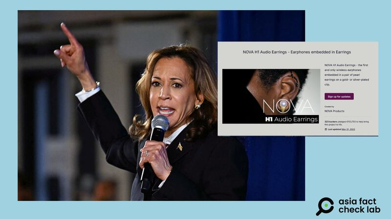
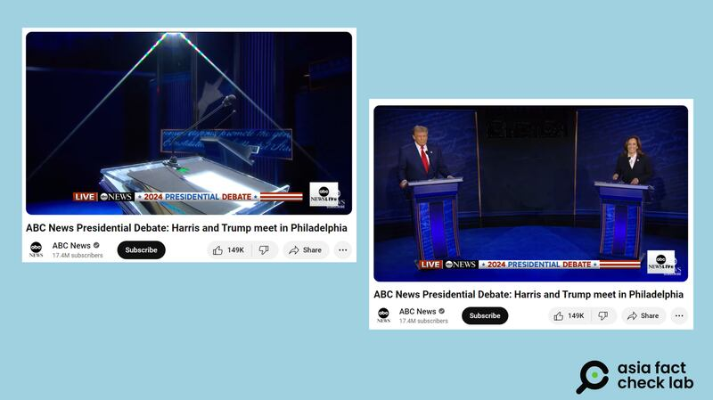

# Did Harris wear audio earrings during a presidential debate to cheat?

## Verdict: False

By Zhuang Jing for Asia Fact Check Lab

2024.09.18

Taipei, Taiwan

## A claim emerged in Chinese-language media posts that US Democratic presidential nominee Kamala Harris was wearing audio earrings – the Nova H1 – to cheat during a presidential debate in September.

## But the claim is false. A photo comparison between earrings worn by Harris during the debate and Nova H1 shows they differ in shape.

The claim was [shared](https://m.weibo.cn/detail/5077522792583550) on Russian state-run media Sputnik's Chinese-language Weibo on Sept. 11, 2024.

“Harris wore the Nova H1 Audio earrings during last night’s debate with Trump,” the claim reads in part. Sputnik cited “American musician Jonnie King” to back its claim.

The Nova H1 has wireless earphones embedded in earrings.

“This is why she was seen continuously taking notes with her pen during the debate, when it was explicitly agreed upon before that there would be NO notes,” the claim reads further.

Chinese social media influencers claimed that Harris cheated during the presidential debates. (Screenshots/Weibo)

The claim began to circulate after Vice President Kamala Harris and former President Donald Trump met for their first debate of the 2024 election campaign on Sept. 10.

The debate took place in Philadelphia at the National Constitution Center, hosted by the American broadcaster ABC News.

But the claim about Harris’ earrings is false.

According to a [website](https://whatkamalawore.com/tiffany-hardwear-pearl-earrings-necklace/) set up by fashion blogger Susan Kelley, which documents Harris' wardrobe during her campaign, the earrings she frequently wears are products of Tiffany & Co.

A photo comparison between the earrings worn by Harris during the debate and the Nova H1 shows they differ in shape. In particular, the metal portions of both earrings show a major difference.

The shape of the earrings worn by Harris during the debate (left) differ significantly from the Nova H1 (right). (AFP/Jim Watson and Screenshot from X)

The claim about Harris' earrings has also been debunked by other fact-checking organizations, including [USA Today](https://www.usatoday.com/story/news/factcheck/2024/09/11/kamala-harris-earrings-debate-fact-check/75174487007/), [FactCheck.org](http://factcheck.org) and [PolitiFact](https://www.politifact.com/factchecks/2024/sep/11/social-media/no-kamala-harris-was-not-wearing-audio-earrings-du/).

## Taking notes

Under the debate rules [issued](https://abcnews.go.com/US/abc-news-releases-rules-sept-10-debate-harris/story?id=113019909) by ABC it is forbidden to use props or pre-written notes.

However, ABC did provide pen and paper for each candidate’s use during the debate.

Pen and paper were provided for both candidates to use during the debate (left). Harris can be seen picking up her pen as she enters the room. (right) (Screenshots/YouTube)

These items were [shown](https://www.youtube.com/live/kRh6598RmHM?feature=shared&t=116) on each candidate's podium as the hosts of the program explained the rules of the debate before the candidates took their positions.

After the candidates entered the room, Harris can be seen [picking up](https://www.youtube.com/live/kRh6598RmHM?feature=shared&t=152) the pen at her podium.

## *Translated by Shen Ke. Edited by Shen Ke and Taejun Kang.*

*Asia Fact Check Lab (AFCL) was established to counter disinformation in today's complex media environment. We publish fact-checks, media-watches and in-depth reports that aim to sharpen and deepen our readers' understanding of current affairs and public issues. If you like our content, you can also follow us on*   [*Facebook*](https://www.facebook.com/asiafactchecklabcn)  *,*   [*Instagram*](https://www.instagram.com/asiafactchecklab/)   *and*   [*X*](https://twitter.com/AFCL_eng)  *.*

[Original Source](https://www.rfa.org/english/news/afcl/afcl-harris-earrings-09182024053204.html)