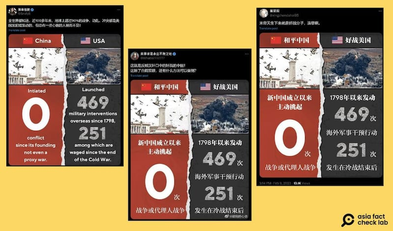
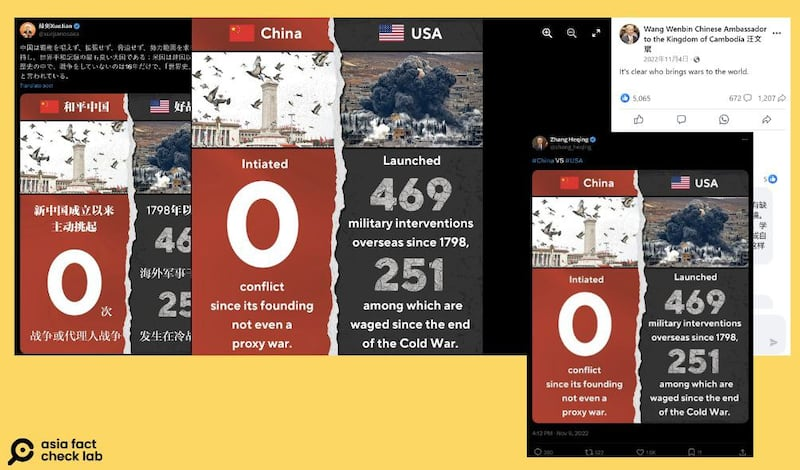

# Has China not launched a war since 1949?

## Verdict: Misleading

By Alan Lu for Asia Fact Check Lab

2024.09.20

Taipei, Taiwan

## A claim emerged in Chinese-language social media posts that China has not launched a war since 1949.

## But the claim is misleading as it is a one-sided historical interpretation. A review of events shows that China has been involved in several major conflicts since 1949, and there are different views about how much of a role it played in starting them.

The claim was [shared](https://x.com/Whatis7777777/status/1776401993743090021) on X, formerly known as Twitter, on Aug. 24, 2024.

“While the U.S. has launched 469 conflicts since 1789, China has launched none since 1949,” the claim reads in part.

Multiple Chinese accounts on X have reposted an infographic comparing the number of wars initiated by the U.S. and China. (Screenshots/X)

The claim has also been shared by [several](https://www.facebook.com/photo/?fbid=538168218123497&set=a.395332982407022) [Chinese](https://x.com/zhang_heqing/status/1590255947012018176) [diplomats](https://x.com/xuejianosaka/status/1623324863103647744) on X.

Even Chinese President Xi Jinping said during a telephone call with U.S. President Joe Biden in 2021 that his country had not started a conflict since the founding of the People’s Republic of China in 1949.

Several Chinese diplomats also reposted the image and further spread on the narrative of the U.S. as a warhawk (Screenshots/X)

But the claim is misleading as it is a one-sided historical interpretation.

A review of historical events shows that China has been involved in several major conflicts since 1949 and there are different views about how much of a role Beijing played in starting them.

Below is what AFCL found.

## The Sino-Indian War

The month-long Sino-Indian War of 1962 was a conflict rooted in disputes with India over China's attempts to build a military road linking its Xinjiang region with Tibet after China occupied the Tibet area in 1950, according to [Encyclopædia Britannica](https://www.britannica.com/topic/Sino-Indian-War), the world's oldest continuously published encyclopedia.

The road was scheduled to pass through Aksai Chin, an area that overlaps parts of Tibet and Xinjiang but is also claimed by India as part of its northern Ladakh region.

The war was preceded by intermittent skirmishes beginning in 1959, which culminated in an attack by Chinese forces against the region on Oct. 20, 1962.

But some scholars, including Wang Hongwei, a Chinese academic expert on South Asia, [said](https://www.zxls.com/UploadFiles/2021/6/1962%E5%B9%B4%E8%BE%B9%E7%95%8C%E6%88%98%E4%BA%89%E5%8F%8A%E5%85%B6%E5%AF%B9%E4%B8%AD%E5%8D%B0%E5%85%B3%E7%B3%BB%E7%9A%84%E5%BD%B1%E5%93%8D_%E7%8E%8B%E5%AE%8F%E7%BA%AC_20216285830.pdf) that the campaign originated from an arbitrary border demarcation by India's government in 1961.

Wang listed the advance of India’s army into territory that China claimed, attacks on Chinese posts, the killing of Chinese border guards and a 1962 Indian order for its forces to expel the Chinese from the North-East Border Special Region as evidence that the war was imposed on China.

China has officially described the conflict as a war of self-defense ever since.

## The Sino-Vietnamese War

Internationally known as the Sino-Vietnamese War, the conflict that broke out when 220,000 Chinese soldiers struck along the 800-mile border with Vietnam early on Feb. 17, 1979.

While at the time both neighbors had communist political systems, Vietnam’s decision to sign a mutual defense pact with the Soviet Union in 1978 provoked the ire of many Chinese leaders, given that at the time Beijing and Moscow were struggling for leadership of the global communist movement.

This tension was later exacerbated by Vietnam’s invasion of neighboring Cambodia at the end of 1978 and the overthrow of the Beijing-backed Khmer Rouge government, an event that served as the catalyst for the conflict between Beijing and Hanoi.

The conflict has been [called](https://www.hoover.org/research/1979-sino-vietnamese-war-and-its-consequences) an aggressive war launched by China by scholars such as Miles Yu, the director of the Hudson Institute's China Center, who emphasized that the conflict is portrayed completely differently in Vietnam and in China.

Vietnam portrays the conflict as a struggle against Chinese expansion, while China frames it as a war of self-defense.

In line with this interpretation, a Chinese government webpage [commemorating](http://www.chinamartyrs.gov.cn/x_xwzx/zhzx/202102/t20210218_45060.html) soldiers killed in the conflict, lists several actions by Vietnam in the mid-1970s – implementing discriminatory policies against Chinese minorities in Vietnam and conducting provocative border raids in which several Chinese citizens were wounded – as evidence that Vietnam came to view China as an enemy and gradually adopted a warlike posture towards it.

However, [Hsiao-Huang Shu](https://www.cat.tku.edu.tw/en/About/2012/Team-Members), a scholar of Chinese military tactics at Taiwan's Tamkang University, told AFCL that while the official Chinese government position paints the war as a punitive conflict rather than as an "invasion," the war was clearly initiated by China.

## Sino-Soviet border clashes

In March 1969, Chinese and Soviet forces engaged in a series of clashes on an island called Zhenbao on a border river.

Subsequent border skirmishes in the months following the conflict resulted in an unknown number of casualties. In order to end the dispute, Moscow adopted a carrot-and-stick approach, proposing negotiations on the border dispute while at the same time threatening military action if Beijing did not cooperate.

The Soviet Union said that an initial ambush by Chinese army units of Soviet border guards on March 2 was followed by a larger clash on March 15.

However, an article [published](https://news.ifeng.com/history/2/200711/1121_336_305551.shtml) by China's state-run CCP Review said that the initial skirmish broke out when a Chinese patrol was obstructed and later shot at by Soviet troops.

But according to the noted historian of Sino-Soviet relations, Li Danhui, Chinese soldiers initially [stabbed](http://www.cnd.org/cr/ZK10/cr592.gb.html) and fired upon a Soviet patrol on the day fighting broke out.

He [cited](http://www.cnd.org/cr/ZK10/cr592.gb.html) statements by Chen Xilian, the Chinese commander at Zhenbao, as evidence.

Michael S. Gerson, a former analyst at the U.S. Center for Naval Analyses, [published](https://www.cna.org/archive/CNA_Files/pdf/d0022974.a2.pdf) a study of the incident, saying that territorial disputes over the strategically unimportant island largely arose as a byproduct of the larger Sino-Soviet ideological split in the 1960s.

As part of the split, China said that the Soviet Union’s control of the island was a direct result of unequal treaties China had been coerced to sign, while the Soviet Union argued that China had no legal claim to the island.

## ‘Illogical comparison’

Michael Szonyi, a professor of Chinese history at Harvard University, [told](https://ealc.fas.harvard.edu/people/michael-szonyi) AFCL that while the U.S. has been involved in several wars around the world, the notion that China had "never started a war" was "absurd," mentioning the conflicts involving Vietnam, Tibet, and fighting over the Kinmen Islands in the Taiwan Strait as evidence.

Szonyi pointed out that counting conflicts involving the U.S. from 1798 and conflicts involving China from 1949 – over 150 years later – is an illogical baseline for making such a comparison.

He added that many of the wars the U.S. has been involved in – such as the Korean War and the 2003 invasion of Iraq – did not involve territorial seizure.

China also characterizes several other conflicts it has been involved in since 1949 as either extensions of the Chinese Civil War or as incidents of large-scale civil unrest.

They include [fighting](https://www.taipeitimes.com/News/feat/archives/2018/10/21/2003702748) on Kinmen in 1949, [shelling](https://history.state.gov/milestones/1953-1960/taiwan-strait-crises) of the island in 1958 and the [Tibetan uprising](https://direct.mit.edu/jcws/article-abstract/8/3/54/12800/The-Tibetan-Rebellion-of-1959-and-China-s-Changing) of 1959.

But Szonyi said it was still incorrect to say that China never initiated any of these wars.

## *Translated by Shen Ke. Edited by Shen Ke and Taejun Kang.*

*Asia Fact Check Lab (AFCL) was established to counter disinformation in today's complex media environment. We publish fact-checks, media-watches and in-depth reports that aim to sharpen and deepen our readers' understanding of current affairs and public issues. If you like our content, you can also follow us on*   [*Facebook*](https://www.facebook.com/asiafactchecklabcn)  *,*   [*Instagram*](https://www.instagram.com/asiafactchecklab/)   *and*   [*X*](https://twitter.com/AFCL_eng)  *.*

[Original Source](https://www.rfa.org/english/news/afcl/afcl-china-war-1949-09202024053036.html)