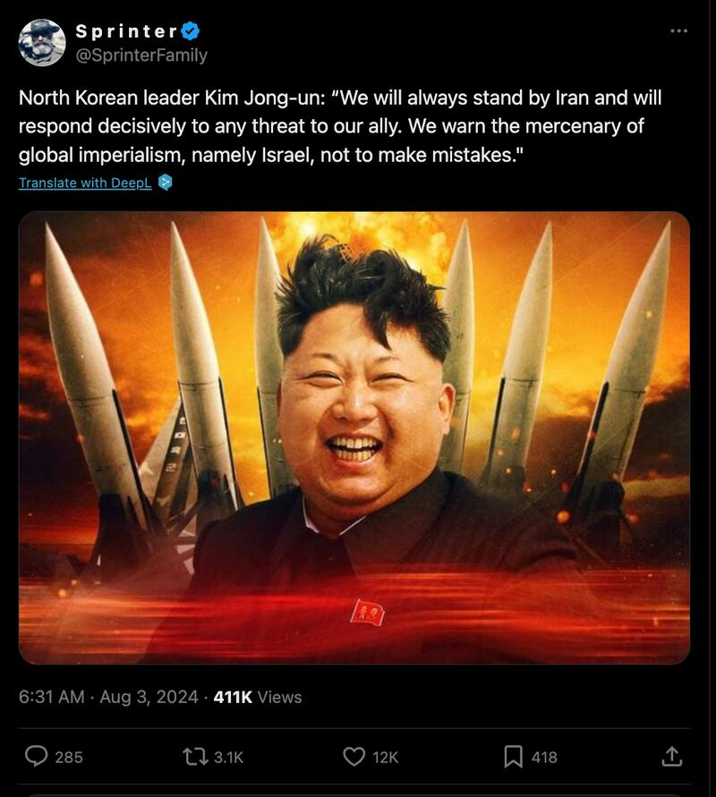

# Did Kim Jong Un make a statement threatening Israel?

## Verdict: False

By Dukin Han for RFA Korean

2024.09.23

Seoul, South Korea

## A claim has been repeatedly shared in social media posts that North Korean leader Kim Jong Un made a statement threatening Israel in support of Iran.

## But the claim is false. Keyword searches found no official statements or credible reports that back the claim. Experts dismissed the claim, saying there is little to gain for Kim in making such a statement.

The claim was [shared](https://x.com/SprinterFamily/status/1819501293574238558) in a post on X, formerly known as Twitter, on Aug. 3, 2024, by a user called "SprinterFamily" who has previously spread false information about North Korea.

The post cited Kim as saying: “We will always stand by Iran and will respond decisively to any threat to our ally. We warn the mercenary of global imperialism, namely Israel, not to make mistakes.”

A screenshot of the false X post.

The claim began to circulate amid growing fears of a regional war in the Middle East.

The nearly 10-month-old war in Gaza between Israel and Hamas has led to regular low-level hostilities between Israel and Iran and Hezbollah, as well as other groups in the region that are aligned with Tehran.

But after the killing of the top leaders of Hamas and Hezbollah in July, Iran and Hezbollah pledged to retaliate, with media reports saying they may attack Israel.

North Korea has been a strategic partner of long standing for Iran, based on their subjection to extensive U.S. economic sanctions and other U.S. policies designed to counter the threats they pose to key U.S. partners.

There have been media reports that North Korean-made weapons have been supplied to Palestinian militant groups such as Hamas through Iran.

Some believe North Korea is indirectly involved in the conflicts in the Middle East, although it has never officially acknowledged or commented on any military support.

But the claim about the North Korean leader’s threat against Israel is false.

A review of North Korea’s state-run media outlets, which often carry statements from Kim, found no such statement or report.

## ‘Little to gain for Kim’

Harry Kazianis, senior director at the Center for the National Interest think tank, believes that if the statement was not recorded by North Korea’s official news agency, it should be assumed that the claim is false.

Kazianis said North Korea had “other ways” to cause trouble for Israel, including sales of missile technology to Iran that could be used against Israel, citing U.S. and South Korean intelligence agencies.

Makino Yoshihiro, a visiting professor at Hiroshima University and diplomatic correspondent for Japanese daily *Asahi Shimbun*, said there would be little to gain for Kim in making such a statement.

“Iran is currently trying not to overly provoke the United States, and North Korea’s involvement would create confusion,” said Yoshihiro.

Bruce Bennett, a senior researcher at the RAND Corporation, believes the claim about Kim’s statement on Israel may have originated from China or Russia, citing Russia’s attempts to build an anti-Western coalition.

“Given that there was an attack in Iran that killed a major Hamas leader, and Kim Jong Un did nothing, it suggests that if he was really threatening to confront Israel, something would have already happened,” Bennett said, adding that Kim’s threats are primarily for propaganda purposes and are unlikely to be carried out in practice.

## *Translated by Dukin Han. Edited by Taejun Kang.*

*Asia Fact Check Lab (AFCL) was established to counter disinformation in today's complex media environment. We publish fact-checks, media-watches and in-depth reports that aim to sharpen and deepen our readers' understanding of current affairs and public issues. If you like our content, you can also follow us on*   [*Facebook*](https://www.facebook.com/asiafactchecklabcn)  *,*   [*Instagram*](https://www.instagram.com/asiafactchecklab/)   *and*   [*X*](https://twitter.com/AFCL_eng)  *.*

[Original Source](https://www.rfa.org/english/news/afcl/afcl-north-korea-isreal-iran-09232024040626.html)