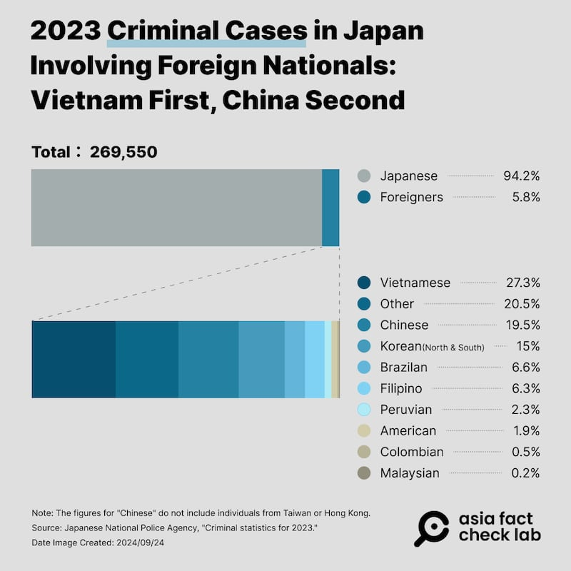
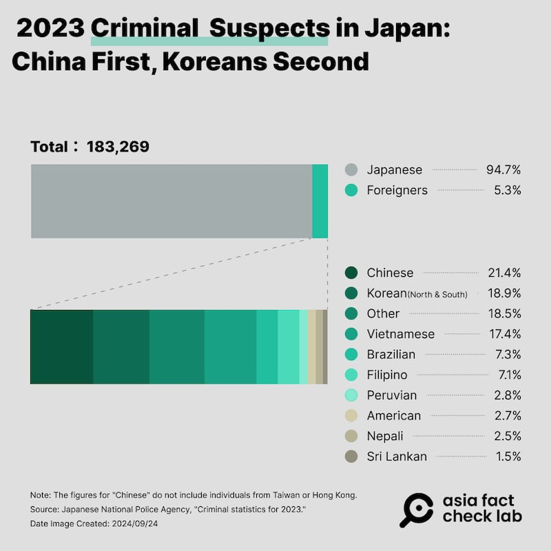
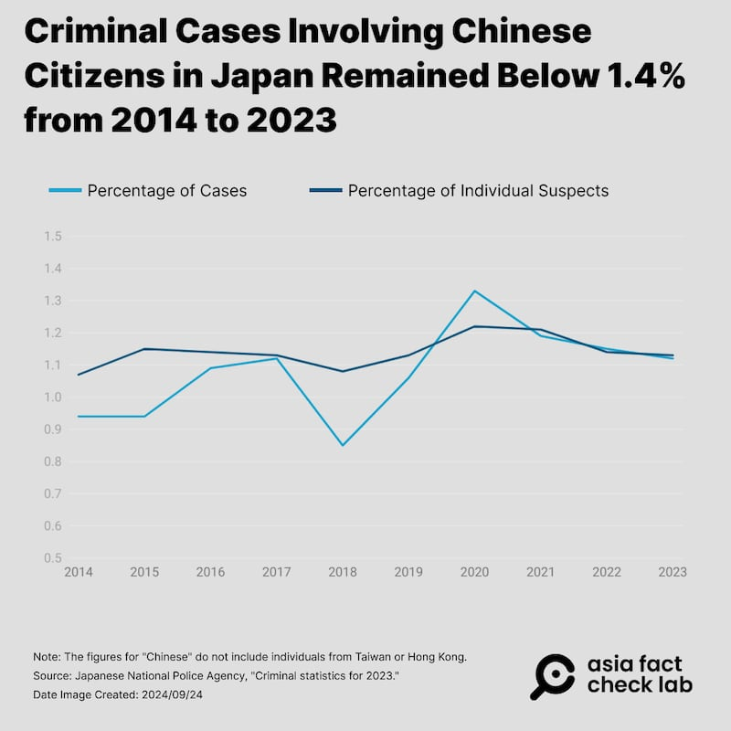

# Did Chinese citizens account for 60% of the crimes in Japan?

## Verdict: False

By Dong Zhe for Asia Fact Check Lab

2024.09.30

Taipei, Taiwan

## A claim has been shared in Chinese-language social media posts that Chinese people account for 60% of all crimes committed in Japan.

## But the claim is false. According to official data from 2023, Chinese nationals were involved in 1.123% of prosecutions in Japan, and they made up 1.135% of all suspects.

The claim was [shared](https://archive.ph/bKFS9#selection-509.0-509.59) on X, formerly known as Twitter, on Sep. 21.

“Chinese people already account for three-fifths of all criminal offenses in Japan. Do you think the Chinese should be driven back to China?” the claim reads in part.

The post did not provide further details on the source of the data.

Screenshot of the false post on X.

The claim began to circulate online after the Sept. 18 stabbing and subsequent death of a 10-year-old Japanese schoolboy in the Chinese city of Shenzhen by a Chinese man.

The incident ignited a wave of anger in Japan, with critics accusing China of fostering anti-Japanese sentiment through its education system and state-controlled media.

But the claim about the crime rate for Chinese people in Japan is false.

## Official data

A [report](https://www.npa.go.jp/publications/statistics/safetylife/jousei.html) from Japan's National Police Agency, NPA, in June 2024 shows that in 2023, there were 269,550 criminal prosecutions and 183,269 suspects in total.

Out of those, 2,080 Chinese nationals were involved in 3,028 cases. This count does not include individuals from Taiwan and Hong Kong.

The figures mean Chinese nationals accounted for just 1.123% of total prosecutions and 1.135% of all suspects.

When looking only at cases involving foreigners, Chinese nationals were involved in 19.5% of them, and they made up 21.4% of the suspects, ranking second in the number of cases and first in the number of suspects.

Proportion of the number of criminal cases in Japan involving foreign nationals (top) and foreign suspects (bottom) in 2023, according to data from the NPA. (AFCL)

Similar annual statistics from the NPA, going back to 2014, show that the proportion of cases involving Chinese nationals in Japan has never exceeded 1.4% during this period.

Change in annual percentage of criminal cases involving Chinese people and Chinese suspects in Japan over the past ten years. (AFCL)

The X user who made the claim has not responded to AFCL’s inquiries.

## *Translated by Shen Ke. Edited by Shen Ke and Taejun Kang.*

*Asia Fact Check Lab (AFCL) was established to counter disinformation in today's complex media environment. We publish fact-checks, media-watches and in-depth reports that aim to sharpen and deepen our readers' understanding of current affairs and public issues. If you like our content, you can also follow us on*   [*Facebook*](https://www.facebook.com/asiafactchecklabcn)  *,*   [*Instagram*](https://www.instagram.com/asiafactchecklab/)   *and*   [*X*](https://twitter.com/AFCL_eng)  *.*

[Original Source](https://www.rfa.org/english/news/afcl/afcl-chinese-japan-crime-rate-09302024031123.html)