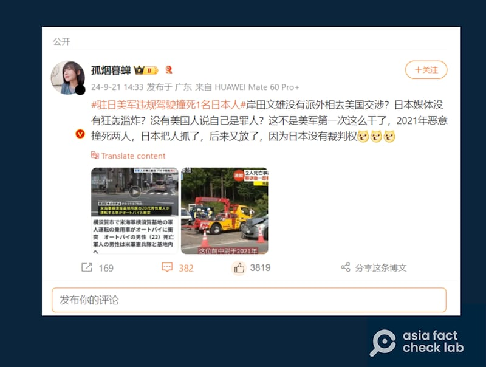

# No jurisdiction for Japan over US troops committing crimes on its soil?

## Verdict: False

By Rita Cheng for Asia Fact Check Lab

2024.10.03

Washington

## A claim emerged in Chinese-language social media posts that Japan has no jurisdiction over American service personnel who commit crimes in the country.

## But the claim is false. Japan has jurisdiction over most criminal cases involving U.S. military members on its soil, according to an agreement between two nations.

The claim was [shared](https://archive.ph/GGcJL) on Weibo on Sept. 21, 2024.

“An American soldier stationed in Japan’s Yokosuka acted recklessly, killing a Japanese person. This is not the first time the U.S. military has done this. In 2021, they maliciously killed two people. Japan arrested them, but later released them because Japan has no jurisdiction over them,” reads the claim.

Influencers on Weibo said that Japan lacks jurisdiction over U.S. troops in its territory. (Screenshot/Weibo)

The claim began to circulate online after a 10-year-old Japanese boy was stabbed to death last month in the southern Chinese city of Shenzhen.

Some Chinese social media users see the death of the Japanese boy as a warning against hatred being accepted in society while others accuse Japan of using the incident to smear China’s reputation. Additionally, some online users compare Japan’s reaction to the incident in China with its “silence” on crimes committed by U.S. soldiers in Japan.

But the claim about Japan’s jurisdiction over U.S. personnel is false. Japan has jurisdiction over most criminal cases involving U.S. military personnel on its soil.

The first [three paragraphs of Article 17](https://www.usarj.army.mil/Portals/33/cmdstaffs/sja/doc/sofa_201601.pdf) of the U.S.-Japan Status of Forces Agreement, commonly known as SOFA, outlines and [regulates](https://www.mofa.go.jp/mofaj/area/usa/sfa/pdfs/giji_fulltext.pdf) the jurisdiction of U.S. forces in Japan under different circumstances.

## 2021 car accident

Keyword searches found the Weibo post is likely referencing a car accident in 2021 involving a U.S. Navy officer formerly stationed in Yokosuka, named Ridge Alkonis.

Alkonis [crashed](https://english.kyodonews.net/news/2023/12/d30fab182b0f-us-officer-jailed-in-japan-over-fatal-car-crash-to-return-home.html) his car while driving toward Mt. Fuji with his family while off duty, accidentally killing two Japanese citizens, including an 85-year-old woman. A third person was injured in the crash.

The case was brought to a Japanese court where a Japanese judge rejected Alkonis’ defense that he was suffering from “acute mountain sickness” at the time of the incident and eventually sentenced him to three years in prison on charges of negligent driving.

During and after his trial, his family [campaigned](https://apnews.com/article/japan-navy-defense-department-alkonis-ca2b3de8bf962b5faa49cf4dc6bd0b88) to have him sent back to the U.S.

After spending 507 days in prison and following negotiations between the U.S. and Japan, Alkonis was repatriated at the end of 2023 and [released](https://www.bbc.com/news/world-asia-68137582) on parole one month after his return.

Julian Ku, a professor at Hofstra University School of Law who specializes in international criminal law, said in most cases, Japanese authorities have jurisdiction over U.S. military members in Japan.

“It is likely that Japanese law has primary jurisdiction unless the U.S. military member’s driving falls within US military law – e.g. the driving was ‘an act or omission of official duties’ or involved theft of U.S. government property,” said Ku.

Even with cases in which U.S. military law is applied, the SOFA would still require authorities from both countries to cooperate, and the U.S. would likely yield to Japanese jurisdiction in most cases, he explained.

## Other cases

In recent years, personnel at the Yokosuka Naval Base, a main base for U.S. forces in Japan, have faced increased scrutiny for misconduct, with most being punished under Japanese law.

In 2022, for instance, U.S. Navy member Daniel Krieger was sentenced to 28 months in prison by a Japanese court for drunkenly assaulting four people in Tokyo.

Justin Keller, a spokesperson for the Yokosuka base, told AFCL that Japanese police had jurisdiction over the case and that the U.S. Navy will fully cooperate with the investigation.

## *Translated by Shen Ke. Edited by Shen Ke and Taejun Kang.*

*Asia Fact Check Lab (AFCL) was established to counter disinformation in today's complex media environment. We publish fact-checks, media-watches and in-depth reports that aim to sharpen and deepen our readers' understanding of current affairs and public issues. If you like our content, you can also follow us on*   [*Facebook*](https://www.facebook.com/asiafactchecklabcn)  *,*   [*Instagram*](https://www.instagram.com/asiafactchecklab/)   *and*   [*X*](https://twitter.com/AFCL_eng)  *.*

[Original Source](https://www.rfa.org/english/news/afcl/afcl-japan-jurisdiction-us-army-10032024215747.html)