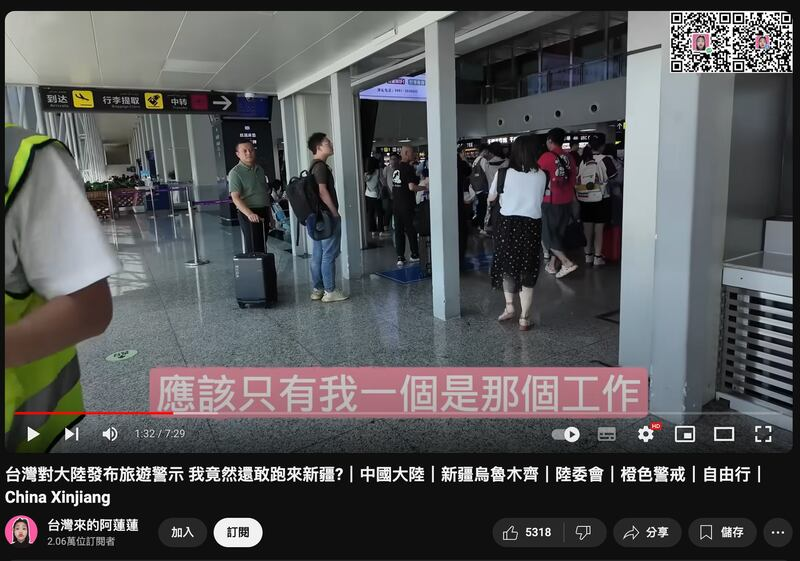

# Media Watch: Taiwanese YouTubers’ visit to Xinjiang, genuine or propaganda?

## Taiwanese YouTubers face scrutiny for promoting videos about Xinjiang that align with China’s official stance.

By Rita Cheng for Asia Fact Check Lab

2024.10.08

Washington

In late August, a Taiwanese YouTuber named Chang Shao-qun, who goes by “Han Guo Ren”, with more than half a million followers posted a video on YouTube of his tour of a large bazaar in Xinjiang’s capital of Urumqi, accompanied by two other Taiwanese online celebrities.

At around the video's five-minute mark, Chang abruptly [asks](https://youtu.be/Fwn5w5O9KyA?t=51) one of his guests: "First time in the bazaar? See any 'extermination' going on?"

Chang’s remark was a sarcastic reference to concerns of some Western governments and international organizations about genocide in Xinjiang, home to many members of the Uyghur Muslim community and other ethnic minorities.

The Chinese government has been accused of ethnic genocide there, involving mass detentions, forced labor, and cultural suppression. Beijing denies the accusations, framing its actions as counter-terrorism efforts.

Chang is not alone in promoting the message that Xinjiang is a safe place to travel with no abuses to be seen.

AFCL found several other Taiwanese YouTubers who made trips to Xinjiang to promote a message that Xinjiang was a safe place to travel or there were “no concentration camps” there because they didn’t see them.

Several Taiwanese YouTubers posted videos walking through Xinjiang. (Graphic/AFCL)

## Who paid for their trips?

Some of the videos posted by Taiwanese YouTubers sparked online debate among Chinese-speaking users, with many questioning whether the content creators were paid by the Chinese government. Some accused the creators of being a mouthpiece for the state, while others defended the content as independent and genuine.

In one of the videos, a young man mentioned spending about 66,000 Taiwanese dollars (US$2,094) to join a tour of Xinjiang, but AFCL has not been able to independently verify whether the YouTubers’ trips were self-funded or sponsored by the Chinese government.

As of press time, none of the YouTubers had responded to inquiries on their trips.

However, AFCL found that the Chinese government has used the comments and content from those Taiwanese YouTubers to promote its political narratives about Xinjiang and Taiwan on social media and in reports published by state media, as seen [here](https://x.com/ChinaDaily/status/1834198419633734137).

Both Taiwanese and Chinese media outlets posted coverage supporting the YouTubers’ comments (Screenshots/CTI YouTube and China Daily’s official X account)

“Although the [video’s] production is rough and its logic weak, it still gives an air of ‘authenticity’ that attracts many young viewers,” said Su Chiao-ning, an associate professor of journalism at Oakland University, after watching one of the videos.

“The videos give the impression that Chinese policies in Xinjiang are doing great,” Su told AFCL, adding that this is meant to make Taiwanese less wary of China, in line with Beijing’s goal of unifying Taiwan with mainland China.

The overarching goal of Chinese propaganda is to uphold the legitimacy of the Chinese Communist Party in the face of international criticism, Su said.

Narratives about Xinjiang in particular were aimed at portraying it in a positive light to deflect international criticism and accusations of rights abuses, she said.

China has been accused of cultivating foreign influencers who promote the Communist Party line and counter global narratives.

A Canberra-based think tank Australian Strategic Policy Institute said China had “cultivated” a large pool of foreign influencers and content creators who push the Chinese government’s online propaganda and sell the China dream.

Beijing has set up multilingual influencer incubator studios, tapped into a network of international students at Chinese universities, and created competitions among ambitious creators to push the pro- party-state’s narrative and combat global perception of China, the think tank added.

## No concentration camps?

A claim made by one of the YouTubers that there are no concentration camps in Xinjiang because he or she didn’t see them is misleading.

Evidence and testimonials strongly suggest the existence of concentration camps in Xinjiang, where Uyghur Muslims and other ethnic minorities are detained.

Former detainees have reported being subjected to forced labor, indoctrination, and severe human rights abuses, including torture.

Satellite imagery, leaked government documents, and investigative [reports](https://www.ohchr.org/sites/default/files/documents/countries/2022-08-31/22-08-31-final-assesment.pdf) have also provided further proof of these camps, which Beijing describes as "vocational training centers" but are widely seen as part of a broader campaign to suppress and control the Uyghur population.

## ‘Safe’ for travel?

The claim that Xinjiang is a safe place to travel is also misleading, at least for Taiwanese people.

Taiwan raised its travel alert for China, Hong Kong and Macau to the second-highest orange alert in June, advising its citizens to avoid unnecessary travel to those regions due to increasing safety concerns.

This came after a set of newly issued guidelines by China, which allows individuals advocating for Taiwanese independence to be sentenced to life imprisonment or even death.

Taiwan maintains that it is a sovereign state with its own government and democratic system, though it stops short of formally declaring independence to avoid escalating tensions with China, which views Taiwan as a renegade province that should be reunited with the mainland, by force if necessary.

Figures [compiled](https://www.rfa.org/english/news/china/taiwanese-disappear-08302024151407.html) by the Taiwan Association for Human Rights and several other non-government groups showed that 857 Taiwan nationals have been "forcibly disappeared or arbitrarily arrested" in China over the past 10 years.

Screenshot from one of the vloggers’ trips to Urumqi. (Screenshot/YouTube)

## Uyghur language

One Taiwanese YouTuber claimed that there was no suppression of the Uyghur language in Xinjiang, citing the fact that the names of Urumqi metro stations were written in both Chinese and Uyghur.

Chinese law [stipulates](https://www.gjxfj.gov.cn/gjxfj/xxgk/fgwj/flfg/webinfo/2016/03/1460585590001366.htm) that signs at public facilities in autonomous regions across China such as Xinjiang and Inner Mongolia must be written in both Chinese and the local minority language.

However, it is flawed reasoning to use this as evidence that the Chinese government is not suppressing the Uyghur language, as there have been clear signs that such suppression is taking place. For instance, in 2017, Radio Free Asia [reported](https://www.rfa.org/mandarin/yataibaodao/shaoshuminzu/ql1-10132017100200.html) that Xinjiang's Department of Education instructed schools across the region to stop using supplementary teaching materials in Uyghur and Kazakh.

## Mosques

Some YouTubers claimed to have seen many mosques near the Urumqi metro, using this as evidence to argue that there had been no destruction of religious sites in the region.

However, they failed to provide enough evidence, such as visual evidence, to back their claim.

Multiple media reports have highlighted the Chinese Communist Party's crackdown on Islam, including a 2023 Financial Times [investigation](https://ig.ft.com/china-mosques/) that revealed more than 1,700 mosques had been torn down or "sinicized" between 2018 and 2023. This process involved modifying visible Islamic elements and replacing them with Chinese-style architecture.

These actions align with an RFA [report](https://www.rfa.org/english/news/uyghur/xi-jinping-visit-08282023165401.html) indicating that, during his second visit to Xinjiang in August 2023, Chinese President Xi Jinping instructed officials to "promote the Sinicization of Islam" and "effectively control various illegal religious activities."

## *Translated by Shen Ke. Edited by Shen Ke and Taejun Kang.*

*Asia Fact Check Lab (AFCL) was established to counter disinformation in today's complex media environment. We publish fact-checks, media-watches and in-depth reports that aim to sharpen and deepen our readers' understanding of current affairs and public issues. If you like our content, you can also follow us on*   [*Facebook*](https://www.facebook.com/asiafactchecklabcn)  *,*   [*Instagram*](https://www.instagram.com/asiafactchecklab/)   *and*   [*X*](https://twitter.com/AFCL_eng)  *.*

[Original Source](https://www.rfa.org/english/news/afcl/afcl-taiwan-youtuber-xinjiang-10082024000704.html)