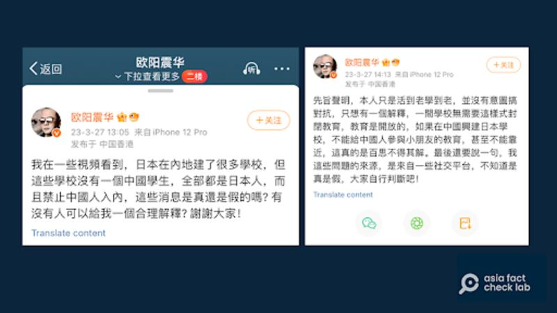
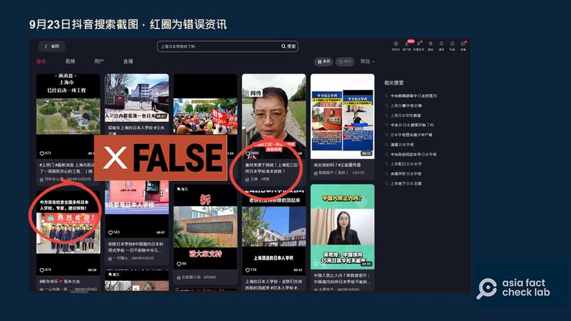
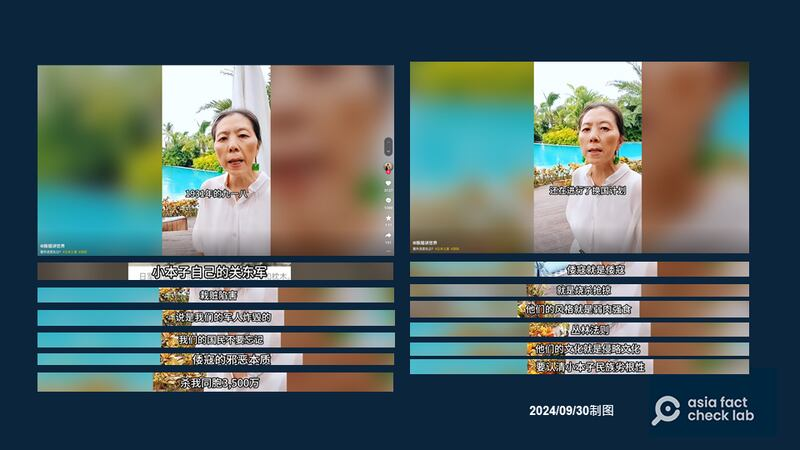
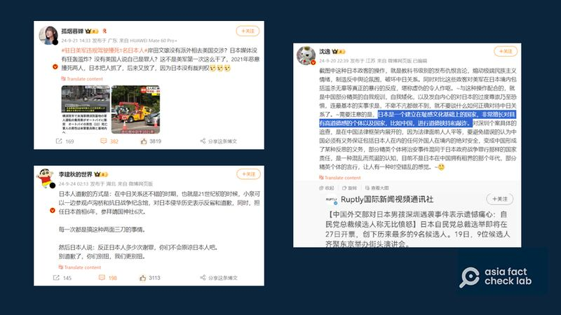

# Media Watch: Anti-Japan sentiment targets Japanese schools in China

## Misleading claims about Japanese schools are rampant on Chinese social media platforms, AFCL found.

By Rita Cheng for Asia Fact Check Lab

2024.10.14

Washington

Following the stabbing and death of a 10-year-old Japanese schoolboy in Shenzhen on Sept. 19, many Chinese citizens laid flowers in front of the boy’s school, expressing their condolences.

This tragedy came just months after a similar attack on June 24, when a Chinese man wounded a Japanese mother and child near a Suzhou Japanese school bus stop.

In that incident, Hu Yuoping, a Chinese bus attendant, who intervened to protect passengers, was killed, prompting an outpouring of sympathy across the country.

Despite ongoing acts of violence against Japanese individuals, anti-Japan sentiment remains widespread on Chinese social media platforms.

Following the recent schoolboy incident, [one article](https://chinadigitaltimes.net/chinese/711615.html) revealed that at least 278 videos, collectively receiving over 2.31 million likes, were uploaded on Douyin, the Chinese version of TikTok. These videos called for the "demolition" of Japanese schools in China.

Many of these videos also spread misleading or false information about Japanese schools. Here is what AFCL found.

## Targeting Japanese schools

AFCL found that videos demanding the demolition of Japanese schools often exaggerate the number of such schools in China, attempting to create the false impression that they are rapidly increasing in number.

Some of these videos even claim that there are over 100 Japanese schools operating across China.

However, according to the latest official [data](https://www.mext.go.jp/content/20240515-mxt_kyokoku-000026120.pdf) from Japan's Ministry of Education, Culture, Sports, Science and Technology, there are only 12 Japanese schools in China, including two located in Hong Kong. These figures do not include the three schools in Taiwan.

Some users on the Chinese social media platform Weibo have [claimed](https://archive.ph/YWdA1) that Japanese schools in China only admit Japanese nationals, expressing frustration that this restricts opportunities for Chinese students.

A Weibo user questioned why Japanese schools in China did not accept local students. (Screenshot/Weibo)

In fact, however, the Japanese schools in China have no control over this policy. According to a [provision](http://www.moe.gov.cn/srcsite/A02/s5911/moe_621/199504/t19950405_81906.html) in Chinese law governing schools for foreign nationals, these institutions are prohibited from enrolling local students. Violations of this law can result in severe penalties, including the forced closure of the school.

## ‘Good business’

Spreading anti-Japan sentiment online is a "good business" that brings in a lot of traffic for many online platforms in China, [according to](https://x.com/wenqiangjp/status/1837482191049445551) "Tokyo Brother Wen," a self-claimed former editor-in-chief of the Japanese version of the Chinese news website NetEase.

For example, one video posted on Douyin falsely claimed that a Japanese school in Shanghai’s Hongkou District was slated for demolition, drawing widespread attention. However, no such school exists in the district.

Large amounts of misinformation about Japanese schools can still be found on Douyin as of press time. (Screenshots/Douyin)

Some videos went even further, promoting conspiracy theories suggesting that the killing of the schoolchildren may have been orchestrated by Japanese nationalists.

“Such content raises a constant danger that radical individuals swayed by such ideas might commit violent acts,” Tokyo Brother Wen wrote.

A video on Douyin theorized that the incident in Shenzhen may have been perpetuated by Japanese nationalists. (Screenshot/Douyin)

## One-sided debate

Several Chinese scholars attempted to [reflect](https://archive.ph/avpke) on the incident by discussing how nationalism fueled the violence, but their comments were repeatedly deleted on WeChat, a Chinese instant messaging app.

In contrast, [posts](https://archive.ph/lGEtd) by notable pro-Beijing influencers, such as Guyan Muchan, critiquing these reflections and emphasizing Japan's alleged role in the tragedy have remained online.

Guyan Muchan drew a comparison between the arrest of the killer in Shenzhen and Japan's continued use of the Yasukuni Shrine, presenting it as a marker of the difference in the level of civilization between China and Japan. Her perspective has [resonated](https://archive.ph/LqHc6) with many netizens, fueling heated debates in the aftermath of the incident.

Several influencers have steered online discussion over the child’s death towards blaming Japan. (Screenshot/Weibo)

Shen Yi, a political science professor at Fudan University in Shanghai, [argued](https://archive.ph/2PrRr) that such reflections on the incidents only undermine China, suggesting that Japan skillfully exploits these moral debates to manipulate countries like China.

## *Translated by Shen Ke. Edited by Shen Ke and Taejun Kang.*

*Asia Fact Check Lab (AFCL) was established to counter disinformation in today's complex media environment. We publish fact-checks, media-watches and in-depth reports that aim to sharpen and deepen our readers' understanding of current affairs and public issues. If you like our content, you can also follow us on*   [*Facebook*](https://www.facebook.com/asiafactchecklabcn)  *,*   [*Instagram*](https://www.instagram.com/asiafactchecklab/)   *and*   [*X*](https://twitter.com/AFCL_eng)  *.*

[Original Source](https://www.rfa.org/english/news/afcl/afcl-china-anti-japan-school-10142024225104.html)