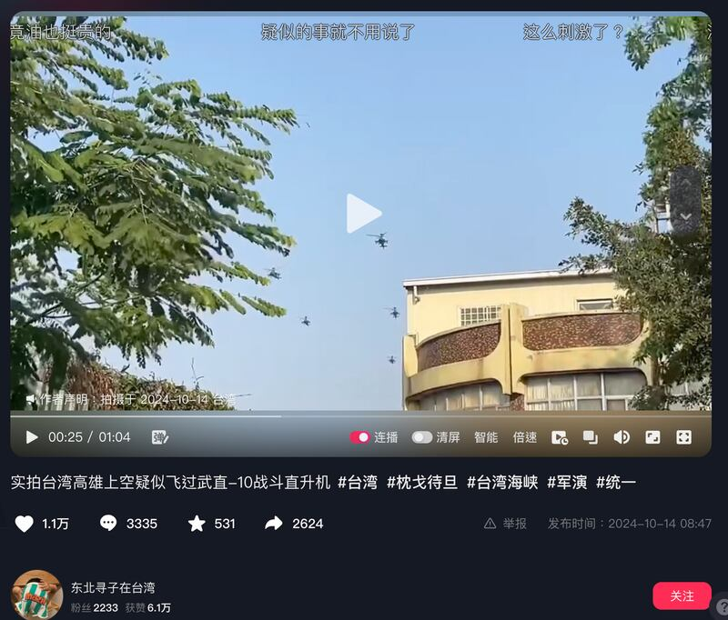
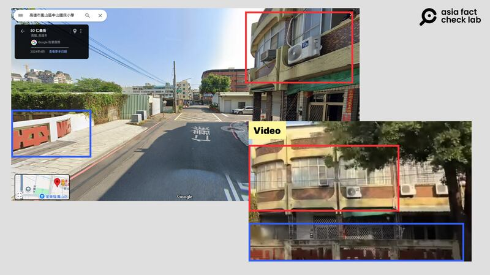
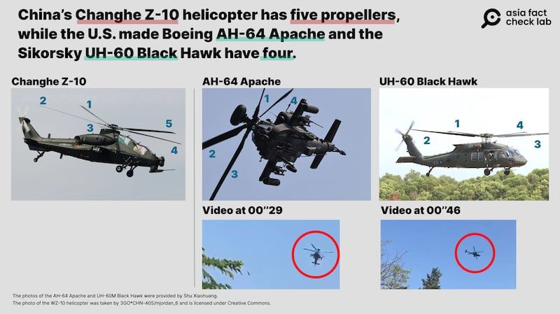
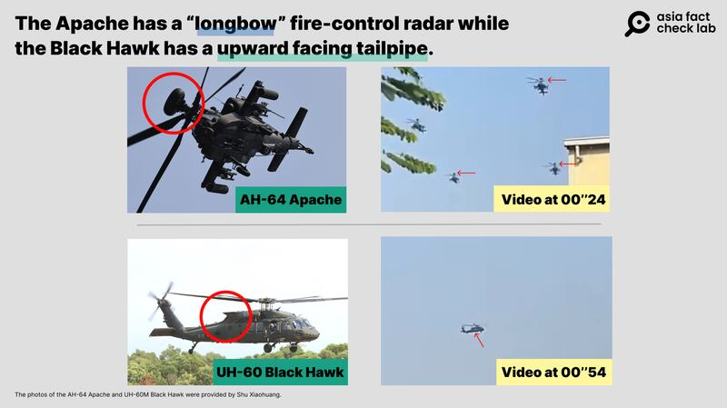

# Did Chinese helicopters fly over Taiwan during recent military exercises?

## Verdict: False

By Dong Zhe for Asia Fact Check Lab

2024.10.17

Taipei, Taiwan

## A video of several helicopters flying over the southern Taiwanese city of Kaohsiung has been shared over Chinese-language social media posts with the claim that they are mainland Chinese military helicopters spotted during the recent China’s military exercises in the Taiwan Strait and in waters around the island.

## But the claim is false. The helicopters seen in the video are U.S. Apache and Black Hawk models. AFCL also found no credible reports that show Chinese aircraft flew over Taiwan during the exercises.

The video was shared on Douyin, the Chinese version of TikTok, on Oct. 14, 2024, which was during China’s military exercises in the Taiwan Strait and in waters around the island.

The one-minute and three-second video shows multiple helicopters flying over what appears to be a residential area.

“A suspected Z-10 attack helicopter was seen flying over Kaohsiung, Taiwan,” the claim reads.

The Chinese military said on Monday that it organized multiple forces for a joint drill around the Taiwan Strait and the island’s northern, southern, and eastern regions.

According to a spokesman for the Eastern Theater Command of the Chinese People’s Liberation Army, or PLA, the Joint Sword-2024B exercises involved vessels and aircraft approaching Taiwan from multiple directions and carrying out drills of joint force attacks.

But the claim about the helicopters seen in the video is false.

A Douyin user claimed that China sent helicopters over Taiwan during recent drills. (Screenshot/Douyin)

## Location

A closer look at the video found the video was taken at either a primary school or kindergarten campus. AFCL found the Chinese word “zhongshan” written on a wall of one of the buildings seen in the video.

A keyword search of “zhongshan elementary school” found two schools located in Kaohsiung.

A photo comparison between scenes in the video and Google Street View confirmed that the video was filmed in the city’s Fengshan District.

The video was recorded near the Zhongshan Elementary School in Kaohsiung’s Fengshan District. (Screenshots/Douyin and Google Street View)

## Origin of helicopters

[Shu Hsiao-Huang](https://indsr.org.tw/en/member?resid=6&uid=2&pid=81), an associate researcher fellow at Taiwan's Institute for National Defense and Security Research, said that the helicopters seen in the video are actually two U.S. made models: the Boeing AH-64 Apache and the Sikorsky UH-60 Black Hawk.

Shu added that while the two U.S. models use four blades on their propeller, China’s Changhe Z-10 uses five.

The helicopters in the video only have four propellers, while the Changhe Z-10 has five. (Screenshots /Douyin. Images of the AH-64 and UH-60 provided by Shu Hsiao-Huang. Image of Changhe Z-10 used under CC license)

Shu pointed out distinctive features such as the Apache’s “longbow” fire-control radar and the Black Hawk’s upturned tail pipe, both located atop their respective engines, which are absent from the Changhe Z-10.

These features are visible in the footage, with three Apache helicopters coming into view at the 24-second mark, and a Black Hawk appearing in the distance at the 54-second mark of the video.

The Apache’s longbow radar and the Black Hawk’s upturned tail pipe are not found on the Changhe Z-10. (Screenshots/Douyin)

Wang Hsin-wei, a spokesman for Taiwan’s Army Aviation Special Warfare Command Major, told AFCL that the aircraft in the video were Taiwan-owned Apaches and Black Hawks conducting routine training over Kaohsiung.

Wang said that the video was old and is unrelated to recent Chinese military exercises.

## Taiwan’s announcement

On Tuesday, Taiwan said that China deployed a record 153 military aircraft during war games around the democratic island, with 90 sorties entering Taiwan’s air defense identification zone over surrounding waters.

However, none of the aircraft were reported to have flown over the island itself.

## *Translated by Shen Ke. Edited by Shen Ke, Taejun Kang and Malcolm Foster.*

*Asia Fact Check Lab (AFCL) was established to counter disinformation in today’s complex media environment. We publish fact-checks, media-watches and in-depth reports that aim to sharpen and deepen our readers’ understanding of current affairs and public issues. If you like our content, you can also follow us on [Facebook](https://www.facebook.com/asiafactchecklabcn), [Instagram](https://www.instagram.com/asiafactchecklab/) and [X](https://twitter.com/AFCL_eng).*

[Original Source](https://www.rfa.org/english/news/afcl/fact-check-taiwan-china-helicopters-10172024135340.html)