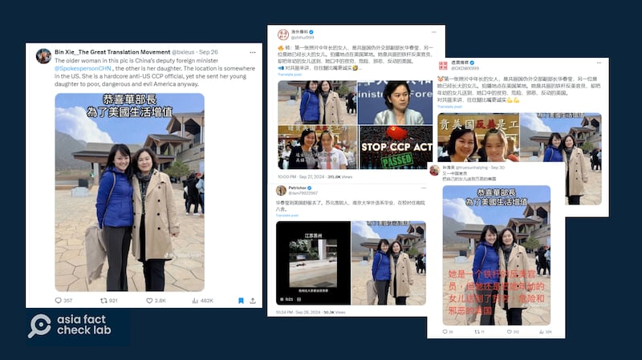
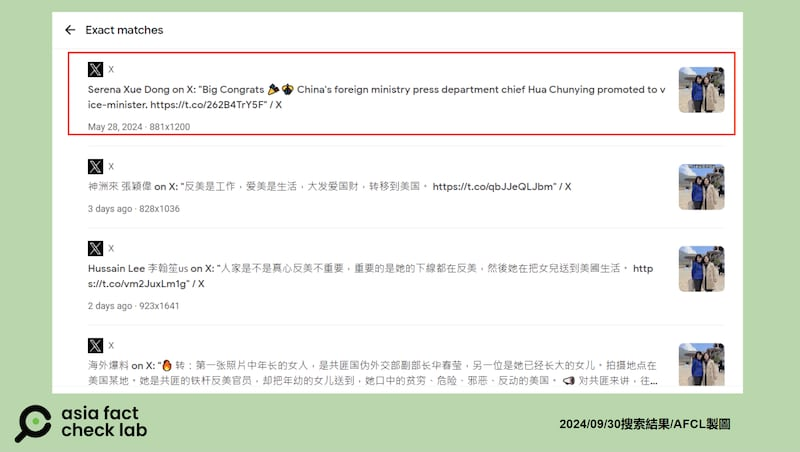
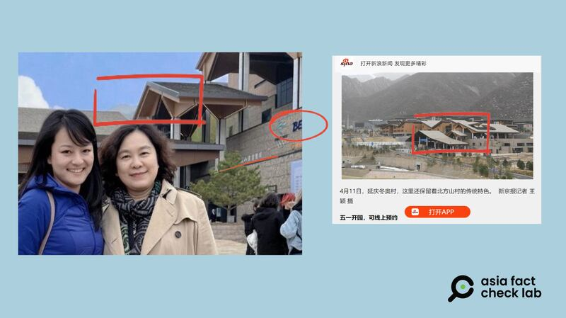

# Did a photo of Hua Chunying and her daughter in the US leak online?

## Verdict: False

By Rita Cheng

2024.10.23

Washington

## A photo of Chinese Vice Minister of Foreign Affairs Hua Chunying has circulated in Chinese-language social media claiming to show Hua and her daughter in the United States.

## But the claim is false. The photo in fact shows Hua and a Chinese journalist, Serena Dong, and it was taken in Beijing. AFCL found no reliable reports that Hua and Dong are related.

The photo of Hua posing with a woman in a blue hooded jacket was [shared](https://archive.ph/8cIS8) on X, formerly known as Twitter, on Sep. 27, 2024.

“The older woman in this pic is China’s deputy foreign minister [@SpokespersonCHN](https://archive.ph/o/8cIS8/https://x.com/SpokespersonCHN) [Hua’s X handle], the other is her daughter. The location is somewhere in the US,” the claim reads in part.

“She is a hardcore anti-US CCP official, yet she sent her young daughter to poor, dangerous and evil America anyway,” it reads further.

afcl-huan-chunying-daughter-photo\_1 A photo purportedly showing Hua Chunying standing with her daughter in the U.S. has circulated on social media. ((Screenshot/X))

[Hua](https://www.scmp.com/news/china/diplomacy/article/3264229/outspoken-head-chinas-foreign-ministry-press-corps-hua-chunying-promoted-deputy-foreign-minister) is a prominent diplomat, known for her sharp rhetoric and staunch defense of China’s policies. She has become a key figure in shaping China’s international image, playing a significant role in addressing global concerns related to China, especially on issues such as the U.S.-China relations, human rights and regional disputes.

But the claim about the photo of Hua is false.

## Original photo

A reverse image search on Google found the same photo published on May 28 by Serena Dong, a journalist for the English-language news channel of state-run China Global Television Network, or CGTN.

The photo was published alongside a congratulatory text a day after the government announced Hua’s promotion to vice foreign minister.

Dong later removed the post from X.

afcl-hua-chunying-daughter-photo\_2 The same photo circulated multiple times on X. (Screenshot/X)

## Location

AFCL found the photo was taken in China’s capital, Beijing, not in the U.S.

A closer look at the photo shows the Beijing Winter Olympics logo and unclear Chinese text on the building behind Hua and Dong.

A comparison with [photos](https://m.bjnews.com.cn/detail/165626596414063.html) published by *The Beijing News* shows that the roof shape of the building seen in Dong’s photo is identical to that of the Olympic village in Yanqing, Beijing.

afcl-hua-chunying-daughter-photo\_3 A comparison of the photo featuring Hua and the winter Olympic village in Yanqing. (Screenshot/Sina News)

## Relationship between Dong and Hua

AFCL does not know the exact relationship between Hua and Dong but found no credible reports that they are related.

Public information about Hua’s family is scarce.

Hua [is married](http://politics.people.com.cn/n/2012/1116/c41223-19605416.html) and has a daughter, though the identity of her husband has been the subject of debate, although the pro-Beijing Chinese-language *Sing Tao Daily* [said](https://std.stheadline.com/realtime/article/1217197/%E5%8D%B3%E6%99%82-%E4%B8%AD%E5%9C%8B-%E4%B8%AD%E5%9C%8B%E5%BB%BA%E7%AF%89%E5%89%8D%E8%91%A3%E4%BA%8B%E9%95%B7%E7%97%85%E9%80%9D-%E5%82%B3%E7%82%BA%E8%8F%AF%E6%98%A5%E7%91%A9%E4%B8%88%E5%A4%AB%E6%B6%88%E6%81%AF%E6%8C%87%E7%B4%94%E5%B1%AC%E8%AC%A0%E8%A8%80) that Hua’s husband was also a Chinese diplomat.

Dong has not responded to inquiries as of the time of publication.

## *Translated by Shen Ke. Edited by Shen Ke and Taejun Kang.*

*Asia Fact Check Lab (AFCL) was established to counter disinformation in today’s complex media environment. We publish fact-checks, media-watches and in-depth reports that aim to sharpen and deepen our readers’ understanding of current affairs and public issues. If you like our content, you can also follow us on* [*Facebook*](https://www.facebook.com/asiafactchecklabcn)*,* [*Instagram*](https://www.instagram.com/asiafactchecklab/) *and* [*X*](https://twitter.com/AFCL_eng)*.*

[Original Source](https://www.rfa.org/english/factcheck/2024/10/24/afcl-hua-chunying-daughter-photo/)