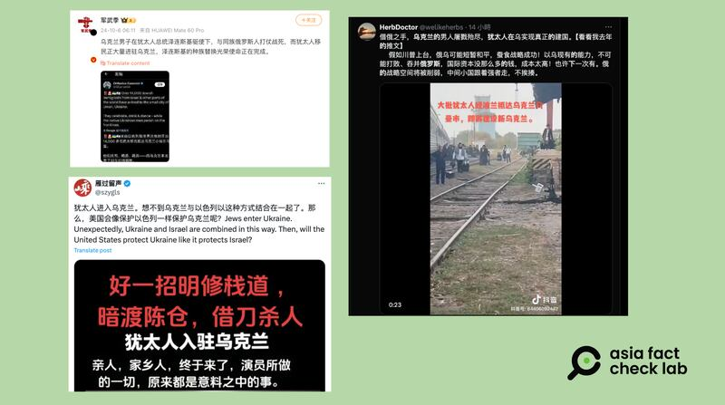
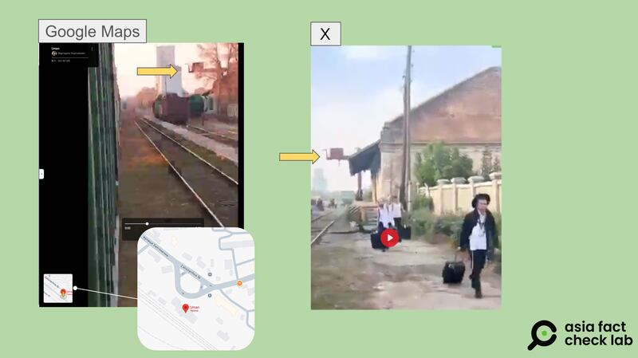
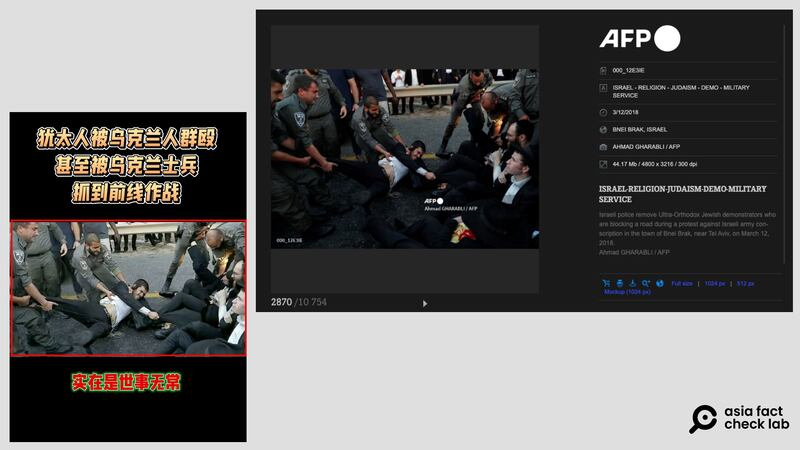
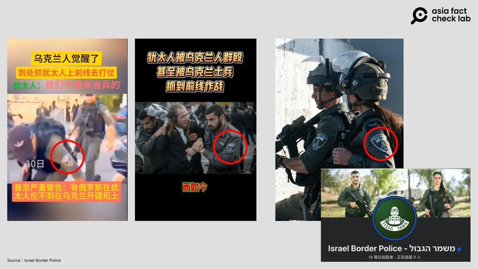
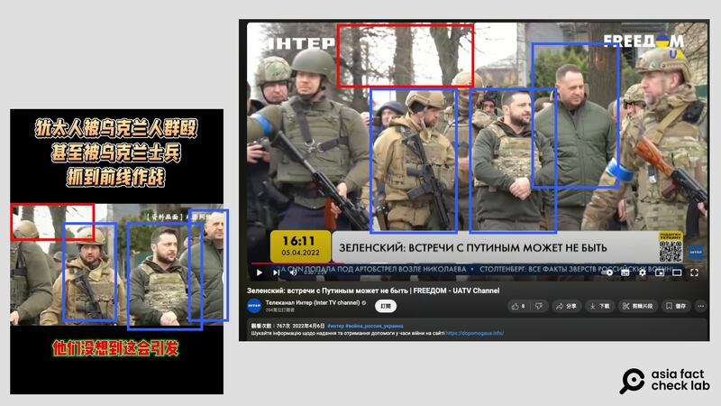

# Did a large number of Hasidic Jews enter Ukraine to build a new state?

## Verdict: False

By Dong Zhe for Asia Fact Check Lab

2024.10.25

Taipei, Taiwan

## A video has been shared in Chinese-language social media posts that claim it shows Jews entering Ukraine to build a new state.

## But the claim is false. The video shows Hasidic Jews making a customary pilgrimage during the Jewish New Year in order to visit the grave of the sect’s founder, Nachman of Breslov.

The video was [shared](https://archive.ph/IDtej) on X, formerly known as Twitter, on Oct. 5, 2024.

The 30-second video shows a large number of men dressed in rabbinical garb with luggage walking along a rail track.

“A large number of Jews arrived in the Ukrainian city of Uman via Poland

to establish a new state,” the claim reads in part.

afcl\_jews-ukraine Chinese influencers claim that a large number of Jews entered Ukraine with the intent of ‘building a state.’ (Screenshots/Weibo, X and Douyin)

Similar claims were also shared on X [here](https://archive.ph/ORFPn) and [here](https://archive.ph/echan).

But the claim is false.

A comparison between the video and Google Maps found the clip was taken at a train station in the Ukrainian city Uman.

Further reverse image searches of the video’s key frames found clips with a similar scene that show Hasidic Jews [making a pilgrimage](https://www.myjewishlearning.com/article/why-do-some-jews-visit-uman-for-rosh-hashanah/) to Uman during the Jewish New Year, to visit the grave of the sect’s founder Nachman of Breslov.

afcl\_jews-ukraine Comparison of the video with images from Google Map confirms that it was filmed in Uman, a pilgrimage site of the Hasidic sect of Judaism. (Screenshots/Google Maps and Douyin)

Although the Ukrainian government advised Jews to postpone their pilgrimage due to the war there, reports indicate that this year more than 35,000 people made the journey.

Some Chinese-speaking online users shared a [video](https://v.douyin.com/iBK1Wyo9/) alongside a claim that it shows Ukraine soldiers arresting Jews and sending them to the front line to fight against Russia.

AFCL found the video in question is primarily composed of two separate clips. One segment, filmed in 2018, shows Israeli police clearing Orthodox Jews from the roads during a protest against the Israeli military draft in Bnei Brak, a town near Tel Aviv.

afcl\_jews\_ukraine Screenshot of images used in the false video. (AFP/AFCL)

The police uniforms and armbands seen in this footage are those of the [Israeli border police](https://www.facebook.com/ILBorderPolice), not Ukrainian soldiers.

afcl\_jews\_ukraine The police uniforms and armbands seen in this footage are those of the Israeli border police, not Ukrainian soldiers. (Illustration by AFCL)

The video includes clips of Ukrainian President Volodymyr Zelenskyy in military attire. These clips are identical to news footage [released](https://youtu.be/4ZKb32-ovNY?feature=shared&t=28) by the Ukrainian TV station Inter two years ago, of Zelenskyy’s visit to the Ukrainian town of Bucha in April 2022 following a massacre by Russian forces.

afcl\_jews\_ukraine\_5 Screenshot comparison between the false video and Ukrainian TV station Inter. (Illustration by AFCL)

AFCL found no credible reports that a large number of Jews entered Ukraine to build a new state or that Ukraine police were arresting Jews and sending them to the front line.

## *Translated by Shen Ke. Edited by Shen Ke and Taejun Kang.*

*Asia Fact Check Lab (AFCL) was established to counter disinformation in today’s complex media environment. We publish fact-checks, media-watches and in-depth reports that aim to sharpen and deepen our readers’ understanding of current affairs and public issues. If you like our content, you can also follow us on* [*Facebook*](https://www.facebook.com/asiafactchecklabcn)*,* [*Instagram*](https://www.instagram.com/asiafactchecklab/) *and* [*X*](https://twitter.com/AFCL_eng)*.*

[Original Source](https://www.rfa.org/english/factcheck/2024/10/25/afcl-jews-ukraine/)