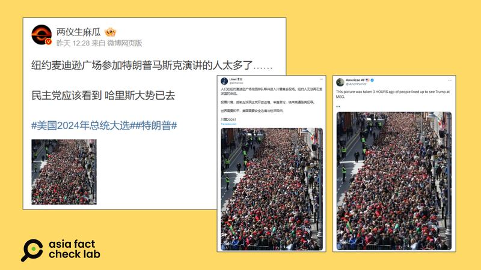
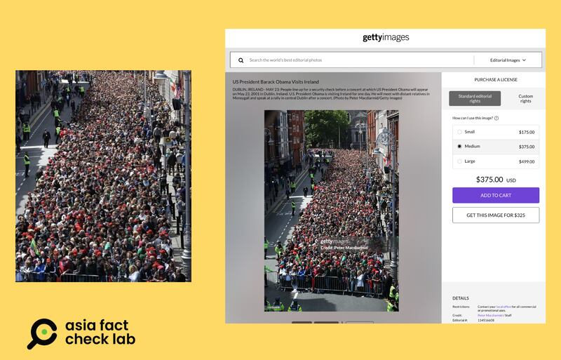

# Does a photo show people lining up for a Trump rally in New York?

## Verdict: False

By Zhuang Jing for Asia Fact Check Lab

2024.11.01

TAIPEI, Taiwan

## A photo of a crowd has been circulated in Chinese-language social media posts alongside a claim that it shows a huge crowd of people waiting to get into an Oct. 27 rally for presidential candidate Donald Trump at New York City’s Madison Square Garden.

## But the claim is false. The photo was in fact taken in 2011 of people in Dublin waiting to go into a concert attended by former U.S. President Barack Obama.

The photo was published on [Weibo](https://archive.ph/fcL3n), [X](https://x.com/iAnonPatriot/status/1850576008014864704) and [Threads](https://www.threads.net/@alanfahringer/post/DBo3t5AB9ax).

“This picture was taken 3 HOURS ago of people lined up to see Trump at MSG,” reads the X post, which other influencers cited. A Chinese-language account on X disseminated the same photo with a similar caption.

But the photo was actually taken in 2011 of people in Dublin waiting to go into a concert attended by former U.S. President Barack Obama.

While people did line up in Manhattan to enter the Trump rally in Madison Square Garden, the photo in question was from 13 years ago.

Does a photo show people lining up for a Trump rally in New York? Chinese and English influencers circulated a purported photo of a New York crowd attending U.S. Republican presidential candidate Donald Trump’s recent rally at Madison Square. (Screenshot/Weibo & Getty Images)

The bus stop sign does not look like those in New York, and flags in people’s hands are different from the materials used at other Trump rallies.

But more convincingly, a reverse image search revealed a similar image published by [*The* *Guardian*](https://www.theguardian.com/world/gallery/2011/may/23/barack-obama-usa) in May 2011 of crowds in Dublin waiting to attend a concert attended by Obama. The photo was sourced from Getty Images and credited to photographer Peter Macdiarmid.

A further search through Getty’s records found a [separate photo](https://www.gettyimages.hk/detail/%E6%96%B0%E8%81%9E%E7%85%A7%E7%89%87/people-line-up-for-a-security-check-before-a-concert-at-which-us-%E6%96%B0%E8%81%9E%E7%85%A7%E7%89%87/114516608?adppopup=true) taken by Macdiarmid with a frame composition identical to the photo shared on X.

Does a photo show people lining up for a Trump rally in New York? A purported photo of a crowd at a rally for Republican presidential candidate Donald Trump in New York (left) is identical with the center of a photo taken during a visit by Obama to Dublin in 2011. (Screenshot/Weibo & Getty Images)

A comparison shows that the influencers zoomed in and cropped the center of the original photo. The crowds, buildings, and positioning of policemen on the street are an exact match.

## *Translated and edited by Shen Ke. Edited by Malcolm Foster.*

*Asia Fact Check Lab (AFCL) was established to counter disinformation in today’s complex media environment. We publish fact-checks, media-watches and in-depth reports that aim to sharpen and deepen our readers’ understanding of current affairs and public issues. If you like our content, you can also follow us on* [*Facebook*](https://www.facebook.com/asiafactchecklabcn)*,* [*Instagram*](https://www.instagram.com/asiafactchecklab/) *and* [*X*](https://twitter.com/AFCL_eng)*.*

[Original Source](https://www.rfa.org/english/factcheck/2024/11/01/fact-check-trump-rally-photo/)