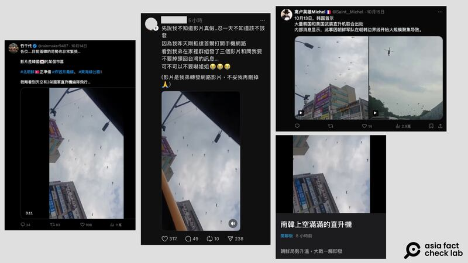
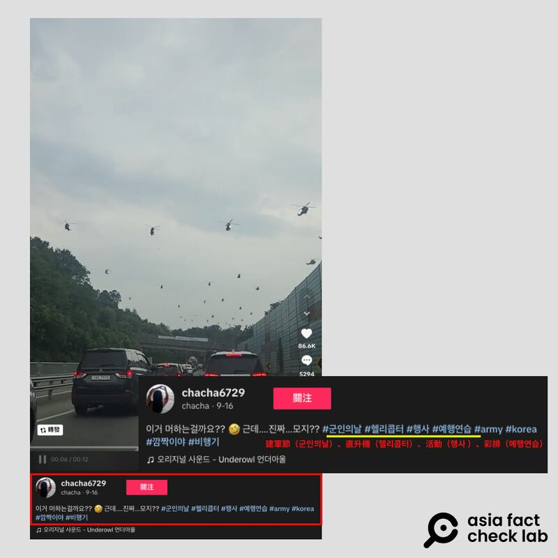
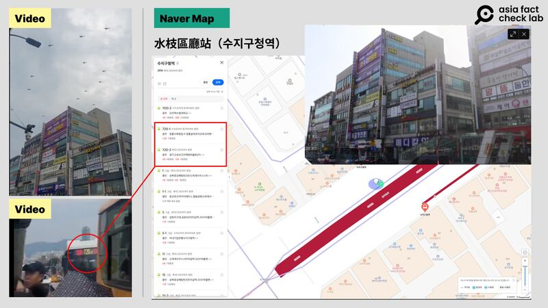
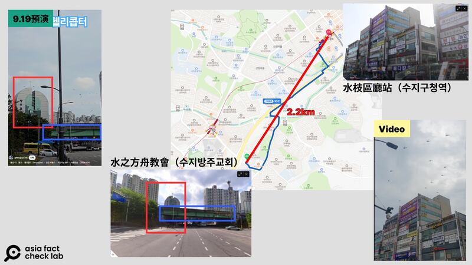
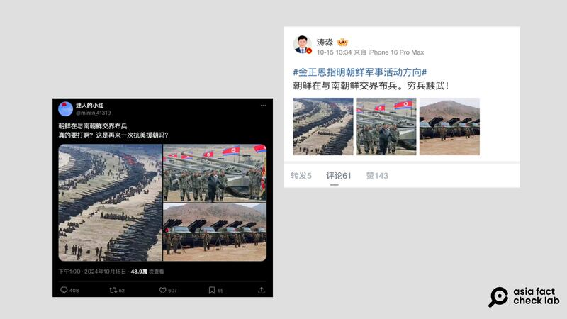
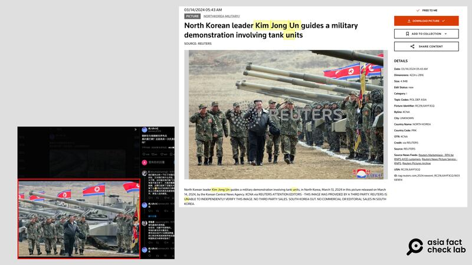
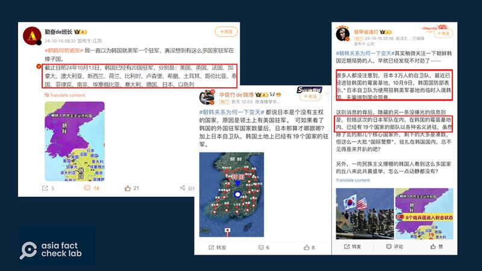
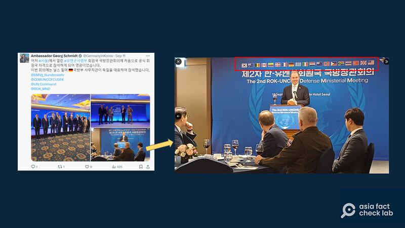
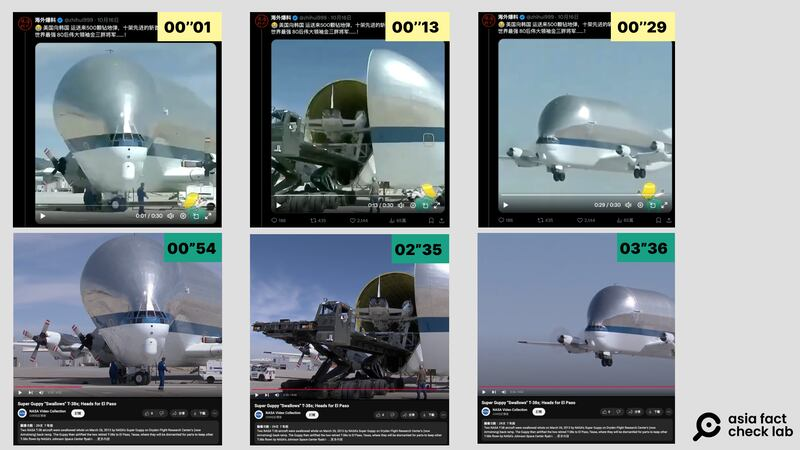
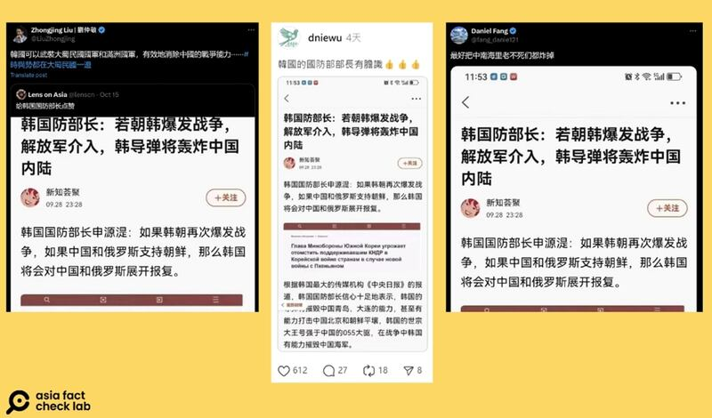

# Media Watch: Inter-Korean tension sparks rumors in China

## False claims spread amid speculation about potential fallout of a conflict.

By Dong Zhe, Rita Cheng, Alan Lu and Zhuang Jing for Asia Fact Check Lab

2024.10.31

Tensions have intensified between North and South Korea following accusations of drone incursions and the exchange of threats. Both sides have raised their military alerts and North Korea has taken further steps by dismantling parts of shared infrastructure near the border.

Meanwhile, in broader developments, South Korea and the United States say North Korea is supporting Russia’s war in Ukraine by sending troops that Seoul says is an escalation of the conflict.

The simmering tensions have ignited a flurry of rumors in China with many people speculating online about the possible ramifications of an inter-Korean conflict.

AFCL has determined that the following posts are based on false or misleading claims.

## Were South Korean helicopters sent near the border with North Korea?

Two videos were [shared](https://archive.ph/4ibR8) in Chinese-language social media posts alongside claims that they show a large group of helicopters sent by South Korea to the border with North Korea.

korea-china-fact-check-tension-claims-01 Online users claimed that a large number of South Korean helicopters are massing along its border with North Korea. (Images via Threads and Dcard)

But the claims are false. A reverse image search on Google found both videos circulated online before the latest inter-Korean tension.

AFCL found similar videos indicating the two shared clips were taken from ceremonies relating to South Korea’s 76th anniversary of the founding of its armed forces on Oct. 1.

## First video

The first video shows multiple helicopter flights over a large road.

A reverse image search using a screenshot from the footage shows that it was first [uploaded](https://www.tiktok.com/@chacha6729/video/7415212839914179848) by a TikTok account named “chacha6729” on Sept. 16, 2024. It was accompanied by the tags “Army Day,” “helicopter,” “event” and “rehearsal.”

korea-china-fact-check-tension-claims-02 The same video appeared almost a month before the recent outbreak of tensions between North and South Korea. (Image via TikTok)

AFCL has not been able to confirm the exact date the video was taken but found there were numerous rehearsals of helicopter formations between [August](https://koreajoongangdaily.joins.com/news/2024-09-19/national/socialAffairs/Seoul-to-reroute-traffic-for-Armed-Forces-Day-parade-on-Oct-1/2137375?detailWord=) and [September](https://koreajoongangdaily.joins.com/news/2024-09-24/national/defense/Military-helicopters-assemble-for-flight-rehearsal-ahead-of-Armed-Forces-Day/2140897).

The Seoul Metropolitan Government sent resident alerts about the noise of the rehearsals from August until Oct. 1.

## Second video

A search on the South Korean Naver website found the second video was taken in a district of the South Korean city of Yongin.

A closer look at signboards and bus routes in the video showed that the video was filmed near a metro station in the district.

korea-china-fact-check-tension-claims-03 The location in the video matches the street view around the Suji metro in the South Korean city of Yongin. (Image via Naver)

Separately, a keyword search found a YouTube clip [taken](https://www.youtube.com/shorts/3yYQs7nzULw) on Sept. 19 that shows helicopters flying over the same district in Yongin.

A screenshot comparison between the video shared alongside the false claim and the clip shared on YouTube shows that both videos show the same helicopters.

korea-china-fact-check-tension-claims-04 The two videos were shot in close proximity to each other (AFCL)

## Did North Korea amass troops near the border?

Three photos were also [shared](https://m.weibo.cn/detail/5089733527736440) in Chinese-language social media posts alongside a claim that they showed North Korea sending troops toward its border with South Korea.

korea-china-fact-check-tension-claims-05 Online users claimed a photo shows North Korea was amassing troops along its border with South Korea. (Images via Sina Weibo and X)

But the claim is false.

A reverse image search confirmed that none of the three photos were related to the recent tensions.

The first photo shows a North Korean [military drill](https://edition.cnn.com/2017/04/26/asia/north-korea-official-nuclear/index.html) in 2017 in the North Korean city Wonsan, not on the border. This same photo had previously been used by online users to spread a false claim that China was [massing](https://tfc-taiwan.org.tw/articles/7976) troops on its southern coast for an attack on Taiwan.

The second photo shows North Korean leader Kim Jong Un testing a new tank model in March this year.

korea-china-fact-check-tension-claims-06 The online photo is the same as one taken by the Korean Central News Agency. (Reuters)

The third photo shows a North Korean rocket artillery unit and was used by the South Korean online media outlet New Daily in a [report](https://www.newdaily.co.kr/site/data/html/2013/05/17/2013051700018.html) in May 2014.

## Did Japan send its Self-Defense Forces to South Korea?

A claim [emerged](https://archive.ph/Rd2s5) in Chinese-language social media posts that Japan had sent members of its military, known as the Self-Defense Force, or SDF, to South Korea.

korea-china-fact-check-tension-claims-07 Online users claimed that many countries, including Japan, sent their troops to South Korea. (Image via Weibo)

But the claim lacks evidence.

One Chinese online user claimed that South Korea’s Ministry of National Defense allowed Japan’s SDF to use U.S. military bases in South Korea “without approval from the South’s National Assembly.”

Keyword searches found that this appears to be a misunderstanding of statements by South Korean lawmaker Hong Ki-won, as reported by South Korean media on Oct. 8.

Hong was in fact discussing a hypothetical scenario, expressing concern that if the SDF could enter South Korea without government approval, it would be “absolutely unacceptable” to the public.

David Maxwell, a retired U.S. Army colonel with years of experience in South Korea, believes it unlikely that Japanese troops would be stationed in South Korea or that the U.S. military would try to covertly let them enter.

South Korean citizens would certainly report spotting any Japanese forces to the government, said Maxwell, adding that he could not remember the SDF ever being deployed to Korea from the 1980s.

While the United Nations Command, or UNC, deployed in South Korea is led and largely staffed by American troops since its creation in 1950, other countries do help provide medical supplies or send troops to garrison the Joint Security Area between the two Koreas.

However, Japan’s flag was not among those of 19 countries displayed during a speech given by the German Ambassador to South Korea Georg Schmidt at a [UNC defense ministers’ meeting](https://x.com/GermanyinKorea/status/1833754381419999352) in September welcoming [Germany’s participation](https://www.reuters.com/world/germany-joins-us-led-un-command-south-korea-policing-armistice-border-2024-08-02/) in the organization.

korea-china-fact-check-tension-claims-08 UNC Defense Ministers’ Conference materials show Japan is not on the UNC list. (Image via X)

The U.S. Forces Korea Command and Japan’s Ministry of Defense did not respond to inquiries as of press time.

## Is the U.S. sending weapons to South Korea?

A video [emerged](https://archive.ph/IWO2l') in Chinese-language social media posts alongside a claim that it shows the U.S. urgently sending 500 bunker buster bombs and 10 combat drones to South Korea.

But the claim is false.

A reverse image search found that it was actually edited footage of [a Youtube clip](https://www.youtube.com/watch?v=aSxFe93pYCA) originally filmed by NASA in March 2013.

The footage shows two T-38 aircraft being brought inside a Super Guppy cargo freighter in preparation to depart to El Paso, Texas, for scheduled dismantling.

korea-china-fact-check-tension-claims-09 Chinese online users claimed that a misappropriated clip taken by NASA in 2013 was footage related to the recent tensions on the Korean peninsula. (Images via X, NASA and YouTube)

The NASA Armstrong Flight Research Center also [uploaded](https://www.youtube.com/watch?v=aSxFe93pYCA&ab_channel=NASAArmstrongFlightResearchCenter) a separate video of the same event on Youtube.

## Did South Korea’s defense minister threaten missile strikes against China?

A claim [circulated](https://www.threads.net/@dniewu/post/DBNnp4sSfHp) in Chinese-language social media posts that South Korean Defense Minister Shin Won-sik had warned of retaliation against China and Russia if either of them supported North Korea in the event of another war breaking out between North and South Korea.

Social media users also claimed that South Korea’s JoongAng daily had quoted Shin as saying that South Korea could destroy the Chinese cities of Qingdao, Dalian and Beijing, attaching a screenshot of the purported report.

korea-china-fact-check-tension-claims-10 Chinese online users claimed that South Korea had threatened to strike China with missiles if it supported North Korea. (Images via X and Threads)

This is false.

A closer look at the screenshot reveals that the original quote is from a Russian-language report with a translated headline that reads: “South Korean Defense Minister threatens retaliation against countries supporting North Korea if war breaks out.”

The title did not mention China.

A separate search for the headline and related keywords translated into Korean found no credible reports mentioning Shin’s remarks.

Jieun Seo, a reporter on JoongAng’s national news team, told AFCL that the outlet had not reported such a statement by Shin.

South Korea’s embassies in the U.S. and China have not responded to requests for comments as of press time.

## *Translated by Shen Ke. Edited by Shen Ke, Taejun Kang and Malcolm Foster.*

[Original Source](https://www.rfa.org/english/factcheck/2024/11/01/korea-china-fact-check-tension-claims/)