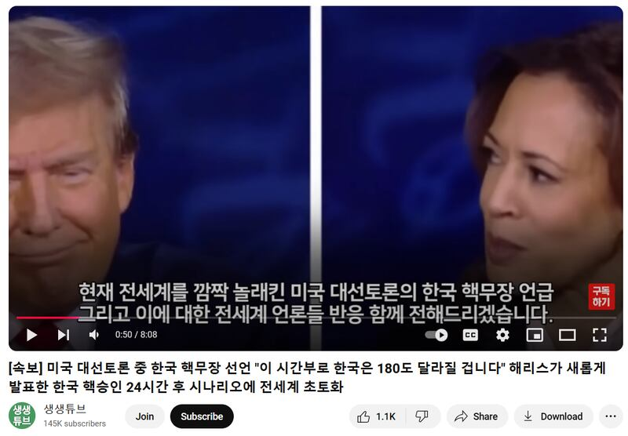

# Did Harris back South Korea’s nuclearization during presidential debate?

## Verdict: False

By Taejun Kang for RFA

2024.11.11

TAIPEI, Taiwan

## A claim emerged in Korean-language social media posts that the U.S. presidential hopeful Kamala Harris endorsed South Korea developing nuclear weapons in a debate with her Republican rival, Donald Trump on Sept. 10.

## But the claim is false. U.S. Vice President Harris did not mention South Korea during the debate. Harris has previously called for the “complete denuclearization of the Korean Peninsula”.

The claim was [shared](https://www.youtube.com/watch?v=s4pd5EdJPl4) in this YouTube video posted on an account with more than 145,000 followers.

“Harris announces new approval for South Korea acquiring nuclear weapons,” the title of the video reads in part.

The eight-minute video shows multiple clips from the U.S. presidential debate in September.

“It was a significant moment that proved South Korea acquiring nuclear weapons is not just an idea out of thin air but is being taken seriously even within the United States,” the narrator of the video says.

afcl-harris-korea-nuclearization\_10292024\_1 Screenshot of the YouTube video with a false claim. (Screenshot/YouTube)

In South Korea, the debate over nuclearization centers on security concerns amid North Korea’s nuclear progress and doubts about U.S. defense commitments.

Supporters of the idea see a South Korean nuclear arsenal as a necessary deterrent, while opponents fear it could trigger an arms race and harm diplomatic ties, challenging the nation’s non-proliferation stance.

President Yoon Suk Yeol [said](https://www.rfa.org/english/news/korea/south-korea-nuclear-weapons-09202024030701.html) in September that South Korea had already established a system that can effectively deter and respond to the North Korean nuclear threat without the need for its own nuclear arsenal.

Yoon’s remarks came a week after North Korea [unveiled](https://www.rfa.org/english/news/korea/north-korea-unranium-facility-09122024233109.html) details of its uranium enrichment facility for the first time.

But the claim about Harris’s remark is false.

A review of the debate’s [recorded video](https://www.youtube.com/watch?v=4dOgWZsDB6Q) and a [transcript](https://abcnews.go.com/Politics/harris-trump-presidential-debate-transcript/story?id=113560542) shows that Harris did not mention South Korea.

In 2022, Harris [said](https://www.whitehouse.gov/briefing-room/speeches-remarks/2022/09/29/remarks-by-vice-president-harris-after-tour-of-the-korean-demilitarized-zone/) a complete denuclearization of the Korean Peninsula was a shared goal between the U.S. and South Korea.

As of Oct. 29, Harris’s campaign website [suggested](https://kamalaharris.com/issues/) her position would not change if she became president.

“She visited the Korean Demilitarized Zone to affirm our unwavering commitment to South Korea in the face of North Korean threats,” the campaign website reads in part.

## *Edited by RFA Staff.*

*Asia Fact Check Lab (AFCL) was established to counter disinformation in today’s complex media environment. We publish fact-checks, media-watches and in-depth reports that aim to sharpen and deepen our readers’ understanding of current affairs and public issues. If you like our content, you can also follow us on* [*Facebook*](https://www.facebook.com/asiafactchecklabcn)*,* [*Instagram*](https://www.instagram.com/asiafactchecklab/) *and* [*X*](https://twitter.com/AFCL_eng)*.*

[Original Source](https://www.rfa.org/english/factcheck/2024/11/11/afcl-harris-korea-nuclearization/)