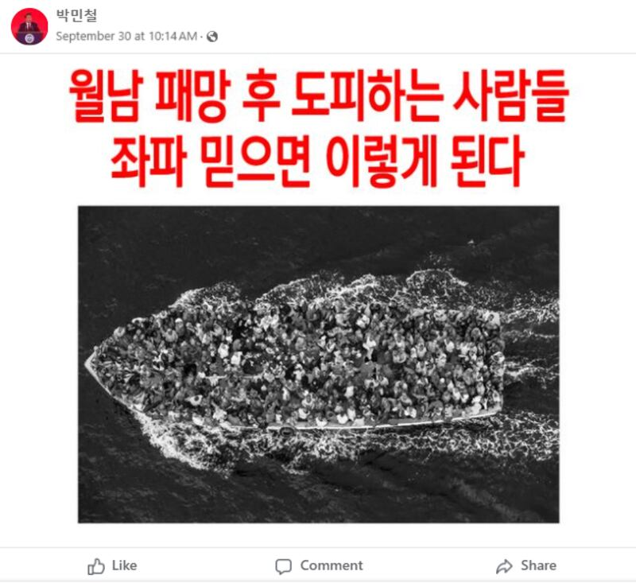
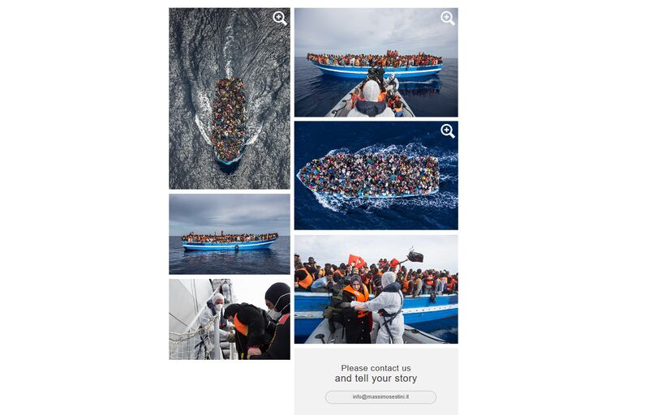

# Does a photo show refugees fleeing South Vietnam?

## Verdict: False

By Taejun Kang for RFA

2024.11.12

## An image of a boat full of people has been shared in Korean-language social media posts that claim it shows people fleeing South Vietnam after its defeat by communist forces of then North Vietnam in 1975.

## But the claim is false. The image in fact shows asylum seekers rescued by the Italian navy off the coast of north Africa.

The image was [shared](https://perma.cc/GL7U-SZ5D) on Facebook on Sep. 30, 2024. The image was later taken down.

“People fleeing after the demise of South Vietnam. This is what happens when you follow leftwings,” reads the clam.

afcl-not-vietnam-boat-photo\_10292024\_1 Screenshot of the false post on Facebook. (Screenshot/Facebook)

In 1975, the city of Saigon, then the capital of South Vietnam, fell to North Vietnamese forces, marking the end of the Vietnam War and the unification of the country. This also triggered a mass exodus of refugees from the south.

But the claim shared in the September post is false. The image in fact shows asylum seekers rescued by the Italian navy off the coast of north Africa.

A reverse image search found the original photo on the [website](https://www.massimosestini.it/wru.html) of Italian photographer Massimo Sestini, alongside other photos of the same scene from different angles.

afcl-not-vietnam-boat-photo\_10292024\_2 Screenshot of Massimo Sestini’s website. (Screenshot/Massimo Sestini’s website)

The caption of the image, dated June 7, 2014, reads: “20 miles off the Libyan coast”.

A further reverse image search found the same photo was published in reports by multiple international media outlets, including the Wall Street Journal in a report [here](https://www.wsj.com/articles/boat-people-trying-to-reach-europe-disrupt-mediterranean-mercantile-shipping-1427399702) on March, 26, 2015.

The caption of the photo, credited to Sestini, reads:

“Immigrants attempting to cross the Mediterranean to seek asylum in Europe have disrupted shipping. Above, the Italian navy rescued shipwrecked immigrants off the coast of Africa in June.”

## *Edited by RFA Staff.*

*Asia Fact Check Lab (AFCL) was established to counter disinformation in today’s complex media environment. We publish fact-checks, media-watches and in-depth reports that aim to sharpen and deepen our readers’ understanding of current affairs and public issues. If you like our content, you can also follow us on* [*Facebook*](https://www.facebook.com/asiafactchecklabcn)*,* [*Instagram*](https://www.instagram.com/asiafactchecklab/) *and* [*X*](https://twitter.com/AFCL_eng)*.*

[Original Source](https://www.rfa.org/english/factcheck/2024/11/13/afcl-not-vietnam-boat-photo/)