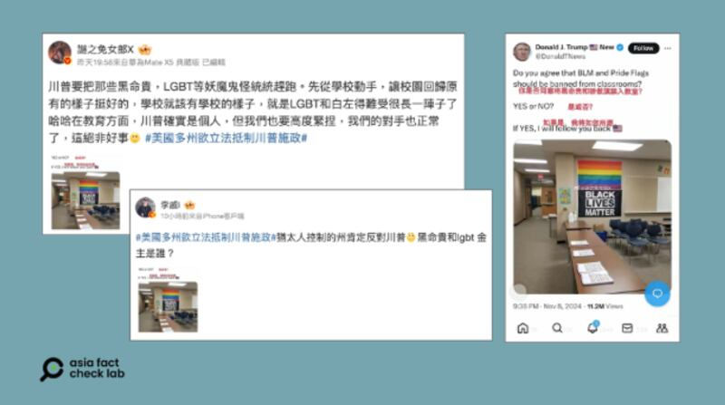

# Media Watch: Online users target Trump, Harris with rumors after US election

## Unverified claims and sensational narratives about both figures spread rapidly across Chinese social media.

By Zhuang Jing and Alan Lu for Asia Fact Check Lab

2024.11.14

In the 2024 U.S. presidential election on Nov. 5, former President Donald Trump secured a second, non-consecutive term by defeating Vice President Kamala Harris.

Following the election, online platforms in China saw a surge of activity, with some users targeting Trump and Harris with a wave of rumors and misinformation.

Here is what AFCL found.

## Did Trump say the Taiwan issue is ‘China’s internal affair’ after winning the election?

A video emerged in Chinese-language social media posts alongside a claim that it shows Trump after his election win saying that the Taiwan issue is China’s internal affair.

A 21-second video posted on X on Nov. 10 features Chinese subtitles showing a purported conversation between a reporter and Trump.

The subtitles read: “Reporter: How will you handle the Taiwan issue?”

“Trump : Why would I care… Are you teaching me how to handle things? That’s a domestic matter for China.”

But the claim is false.

Keyword searches found the original clip published by the American broadcaster CNN in January 2019.

A review of the original clip shows then-President Trump signing a bill related to protection for human trafficking victims and discussing a federal government shutdown crisis with reporters – topics unrelated to Taiwan.

Trump made no mention of the Taiwan issue.

China considers Taiwan a breakaway province and its sovereign territory, even though the island has been governed independently since 1949.

Taiwan, however, operates as a self-governing democracy with its own institutions and society, where many identify independently of the mainland.

The United States takes a nuanced stance, officially recognizing the “One China” policy, which is guided by the Taiwan Relations Act, the three U.S.-China Joint Communiques, and the Six Assurances, while supporting Taiwan’s right to self-defense through arms sales and unofficial diplomatic relations.

afcl-post-election-rumours\_11142024\_1 After the U.S. presidential election, some Chinese social media accounts circulated statements purportedly made by President-elect Trump about Taiwan. (Screenshot/X)

Separately, images of Trump also circulated in Chinese-language social media posts claiming to show Trump saying the Taiwan issue is China’s internal affairs.

The superimposed texts in Chinese, attributed to Trump, on the images read: “Independence or unification is their internal matter! Taiwan affairs do not need U.S. interference!”

Keyword searches found the images were taken from Trump’s pre-election appearance on the podcast “The Joe Rogan Experience” where he discussed Taiwan’s semiconductor business and protection fees.

A review of the segment found that Trump made no mention of Taiwan’s independence or unification.

Separate keyword searches found no recent interviews in which Trump made statements about Taiwan independence.

## Did Trump say he would ban Black Lives Matter and Pride flags from American classrooms?

A screenshot of what appears to be Trump’s X account circulated in Chinese-language social media that claim to show the president-elect saying he would ban Black Lives Matter and LGBT flags from American classrooms.

The Black Lives Matter, commonly known as the BLM movement, began in 2013 to address systemic racism and police violence against Black people.

Pride is a global celebration and advocacy movement for LGBTQ+ rights and equality, honoring the 1969 Stonewall Riots.

afcl-post-election-rumours\_11142024\_2 Screenshot of misleading social media posts that claim to carry a statement from Trump. (Screenshot/X and Weibo)

But the claim about Trump’s statement is false.

The X account seen in the Chinese social media posts is a parody account and doesn’t belong to the former president.

The parody account’s handle is [@DonaldTNews](https://x.com/donaldtnews?lang=en), while that of Trump’s official X account is [@readlDonaldTrump](https://x.com/realDonaldTrump).

Keyword searches found no credible reports of Trump mentioning banning BLM and Pride flags from American classrooms.

## Does a video show Harris losing her temper after election loss?

A video of Harris emerged in Chinese-language social media posts claiming to show Harris losing her composure after the election loss.

The caption of the video [shared](https://x.com/Snofy8/status/1854320148783800816) on X on Nov. 7 reads: “After losing, Harris can no longer smile, angrily lashing out in frustration.”

afcl-post-election-rumours\_11142024\_3 After the 2024 U.S. presidential election, a video titled “Harris Loses Her Temper” circulated online. (Screenshot/X)

But the claim is false.

Keyword searches found the original video posted on Oct. 25, 2024, by the American public broadcaster PBS, days before the U.S. presidential election.

The video shows a Harris rally in Houston, Texas, on Oct. 25. At the 3-hour and 57-minute mark of the video, Harris and her supporters can be heard chanting “We’re not going back” three times.

At the rally, Harris discussed women’s reproductive rights in the U.S., urging supporters to vote promptly, as only 11 days remained until the election, and early voting had already begun in Texas.

## Does a video show Biden and Obama discussing Harris after the election?

A video of U.S. President Joe Biden and the former president Barack Obama [circulated](https://m.weibo.cn/detail/5097481866056746) on Chinese-language social media posts that claim it shows Biden and Obama discussing post-election strategy and Harris.

“How’s Harris doing?” subtitles in Chinese read attributed to Biden.

“She’s done. I think they found out she’s mentally challenged. Now we’re basically screwed, Trump crushed us in the election,” read subtitles attributed to Obama.

afcl-post-election-rumours\_11142024\_3 Screenshot of misleading social media posts that claim the video shows Biden and Obama discussing Harris after the U.S. election. (Screenshot/X and Weibo)

But the claim is false.

Keyword searches found the original video published on Oct. 16 by the American broadcaster C-SPAN, days before the election.

The video shows Biden and Obama participating at the private funeral of Ethel Kennedy, the widow of the late Robert F. Kennedy, on Oct. 16, 2024.

## *Edited by Taejun Kang.*

*Asia Fact Check Lab (AFCL) was established to counter disinformation in today’s complex media environment. We publish fact-checks, media-watches and in-depth reports that aim to sharpen and deepen our readers’ understanding of current affairs and public issues. If you like our content, you can also follow us on* [*Facebook*](https://www.facebook.com/asiafactchecklabcn)*,* [*Instagram*](https://www.instagram.com/asiafactchecklab/) *and* [*X*](https://twitter.com/AFCL_eng)*.*

[Original Source](https://www.rfa.org/english/factcheck/2024/11/15/afcl-post-us-election-rumors/)