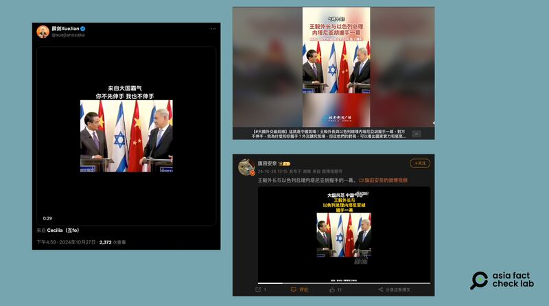

# Does a video show a Chinese official’s authority over Israeli leader?

## Verdict: Misleading

By Dong Zhe for Asia Fact Check Lab

2024.11.18

## A video of Chinese Foreign Minister Wang Yi has been circulated in Chinese-language social media posts alongside a claim that it shows him asserting his authority over Israeli Prime Minister Benjamin Netanyahu.

## But the claim is misleading. The video has been digitally edited to appear as if there was tension between the two officials. In the original video, Wang and Netanyahu can be seen shaking hands amicably.

The video was [shared](https://archive.ph/aeRAX) on X on Oct. 27 by China’s consul general in the Japanese city of Osaka, Xue Jian.

The 41-second clip shows the two officials staring at each other for more than half a minute, as if there was tension, interspersed with an occasional nod or turn of the head, after which Netanyahu reaches out to shake hands with Wang.

The caption of the video reads: “[I] come from a big country. If you don’t reach out first, I won’t reach out either,” hinting that Wang refused to shake hands until Netanyahu reached out, a gesture seemingly intended to assert his authority over the Israeli leader.

afcl-china-israel-video\_11182024\_1 A recently spread video purportedly shows Chinese Foreign Minister Wang Yi refusing to shake hands with Israeli Prime Minister Benjamin Netanyahu at a meeting. (Screenshots/X, Weibo and Beijing News Radio)

The identical video was also circulated in [Weibo](https://archive.ph/0Hsc9) and [Facebook](https://archive.ph/2Klpy) posts, with users touting it as a symbol of a “strong motherland,” emphasizing that Wang projected power.

But the claim is misleading.

A reverse image search found the original video of Wang and Netanyahu taken during a diplomatic meeting in Jerusalem in 2013, as published by the [Associated Press](https://www.youtube.com/watch?v=kPrrBBzjo20&ab_channel=APArchive) and [the Israeli Prime Minister’s office](https://youtu.be/kRgJp_n2MSI?si=PtY87EUu0J4pVhxZ).

The scene used in the latest social media posts starts at the [original video](https://youtu.be/kRgJp_n2MSI?si=PtY87EUu0J4pVhxZ)’s five-minute and 50-second mark.

A review of the original clip shows that the new video was digitally edited, apparently to mislead, by making the two men appear to stare at each other for a few seconds longer.

The meeting was in fact held in what appeared to be an amicable mood, with Netanyahu extending his hand to Wang and saying: “Welcome to Israel. Welcome to Jerusalem.”

Both parties maintained a respectful and cooperative tone throughout the exchange.

## *Translated by Shen Ke. Edited by Shen Ke and Taejun Kang.*

*Asia Fact Check Lab (AFCL) was established to counter disinformation in today’s complex media environment. We publish fact-checks, media-watches and in-depth reports that aim to sharpen and deepen our readers’ understanding of current affairs and public issues. If you like our content, you can also follow us on* [*Facebook*](https://www.facebook.com/asiafactchecklabcn)*,* [*Instagram*](https://www.instagram.com/asiafactchecklab/) *and* [*X*](https://twitter.com/AFCL_eng)*.*

[Original Source](https://www.rfa.org/english/factcheck/2024/11/18/afcl-china-israel-video/)