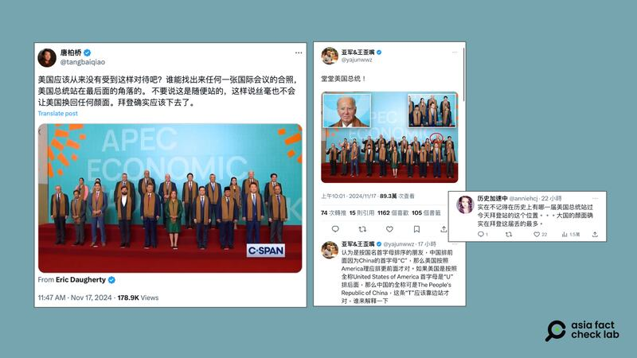
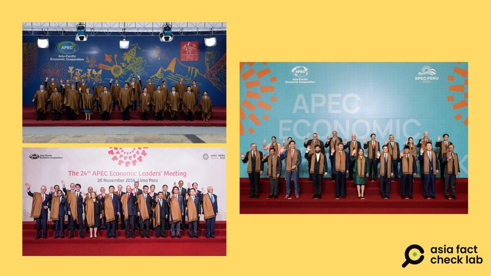

# Did Peru treat Xi and Biden differently during November APEC?

## Verdict: Misleading

By Zhuang Jing for Asia Fact Check Lab

2024.11.20

## A claim emerged in Chinese-language social media that Peru extended different levels of formality in welcoming Chinese President Xi Jinping and U.S. President Joe Biden during the APEC summit in November, hinting that Xi received a more favorable reception.

## But the claim is misleading. The two leaders visited Peru under different diplomatic circumstances and were greeted with different protocols.

The claim was [shared](https://x.com/XiaozhPhD04/status/1857956332206436423) on X on Nov. 17, 2024, alongside two images.

The first image features Xi walking on a red carpet at what seems to be an airport, accompanied by members of an honor guard. In contrast, the second image shows Biden at an airport as well, but with what appears to be a less elaborate reception.

“When Xi went to Peru for a meeting, heads of states from various countries lined up to welcome him. How does the world treat China and the United States today? Is the difference just a red carpet?” the X post reads.

afcl-apec-claim\_11202024\_11 Chinese online users claimed Xi was given a more formal reception than Biden upon their respective arrivals in Peru. (Screenshot/X)

The claim began to circulate online after leaders from 21 economies bordering the Pacific met for the annual Asia-Pacific Economic Cooperation forum to discuss strategies for the region’s major economies, on Nov. 15-16.

The event marked the likely final meeting between Biden and Xi before the U.S. leader leaves office in January 2025.

The same claim was also shared on [X](https://twitter.com/Snofy8/status/1857977228598063460) and Chinese platform [Netease](https://www.163.com/dy/article/JH5TB80605370GH5.html).

But the claim is false.

The two leaders visited Peru under different diplomatic degrees and were greeted with different protocols.

While attending APEC, Xi simultaneously [paid a “state visit”](http://en.cppcc.gov.cn/2024-11/14/c_1044832.htm) to Peru.

Other leaders at the summit such as Malaysian Prime Minister [Anwar Ibrahim](https://www.kln.gov.my/web/guest/-/official-visit-of-the-prime-minister-to-lima-peru-and-his-participation-at-the-asia-pacific-economic-cooperation-apec-economic-leaders-week-2024-13-16) and Vietnamese President [Leang Cuong](https://en.baochinhphu.vn/president-starts-official-visit-to-peru-111241113090606584.htm) also paid “official visits” to Peru during the summit, and both [were](https://theedgemalaysia.com/node/733789) [greeted](https://en.nhandan.vn/state-president-arrives-in-lima-beginning-official-visit-to-peru-attendance-at-aelw-post141173.html) with a red carpet upon arrival.

In contrast, Biden and other leaders such as Canadian Prime Minister Justin Trudeau were only in Lima to attend the APEC meeting, [not to make](https://www.youtube.com/watch?v=0mm02Be7-Tc) an “official visit” to Peru.

The [White House in a statement](https://www.whitehouse.gov/briefing-room/statements-releases/2024/11/07/statement-from-white-house-press-secretary-karine-jean-pierre-on-president-bidens-travel-to-peru-and-brazil/) described the purpose of Biden’s trip as “to reinforce the strong U.S.-Peru bilateral relationship” at the summit.

A “state visit” specifically [refers](https://www.voacantonese.com/a/japan-20150318/2685516.html) to a visit by a country’s head of state and includes a dinner and welcome ceremony as part of the reception.

An “official visit” more broadly refers to visits by high-ranking leaders of another country’s government, though they generally are received with the same level of formality as state visits.

## Biden seen in a back row

Chinese online users also [shared](https://twitter.com/tangbaiqiao/status/1857993946976202946) a group photo that shows all of the leaders who were attending APEC, to claim that Biden was standing in an “unprecedented humiliating position.”

The photo shows Biden standing second from the right in the back row, while Xi is positioned in the front center of the row.

“I don’t think the U.S. has ever been treated like this, right? Can anyone find a group photo of an international conference where the president of the United States is standing in the far back corner,” the post reads.

One comment reads: “I can’t remember any other U.S. president in history who stood in the same position as Biden today. A great nation really has lost face under him.”

afcl-apec-claim\_11202024\_2 Chinese online users commented that Biden’s position in a group photo taken at APEC was the first time a U.S. president had stood in the spot at the summit. (Screenshots/X)

But the claim is false. Former U.S. presidents George W. Bush and Barack Obama both stood in the same spot when they attended separate iterations of the summit in [2008](https://www.apec.org/meeting-papers/leaders-declarations/2008/2008_aelm) and [2016](https://www.apec.org/press/photos/2016/1120_leaders#&gid=1&pid=21).

White House spokesperson Sean Savett emphasized [this precedent and noted](https://nypost.com/2024/11/16/us-news/biden-humiliated-with-back-corner-spot-in-apec-family-photo-as-chinas-xi-get-place-of-honor-in-front/) that while a few leaders “stood out of order due to protocol errors,” Biden correctly stood in his arranged position.

afcl-apec-claim\_11202024\_3 Three separate U.S. presidents stood second from the right in the back row in group photos taken at separate APEC summits hosted by Peru – Bush in 2008 (top left), Obama in 2016 (bottom left), and Biden in 2024 (right). (Screenshots/X)

Bloomberg [reported](https://www.bloomberg.com/news/articles/2024-11-16/xi-takes-spotlight-in-apec-family-photo-with-biden-off-to-side?sref=TuLYJzYL) that while leaders in the APEC group photo are usually arranged in some alphabetical order, this is not a rule and may vary depending on the summit host.

Such an order would be in line with APEC guidelines [regulating](https://www.apec.org/docs/default-source/aboutus/policiesandprocedures/2023/guidelines-for-hosting-apec-meetings_updated-august-2023_approved-at-bmc2-2023.pdf?sfvrsn=315e8e21_2) that seating for ministerial meetings be in the alphabetical order of the names of the participating economies.

## *Translated by Shen Ke. Edited by Shen Ke and Taejun Kang.*

*Asia Fact Check Lab (AFCL) was established to counter disinformation in today’s complex media environment. We publish fact-checks, media-watches and in-depth reports that aim to sharpen and deepen our readers’ understanding of current affairs and public issues. If you like our content, you can also follow us on* [*Facebook*](https://www.facebook.com/asiafactchecklabcn)*,* [*Instagram*](https://www.instagram.com/asiafactchecklab/) *and* [*X*](https://twitter.com/AFCL_eng)*.*

[Original Source](https://www.rfa.org/english/factcheck/2024/11/20/afcl-apec-claim/)