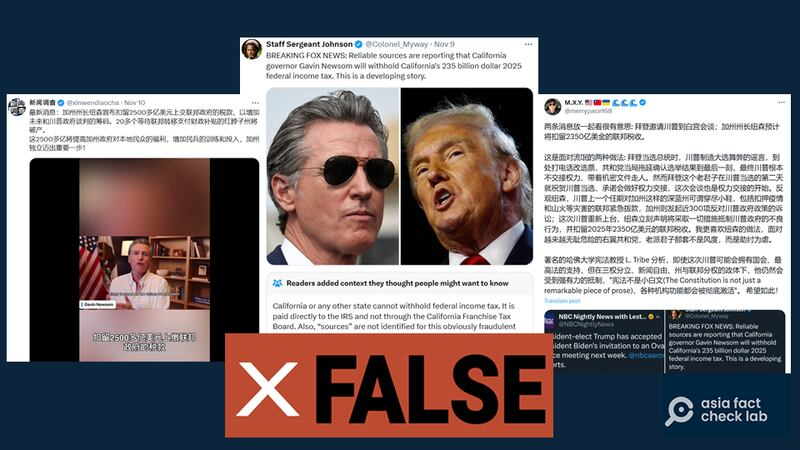
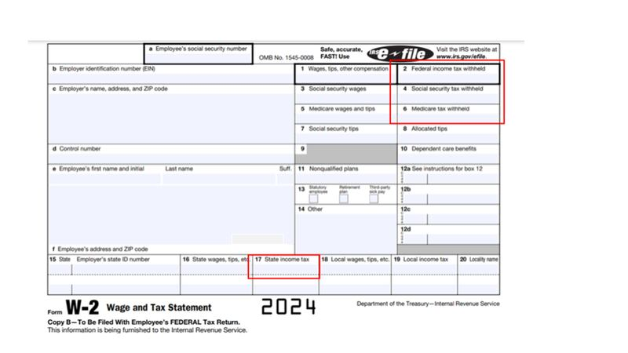

# Did California governor threaten to withhold state’s federal taxes?

## Verdict: False

By Rita Cheng for Asia Fact Check Lab

2024.11.22

## A video clip of California governor Gavin Newsom emerged in Chinese-language social media posts alongside a claim that it shows Newsom threatening to withhold hundreds of billions in federal taxes as leverage in negotiations with the incoming Trump administration.

## But the claim is false. The voiceover in Chinese does not match what Newsom actually said in the video. The governor never made such a remark. His office dismissed the claim. U.S. states cannot “withhold” federal income taxes because they neither collect nor pay them.

The video was [shared](https://x.com/xinwendiaocha/status/1855826420767068274) on X on Nov. 11, 2024.

The 59-second video shows what appears to be a media interview of Newsom. The voiceover in Chinese can be heard throughout the clip.

“The governor announced he would withhold more than US$250 billion in federal taxes as leverage in future negotiations with the Trump administration,” said the Chinese voiceover.

“This would be a major step towards California’s independence,” the post reads.

afcl-california-federal-tax\_11222024\_2 Many Chinese and English X accounts spread the claims that Newsom plans to withhold taxes from the federal government. (Screenshot/X)

The claim began to circulate online after former President Donald Trump secured a second, non-consecutive term by defeating Vice President Kamala Harris in the 2024 U.S. presidential election on Nov. 5.

There has been collective dismay at Trump’s victory in California, a stronghold of progressive values and a Democratic Party bastion, with some groups even suggesting that California leaves the United States and becomes a separate nation.

The same claim was also shared on Weibo [here](https://archive.ph/KGZxi) and [here](https://archive.ph/KGZxi).

But the claim is false.

afcl-california-federal-tax\_11222024\_1 A Weibo account claimed that California’s governor plans to withhold federal taxes as leverage in future dealings with the Trump administration. (Screenshot/Weibo)

A reverse image search found the video [published](https://x.com/GavinNewsom/status/1855387232225632745) on Newsom’s official X account on Nov. 10. It was his first on-camera interview following the U.S. presidential election.

A review of the video found no mention of withholding federal income taxes.

The interview was about a request for the California state legislature to convene a special session to implement state policies protecting “reproductive freedoms” including women’s right to abortion as soon as possible.

Newsom’s office told AFCL the claims were “absolutely false” and [referenced](https://www.gov.ca.gov/2024/11/06/2024-presidential-results/) a statement the governor made on Nov. 6 in response to election results as a clear signal of the governor’s intent.

“California will seek to work with the incoming president — but let there be no mistake, we intend to stand with states across our nation to defend our Constitution and uphold the rule of law” the governor said in the statement.

## State vs federal taxes

There are two types of annual income taxation in the U.S – state and federal taxes.

The former are collected by each state’s government and the latter by the federal government.

States cannot “withhold” federal income taxes because they neither collect nor pay them. The federal government collects them by levying payrolls directly from individuals and corporations.

Tax filing season in the U.S. typically begins with people receiving a statement of their past year’s wages along with [W-2 tax forms](https://www.irs.gov/pub/irs-pdf/fw2.pdf) from their employers which they use to report their income, file refunds, or pay back taxes to the Internal Revenue Service. Federal, state, and local income is reported separately during this process.

afcl-california-federal-tax\_11222024\_3 Instructions for a W-2 form. (Model W2 form taken from IRS website with annotations by AFCL)

[Article VIII of the U.S. Constitution](https://www.archives.gov/founding-docs/constitution-transcript "https://www.archives.gov/founding-docs/constitution-transcript") regulates the federal government’s ability to tax states, while [the 16th Amendment](https://www.archives.gov/founding-docs/amendments-11-27) clarified that Congress can directly tax citizens of any state on their income.

## *Translated by Shen Ke. Edited by Shen Ke and Taejun Kang.*

*Asia Fact Check Lab (AFCL) was established to counter disinformation in today’s complex media environment. We publish fact-checks, media-watches and in-depth reports that aim to sharpen and deepen our readers' understanding of current affairs and public issues. If you like our content, you can also follow us on* [*Facebook*](https://www.facebook.com/asiafactchecklabcn) *,* [*Instagram*](https://www.instagram.com/asiafactchecklab/) *and* [*X*](https://twitter.com/AFCL_eng) *.*

[Original Source](https://www.rfa.org/english/factcheck/2024/11/22/afcl-california-federal-tax/)