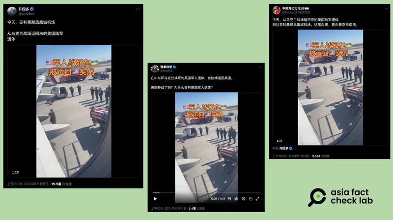
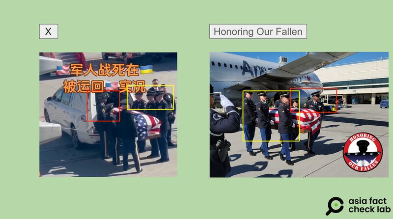
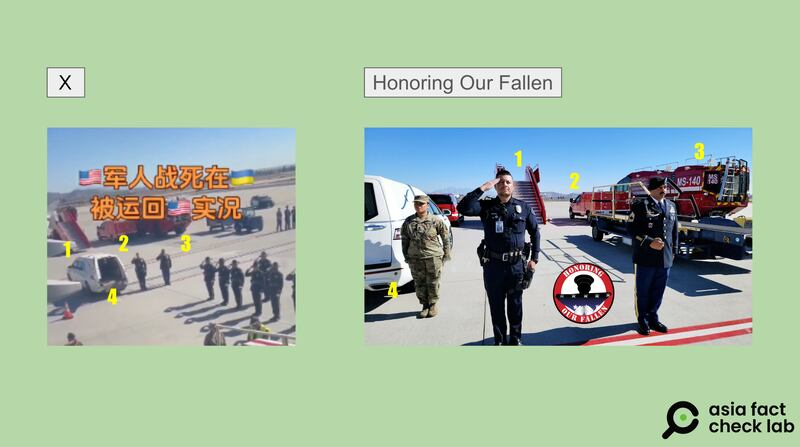

# Does a video show the repatriation of a US soldier killed in Ukraine?

## Verdict: False

By Dong Zhe for Asia Fact Check Lab

2024.11.25

## A video has been shared in Chinese-language social media posts that claim it shows the body of a U.S. soldier, who was killed while fighting in Ukraine, spotted at an American airport.

## But the claim is false. The video shows a ceremony dedicated to a U.S. Air Corps private killed in World War II. The U.S. has said it would assist Ukraine by offering supplies and training but not by sending American troops to fight there.

The video was [shared](https://x.com/xusiduo/status/1855039892797206584) on X Nov. 9, 2024.

The one-minute and 38-second video shows six people in what appears to be military uniform removing a casket covered by a U.S. flag from a plane and placing it in a white hearse.

“This is what happens when U.S.soldiers die in Ukraine and are shipped back to the states,” the post reads.

afcl-us-ukraine-repatriation\_11252024\_1 Online users claimed that a video of a coffin with an American flag draped atop it showed the remains of a U.S. soldier being “repatriated from the battlefields of Ukraine.” (Screenshot/X)

Similar claims were shared on [X](https://archive.ph/w7HL9) and [Weibo](https://archive.ph/VInaO), with some users questioning if the U.S. had entered the war fighting for Ukraine.

But the claim is false.

## Non-profit honoring forgotten soldiers

A combined reverse image search and key word searches [found](https://www.facebook.com/reel/553183294013521?fs=e&mibextid=UalRPS&rdid=yg5VKdFrxafanoRh&share_url=https%3A%2F%2Fwww.facebook.com%2Fshare%2Fr%2FstSibUG7ueRnGJgE%2F%3Fmibextid%3DUalRPS#) a video that shows similar scenes as those in the social media clip.

The video was posted by Honoring Our Fallen, a non-governmental organization that provides support for the U.S. fallen and their family members.

Laura Herzog, founder and CEO of the Honoring Our Fallen, told AFCL that the soldiers shown in the footage were actually her organization’s staff members.

Herzog noted that the ceremony captured in the video was dedicated to a U.S. Air Corps private killed in World War II named Harry M. Seiff, not a soldier involved in the Russo-Ukrainian war.

The Department of Defense, or DOD, [notes](https://www.dvidshub.net/news/484769/remains-world-war-ii-soldier-buried-los-angeles-california) in a press release that Seiff died in a prisoner-of-war camp in the Philippines on Nov. 14, 1942, following his capture by Japanese forces that year.

Seiff’s remains had [lain buried](https://www.dpaa.mil/News-Stories/ID-Announcements/Article/3867959/airman-accounted-for-from-wwii-seiff-h/) in the Manila American Cemetery and Memorial for over 70 years as an unknown soldier before being disinterred in 2018.

Scientists running DNA tests then confirmed the identity of the deceased and the body was finally interred at the Los Angeles National Cemetery on November 14, 2024.

afcl-us-ukraine-repatriation\_11252024\_2 The footage of the purported U.S. soldier from Ukraine being repatriated matches video and photos released by the non-profit organization Honoring Our Fallen. (Screenshots/X and Honoring Our Fallen)

afcl-us-ukraine-repatriation\_11252024\_3 The footage of the purported U.S. soldier from Ukraine being repatriated matches video and photos released by the non-profit organization Honoring Our Fallen. (Screenshots/X and Honoring Our Fallen)

## No U.S. troops in Ukraine

According to a White House [statement](https://www.whitehouse.gov/briefing-room/speeches-remarks/2024/06/13/remarks-by-president-biden-and-president-volodymyr-zelenskyy-of-ukraine-in-joint-press-conference-fasano-italy/) released following the signing of a bilateral security agreement with Kyiv during the 2024 G7 summit, the U.S. would assist Ukraine by offering supplies and training, “not by sending American troops to fight in Ukraine.”

Additional military assistance [announced](https://www.defense.gov/News/Releases/Release/Article/3937146/biden-administration-announces-additional-security-assistance-for-ukraine/) by the DOD to Ukraine on Oct. 16 did not include U.S. troops.

The defense department said in September that the U.S. had committed approximately US$56.3 billion in security assistance to Ukraine since the war began in February 2022.

But a [list](https://media.defense.gov/2024/Sep/26/2003554492/-1/-1/1/20240926-UKRAINE-FACT-SHEET-PDA-66-AND-USAI-T21.PDF) of the various forms of U.S. assistance does not include troops from any branch of the U.S. military among its items.

## *Translated by Shen Ke. Edited by Shen Ke and Taejun Kang.*

*Asia Fact Check Lab (AFCL) was established to counter disinformation in today’s complex media environment. We publish fact-checks, media-watches and in-depth reports that aim to sharpen and deepen our readers’ understanding of current affairs and public issues. If you like our content, you can also follow us on* [*Facebook*](https://www.facebook.com/asiafactchecklabcn)*,* [*Instagram*](https://www.instagram.com/asiafactchecklab/) *and* [*X*](https://twitter.com/AFCL_eng)*.*

[Original Source](https://www.rfa.org/english/factcheck/2024/11/25/afcl-us-ukraine-repatriation/)