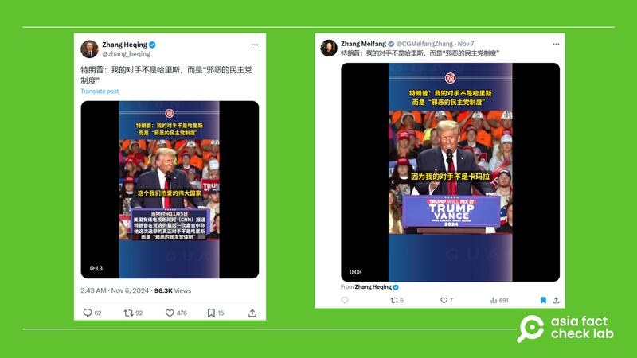
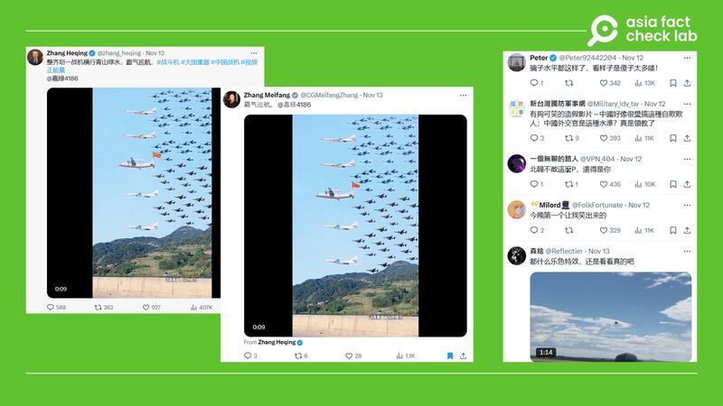

# Media Watch: What’s behind Chinese officials’ social media diplomacy

## Chinese diplomats have been clearly meddling in the domestic affairs of other nations.

By Rita Cheng for Asia Fact Check Lab

2024.12.02

Chinese diplomats, long champions of a non-interference policy, now find themselves under scrutiny for meddling in the domestic affairs of other countries.

In the latest case, Xue Jian, the Chinese consul general in Osaka, Japan, faced sharp criticism from the Japanese government for a post on his X account in which he openly advocated for specific candidates in recent elections. Japan deemed his comment “highly inappropriate.”

Although Xue removed the post at Japan’s insistence, other posts in which he weighs in on U.S. politics – written in Japanese – remain online, fueling the debate over China’s diplomatic boundaries.

## Targeting the US

Xue is not alone. Many Chinese diplomats have increasingly focused their attention on U.S. politics, even if some of them have no official responsibilities related to that country.

Both Xue and Zhang Heping, China’s cultural counselor in Pakistan, for instance, have often been seen spreading rumors online about ballot machine malfunctions and widespread voter fraud in the U.S. election.

afcl-china-official-social-media\_12022024\_1 Identical tweets posted by two different Chinese officials. (Screenshots/X)

And some of their posts have gone viral.

Data from the Hamilton 2.0 Dashboard – an online initiative tracking social media narratives linked to China, Russia, and Iran – shows a post by Zhang about the U.S. election became the sixth most popular post from an official Chinese source on X in the week of the election.

Some Chinese diplomats have gone beyond reposting misleading content, frequently employing AI-generated material to spread disinformation.

“I think the goal is to make U.S. democracy look unappealing so that the PRC is seen as a viable alternative,” said the dashboard’s creator and manager, Bret Schafer, referring to China by its official name, the People’s Republic of China.

“While I don’t think this particular video is going to help them achieve that goal, pointing to real or perceived flaws in the U.S. system has proven to be a successful propaganda strategy over time,” he told AFCL.

afcl-china-official-social-media\_12022024\_2 Chinese diplomats posted a video that included AI-generated Chinese warplane models. (Screenshot/X)

## Changes in Chinese diplomacy

Since 2019, Chinese diplomats have shifted from refuting criticism of China to actively disseminating disinformation on global platforms such as X, Facebook, and Google.

This marks a significant departure from the restraint that once defined Chinese foreign policy, encapsulated by the late statesman Deng Xiaoping’s principle of “hide your strength, bide your time” and former state councilor Dai Bingguo’s approach of “speaking big words in a soft voice.”

Such a change also aligns with the broader trend of “wolf warrior” diplomacy promoted by President Xi Jinping, who urges diplomats to “rouse oneself to action.”

As well as Xue and Zhang, another official, Zhang Meifang, former consul general in Belfast, has adopted a similarly combative and assertive style, signaling a profound shift in China’s diplomatic posture.

## Stirring chaos

David Bandurski, director of the China Media Project, believes that Chinese diplomats have intentionally set out to “add to the confusion” within the media landscape over the U.S. over the past five years.

“China is working to flood the social media space with a range of messages. Some may find viral impact, others fizzle,” he said. “But they understand that they can take advantage of the deeply disrupted information world.”

But Schafer from the Hamilton 2.0 Dashboard said he had observed a trend of some Chinese diplomats “significantly” toning down their messages lately, although many of them still spread conspiracy theories.

Schafer suggested this could be due to China’s “realization” that their aggressive posture on social media was hurting their reputation.

“So they have reverted back to focusing on trying to build a positive image of China,” Schafer noted.

## *Translated by Shen Ke. Edited by Taejun Kang.*

*Asia Fact Check Lab (AFCL) was established to counter disinformation in today’s complex media environment. We publish fact-checks, media-watches and in-depth reports that aim to sharpen and deepen our readers’ understanding of current affairs and public issues. If you like our content, you can also follow us on* [*Facebook*](https://www.facebook.com/asiafactchecklabcn)*,* [*Instagram*](https://www.instagram.com/asiafactchecklab/) *and* [*X*](https://twitter.com/AFCL_eng)*.*

[Original Source](https://www.rfa.org/english/factcheck/2024/12/02/afcl-china-official-social-media/)