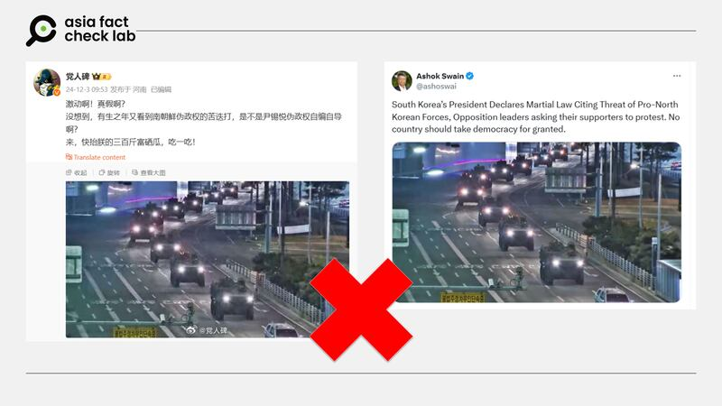
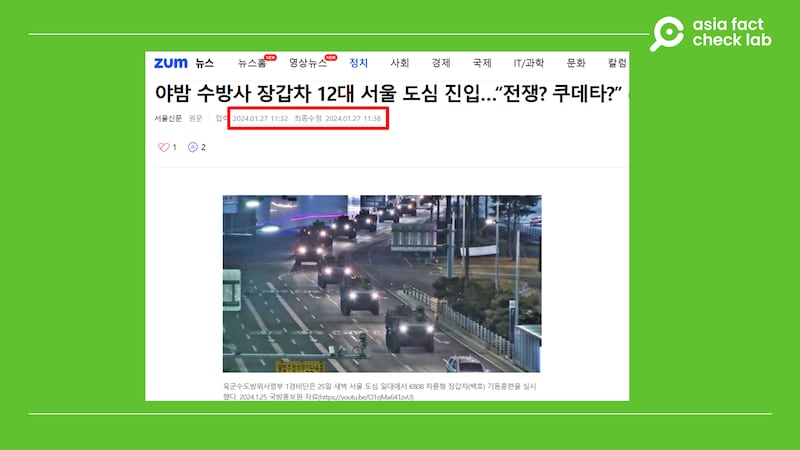

# Does a photo show armored vehicles in Seoul after South Korea declared martial law?

## Verdict: False

By Rita Cheng for Asia Fact Check Lab

2024.12.04

## A photo of multiple armored vehicles has been shared in Chinese-language social media posts that claim the photo was taken after South Korea declared martial law on Dec. 3, 2024.

## But the claim is false. The photo was published in January and shows military exercises arranged by the South Korean army to strengthen its armored division’s readiness to conduct maneuvers in an urban environment.

The photo was [shared](https://archive.ph/vVJms) on Weibo on Dec. 3, 2024 after South Korea declared martial law.

South Korean President Yoon Suk Yeol declared it to counter “threats from North Korea” and “anti-state activities” by the domestic political opposition.

According to Yoon’s declaration, martial law would begin at 11 p.m. Tuesday, but the National Assembly voted to lift the decree nearly three hours later as protesters rallied outside, which led Yoon to end it.

South Korea’s constitution allows the president to declare martial law in periods of national emergency but also stipulates that the president must comply if a majority of the National Assembly votes to lift martial law.

“Exciting! Is it real? Didn’t expect to see a coup d'état of another Korean puppet government again in my life. Wonder if Yoon Suk Yeol’s regime is orchestrating this?” the Weibo post reads.

afcl-korea-martial-law-photo\_12042024 Chinese and English social media users posted images of armored vehicles moving in formation at night in a city, purportedly taken after declaration of martial law in South Korea. (Screenshots/Weibo and X)

The same photo was shared on X in English and Korean.

But the claim is false.

## Old image

A reverse image search found that the same photo was originally [published](https://news.zum.com/articles/88427712) in a report by South Korean daily Soule Shinmun on Jan. 25, 2024.

“The 1st Security Group of the Army’s Capital Defense Command conducted a K808 White Tiger wheeled armored personnel carrier maneuver training in the downtown area of Seoul in the early morning of the 25th,” the caption of the photo reads.

afcl-korea-martial-law-photo\_12042024\_2 One of the images of tanks purportedly taken after Dec. 3 shows from South Korean military drills held in early 2024. (Screenshot/Seoul Shinmun)

The photo was credited to South Korea’s Defense Media Agency with a link to a YouTube clip [published](https://www.youtube.com/watch?v=O1qMa641zvU) on Jan. 25.

At the 25-second mark, the clip features the exact same scene depicted in the latest photo shared on social media.

AFCL found photos of soldiers, military vehicles, and helicopters gathering around South Korea’s National Assembly following the declaration of martial law as seen [here](https://www.reuters.com/pictures/scenes-south-korea-president-yoon-suk-yeol-declares-martial-law-2024-12-03/C2YIUFIDNRLPNFDER2CEQCZM44/) and [here](https://en.yna.co.kr/view/AEN20241203012155315).

But none of them match photos shared on social media with a misleading claim.

## *Translated by Shen Ke. Edited by Taejun Kang.*

*Asia Fact Check Lab (AFCL) was established to counter disinformation in today’s complex media environment. We publish fact-checks, media-watches and in-depth reports that aim to sharpen and deepen our readers’ understanding of current affairs and public issues. If you like our content, you can also follow us on* [*Facebook*](https://www.facebook.com/asiafactchecklabcn)*,* [*Instagram*](https://www.instagram.com/asiafactchecklab/) *and* [*X*](https://twitter.com/AFCL_eng)*.*

[Original Source](https://www.rfa.org/english/factcheck/2024/12/04/afcl-korea-martial-law-photo/)