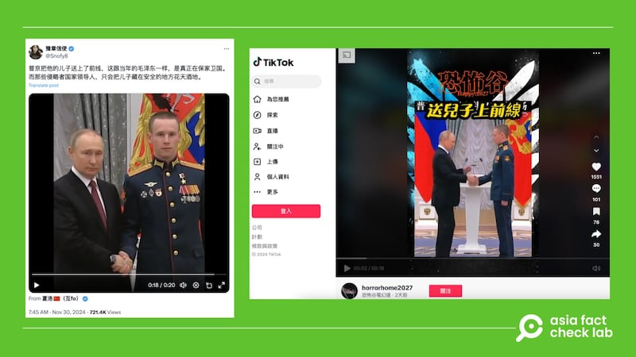

# Does a video show Putin sending off his son to Ukraine?

## Verdict: False

By Zhuang Jing for Asia Fact Check Lab

2024.12.06

## A video emerged in Chinese-language social media posts that claim it shows Russian President Vladimir Putin sending off his son to fight in the war against Ukraine.

## But the claim is false. The video shows Putin awarding a Gold Star to a Russian soldier named Stepan Belov. Details about Putin’s family remain largely private, but he has previously confirmed having two daughters from his first marriage, which ended in divorce in 2014.

The video was [shared](https://x.com/Snofy8/status/1862644092444029057) on X on Nov. 30, 2024.

“Like Mao back in the day, Putin sent his son to the front in defense of his country. In contrast, the leaders of those aggressor countries just let their sons live it up in safety,” the X post reads.

A 20-second clip shows what appears to be an award ceremony featuring Putin and a man in military uniform. Putin pinned a medal on the man’s shirt and posed with him for a photo.

afcl-putin-ukraine-son\_12062024\_1 Some online users claim that Putin sent his son to the front lines in Ukraine. (Screenshots/X and TikTok)

Mao Zedong, the founding father of the People’s Republic of China, sent his eldest son, Mao Anying, to fight in the Korean War. This decision was deemed significant and symbolic, reflecting Mao’s belief in personal sacrifice and his dedication to Communist ideals.

The same video and the claim were shared on [TikTok](https://www.tiktok.com/@horrorhome2027/video/7442995813690723591) and [Threads](https://www.threads.net/@chiahong.chao.9/post/DC8Ne-QvtDg).

But the claim is false.

## A Russian lieutenant

A reverse image search found a photo that shows Putin and the same man posing together published by UPI news agency [here](https://www.upi.com/News_Photos/view/upi/f3465606e1c2ada9e57afdb014b5acd8/President-Putin-Attends-Ceremony-for-Presenting-State-Decorations/) on Dec. 20, 2022.

“Russian President Vladimir Putin, left, awards Senior Lieutenant Stepan Belov with the Gold Star medal of the Hero of Russia during the ceremony for presenting state decorations of the Russian Federation at the Kremlin’s St. Catherine Hall in Moscow, Russia on December 20, 2022,” the caption of the photo reads.

Keyword searches found the identical video published on the website of Kremlin [here](http://www.kremlin.ru/events/president/news/70150).

“The honorary title of Hero of Russia was awarded to Senior Lieutenant Stepan Belov and Major Konstantin Shirokov,” the website reads.

“The highest state decorations will be presented to outstanding Russians for their activity in education, science, medicine and healthcare, industry, agriculture, maritime transport, and a number of other areas,” it reads further.

## Stepan Belov

Belov was born in 1996 in the city of Oktyabrsky, Republic of Bashkortostan, in the family of Mikhail Gennadyevich and Tamara Vitalyevna Belovykh, according to the website “Heroes of the Fatherland.”

On Feb. 24, 2022, Belov took part in Russia’s special operation Ukraine, as Russia describes its invasion of its southern neighbor at that time. In February-April, his unit took part in combat operations in the Kyiv area, the website said.

AFCL has not been able to independently verify his connection with Putin.

## Putin’s children

Details about Putin’s family remain largely private but he has previously [confirmed](https://archive.ph/hWXz7) having two daughters from his first marriage, which ended in divorce in 2014.

But the dissident Russian news outlet Dossier Center, citing unidentified sources, reported that Putin had two sons with former Olympic gymnastics champion Alina Kabaeva, though Russian officials have denied that.

According to the Dossier Center, a first son was born in 2015, while a second son was born in 2019, which makes them around the ages of 9 and 5, as of 2024.

## *Translated by Shen Ke. Edited by Taejun Kang.*

*Asia Fact Check Lab (AFCL) was established to counter disinformation in today’s complex media environment. We publish fact-checks, media-watches and in-depth reports that aim to sharpen and deepen our readers’ understanding of current affairs and public issues. If you like our content, you can also follow us on* [*Facebook*](https://www.facebook.com/asiafactchecklabcn)*,* [*Instagram*](https://www.instagram.com/asiafactchecklab/) *and* [*X*](https://twitter.com/AFCL_eng)*.*

[Original Source](https://www.rfa.org/english/factcheck/2024/12/06/afcl-putin-ukraine-son/)