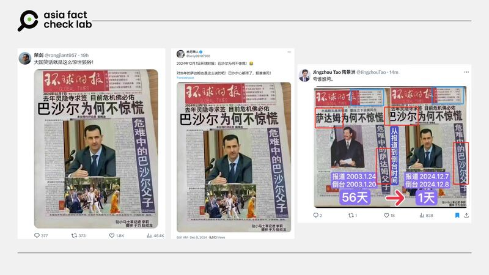
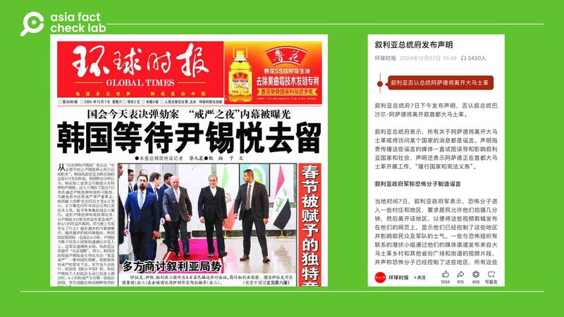

# Did a Chinese tabloid publish a front-page story about Bashar al-Assad’s fall?

## Verdict: False

By Rita Cheng for Asia Fact Check Lab

2024.12.11

## A photo of what appears to be a front page of a newspaper emerged in Chinese-language social media posts that claim it shows coverage of Syrian leader Bashar al-Assad by China’s state-run tabloid, the *Global Times*.

## But the claim is false. The photo has been digitally doctored. The original photo shows a *Global Times* report about former Iraqi president Saddam Hussein published in 2003.

The photo was shared [here](https://archive.ph/PRltU) on X on Dec. 8, 2024.

The photo shows an old front-page news article purportedly published by the *Global Times*.

The headline of the article, dated Dec. 7, 2024, reads: “Why Bashar is not alarmed.”

afcl-global-times-assad\_12112024\_1 Screenshot of a post on X that purportedly shows the front page of the Global Times on Dec. 7, 2024. (Screenshot/X)

In early December, Syrian President Bashar al-Assad’s regime collapsed following a swift offensive by rebel forces, notably Hayat Tahrir al-Sham, which led to the capture of Damascus. Assad and his family fled to Russia, where they were granted political asylum.

The fall of Assad’s regime drew significant attention in China as Syria was a strategic partner and a member of China’s Belt and Road Initiative, which aims to enhance Chinese influence and economic interests in the region through construction efforts.

However, Beijing’s reaction has been cautious, emphasizing the need for a political solution to restore stability while avoiding direct involvement with Syria’s new leadership.

The claim about the *Global Time*’s front page coverage was also shared [here](https://archive.ph/c8ogC) and [here](https://archive.ph/7U5c9) on X.

But the photo has been digitally doctored.

## Doctored image

A reverse image search found the original photo shows a *Global Times* report about former Iraqi president Saddam Hussein published on Jan. 27, 2003.

A user on X [shared](https://archive.ph/SIcRE) an image of one of the article’s original print copies in January 2024. A digitized version of the text [is accessible on](https://archive.ph/3PzwA) the Chinese aggregate news site Sohu.

The original report was published several months before Saddam’s downfall following the U.S. invasion of Iraq.

A comparison of the original photo and the doctored image reveals that the word “Bashar” was added over Saddam’s name in the edited version.

The added text uses a different font style, making it inconsistent with the rest of the headline in black and the white text in a blue column on the right side of the page.

## Actual front page

*The Global Times*’ front-page coverage on Dec. 7, 2024 [detailed](https://archive.ph/pWTqd) the political fallout following current South Korean president Yoon Suk Yeol’s short-lived declaration of martial law a few days earlier.

afcl-global-times-assad\_12112024\_2 The Global Times did not cover Syria on the front page of its Dec. 7 edition but did publish a short report on the country that day. Both differ from the influencers’ doctored image featuring a picture of Assad. (Screenshot/Global Times and WeChat)

The Chinese tabloid separately [published a report](https://archive.ph/DDYmR) online about Syria on Dec. 7, citing a statement from the Syrian Presidential Palace denying claims that Assad had left Damascus.

The phrase “Why Bashar is not alarmed” was not used in the article’s title or body.

## *Translated by Shen Ke. Edited by Taejun Kang.*

*Asia Fact Check Lab (AFCL) was established to counter disinformation in today’s complex media environment. We publish fact-checks, media-watches and in-depth reports that aim to sharpen and deepen our readers’ understanding of current affairs and public issues. If you like our content, you can also follow us on* [*Facebook*](https://www.facebook.com/asiafactchecklabcn)*,* [*Instagram*](https://www.instagram.com/asiafactchecklab/) *and* [*X*](https://twitter.com/AFCL_eng)*.*

[Original Source](https://www.rfa.org/english/factcheck/2024/12/11/afcl-global-times-assad/)