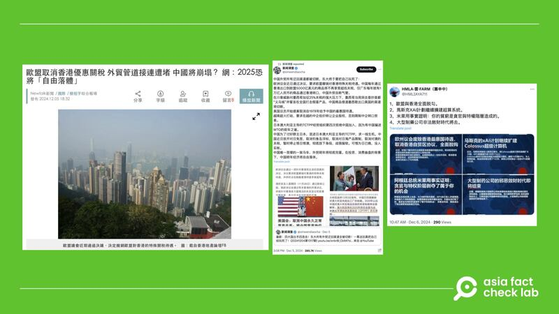

# Has the EU decided to cancel favorable trade treatment for Hong Kong?

## Verdict: Misleading

By Zhuang Jing for Asia Fact Check Lab

2024.12.13

## A claim emerged in Chinese-language reports that the European Union decided to cancel favorable tariff policies towards Hong Kong.

## But the claim is misleading. The reports cited an EU resolution that is a non-binding request designed to draw attention to the latest issues in Hong Kong. As of Dec. 13, the bloc had not revoked the city’s favorable customs treatment.

The claim was shared in a report [published](https://archive.ph/S8wLi) by the Taiwanese media outlet NewTalk News on Dec. 5, 2024.

“The European Parliament has recently passed a resolution to revoke the EU’s special tariff treatment for Hong Kong,” the report reads in part.

The report cited a post on X uploaded by “News Investigation” that reads: “The European Parliament has recently passed a resolution requesting the European Union to revoke favorable tariff treatment for Hong Kong. The US$500 billion in annual Chinese exports to the EU which pass through Hong Kong will no longer enjoy ultra-low tariffs.”

afcl-eu-hong-kong-trade\_12132024\_1 Online media claimed that the EU decided to cancel favorable tariffs previously enjoyed by Hong Kong. (Screenshots/NewTalk News and X)

The EU has historically granted Hong Kong favorable customs treatment, recognizing its status as a separate customs territory distinct from mainland China. This arrangement facilitated trade by simplifying customs procedures and reducing tariffs, thereby promoting economic exchange between the EU and Hong Kong.

The claim about the EU revoking Hong Kong’s favorable customs treatment is false.

## EU resolution on Hong Kong

Keyword searches found a resolution regarding Hong Kong passed by the EU on Nov. 28, 2024 [here](https://www.europarl.europa.eu/doceo/document/TA-10-2024-0051_EN.html).

“Calls on the EEAS [European External Action Service] and the Member States to warn China that its actions in HK will have consequences for EU-China relations; calls on the Council … to revoke HK’s favourable customs treatment and review the status of the HK Economic Trade Office in Brussels,” the resolution reads in part.

The European Parliament adopts three types of resolutions, including non-legislative ones, which offer greater flexibility by allowing the parliament to address any topic it deems relevant. These resolutions are non-binding. The recent resolution on Hong Kong falls under this category.

While such resolutions express the parliament’s views, they do not impose any obligation on other EU institutions to act on their calls. Instead, the primary purpose of these resolutions is to draw the attention of other European institutions to specific issues.

The EU’s resolution was in response to a Hong Kong court jailing 45 democracy supporters for up to 10 years.

In all, 47 Hong Kong opposition politicians and pro-democracy activists were charged with “conspiracy to commit subversion” under the city’s 2020 National Security Law for taking part in a democratic primary in the summer of 2020. Two were acquitted.

Amid growing calls for further sanctions on Hong Kong and the expansion of lifeboat visa schemes for those fleeing the ongoing political crackdown in the city, the governments of the U.S., U.K. and Australia, and the United Nations slammed the sentencing.

The EU resolution on Hong Kong, passed with 473 votes in favor, 23 against and 98 abstentions, calls on the city to immediately release the jailed activists as well as pro-democracy media tycoon Jimmy Lai.

## *Translated by Shen Ke. Edited by Taejun Kang.*

*Asia Fact Check Lab (AFCL) was established to counter disinformation in today’s complex media environment. We publish fact-checks, media-watches and in-depth reports that aim to sharpen and deepen our readers’ understanding of current affairs and public issues. If you like our content, you can also follow us on* [*Facebook*](https://www.facebook.com/asiafactchecklabcn)*,* [*Instagram*](https://www.instagram.com/asiafactchecklab/) *and* [*X*](https://twitter.com/AFCL_eng)*.*

[Original Source](https://www.rfa.org/english/factcheck/2024/12/13/afcl-eu-hong-kong-trade/)