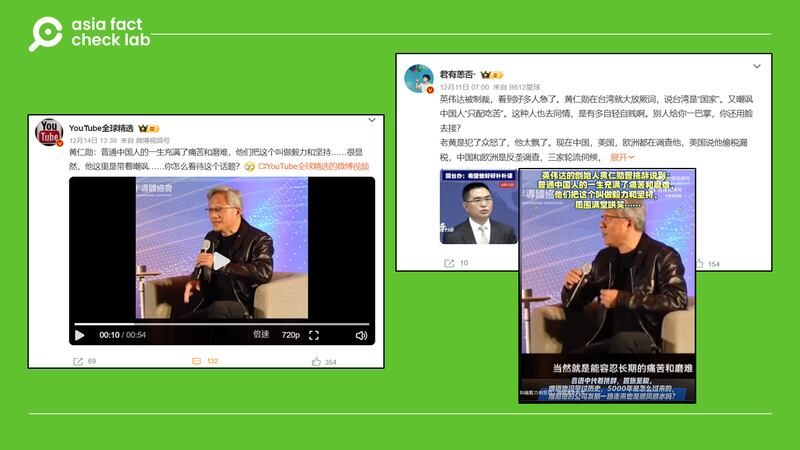
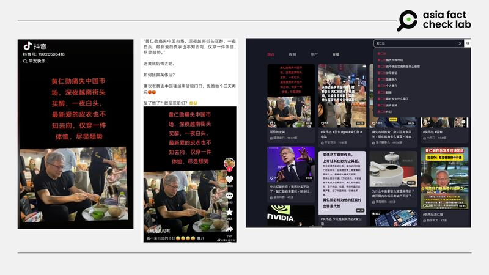
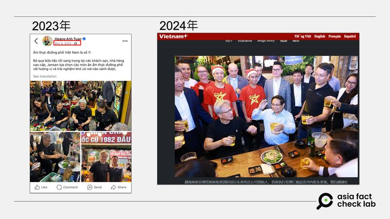

# Media Watch: Rumors hit chipmaker Nvidia amid US-China row

## American chipmaker faces scrutiny as China launches an antitrust probe amid export controls.

By Rita Cheng and Alan Lu for Asia Fact Check Lab

2024.12.20

The escalating chip row between the United States and China has taken a sharp turn as tensions over semiconductor technology grow. With Donald Trump set to begin his new term as president in January, uncertainties surrounding U.S. policies are fueling speculation.

Amid this volatile environment, rumors targeting American chipmaker Nvidia have surfaced in China, particularly after Beijing [announced](https://www.rfa.org/english/china/2024/12/10/china-nvidia-investigation-chip/) an antitrust investigation into the company.

As the world’s largest provider of processors that power artificial intelligence, Nvidia is now under scrutiny just weeks after the U.S. unveiled a sweeping semiconductor export control package aimed at curbing China’s technological advances.

Below is what AFCL found.

## Did Nvidia’s CEO mock Chinese people?

A video emerged in Chinese-language social media posts that claim it shows Nvidia CEO Jensen Huang mocking Chinese people by saying they enjoyed pain and suffering.

The caption of the video shared [here](https://v.douyin.com/iUB5QwUA/) and [here](https://archive.ph/wip/tJgqF) reads: “Nvidia’s founder Jensen Huang provocatively says: The life of ordinary Chinese people is full of pain and suffering, which they call will and grit. And the room laughs.”

The 54-second video shows what appears to be Huang’s media interview.

afcl-china-nvdia-rumor\_12202024\_1 Some Chinese online users claimed that Jensen Huang mocked Chinese people. (Screenshot/Weibo)

But the claim is false.

A keyword search found the original video [published](https://www.youtube.com/watch?v=F2eis4isQiA) on the YouTube channel of the Chinese American Semiconductor Professional Association on Dec. 11, 2023.

A review of the video shows Huang was actually discussing the benefits of being raised by Chinese parents.

At the video’s 54-minute mark, a member of the audience can be heard asking Huang what qualities he believed most contributed to his success.

In response, Huang stressed the importance of character in success, saying that he thought the questioner was “blessed to have been raised (as) Chinese.”

He added: “One of the characteristics of Chinese, of course, is the ability to tolerate long-term pain and suffering. If you’ve been raised by a Chinese parent, you have enjoyed a lot of pain and suffering.

“Isn’t that right? And so, in fact, the ability to endure pain and suffering is called grit, GRIT. It is now recognized as one of the most important characteristics of successful people and so I wish upon you a lifelong, plenty of pain and suffering.”

It’s clear that Huang was referring to the broader values and traditions he associated with Chinese culture when he mentioned the term “Chinese”, not specifically “Chinese nationality.”

## Does a photo show Huang getting drunk in Vietnam after ‘losing’ the Chinese market?

A photo of Huang was [shared](https://v.douyin.com/iUB5QB2q/) on Douyin, China’s equivalent of TikTok, on Dec. 15, 2024, alongside a claim that it shows Huang “getting drunk” in Vietnam after “losing” the Chinese market.

The photo and the claim began to circulate online after China [opened](https://www.rfa.org/english/china/2024/12/10/china-nvidia-investigation-chip/) an antitrust investigation into Nvidia.

“Down at losing the Chinese market, Jensen Huang drowned his sorrows on a Vietnamese street corner, going grey haired overnight,” the caption of the image reads.

“Don’t know where his new beloved leather jacket went, he’s just wearing a T-shirt, clearly distraught.”

afcl-china-nvdia-rumor\_12202024\_2 Some Chinese online users claimed Huang got drunk in Vietnam after the recent investigation by China was launched against Nvidia. (Screenshot/Douyin)

But the claim is false.

A reverse image search found the corresponding photo [published](https://www.yahoo.com/news/nvidias-billionaire-ceo-jensen-huang-220233307.html?guccounter=1&guce_referrer=aHR0cHM6Ly93d3cuZ29vZ2xlLmNvbS8&guce_referrer_sig=AQAAAMYKPyqrLbOlK446xEIy4EPzvo67_pkQfso1XlbU70NGykc3ZK0yKINALp5vkvrlTitD4Xw2XXukXqKpGNdW6DX03QMuer6yTyujhXfdDUvs-QS02ZaIeIz5HMuz4qSIcQ56h5RojGYRXncTt_JExqUE1I_3qLWtpe26oezG7U1b) in media reports in December 2023, months before China’s recent investigation against the American chipmaker.

The same photo was also [uploaded](https://www.facebook.com/share/p/fnHSfZADGaF7ZBwt/) by Vietnam’s consul-general in San Francisco Hoang Anh Tuan on his Facebook page on Dec. 10, 2024.

afcl-china-nvdia-rumor\_12202024\_33 The purported recent photo of Huang was actually taken during a visit to Vietnam in 2023. (Screenshots/Facebook and Vietnam+)

## Is Nvidia pulling out of China due to the investigation?

A claim has been repeatedly [circulated](https://archive.ph/7y0M6) in Chinese-language posts that Nvidia plans to exit China due to Beijing’s antitrust investigation.

However, the claim lacks evidence.

Nvidia dismissed the claim on Dec. 12, a few days after China’s announcement of the investigation, and said it would “continue” to serve Chinese customers.

“China is an important market for Nvidia. Nvidia adheres to the original intention of putting customers first and will continue to provide Chinese customers with the highest quality and most efficient products and services,” the company said in its official Weibo page.

afcl-china-nvdia-rumor\_12202024\_4 Screenshot of Nvidia’s statement dismissing online rumors about its plan to exit China. (Screenshot/Weibo)

Separately, Huang [said](https://www.rfa.org/english/china/2024/12/10/china-nvidia-investigation-chip/) in November that the chipmaker remained committed to maintaining its presence in mainland China.

Keyword searches found no credible reports or statements that show Nvidia’s plan to exit China.

## *Translated by Shen Ke. Edited by Taejun Kang.*

*Asia Fact Check Lab (AFCL) was established to counter disinformation in today’s complex media environment. We publish fact-checks, media-watches and in-depth reports that aim to sharpen and deepen our readers’ understanding of current affairs and public issues. If you like our content, you can also follow us on* [*Facebook*](https://www.facebook.com/asiafactchecklabcn)*,* [*Instagram*](https://www.instagram.com/asiafactchecklab/) *and* [*X*](https://twitter.com/AFCL_eng)*.*

[Original Source](https://www.rfa.org/english/factcheck/2024/12/20/afcl-china-nivida-rumors/)