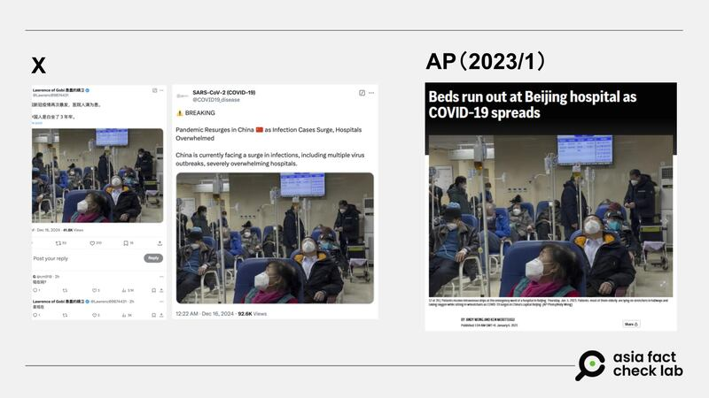

# Does a photo show COVID patients in China in December 2024?

## Verdict: Misleading

By Zhuang Jing for Asia Fact Check Lab

2024.12.23

## A photo of what appears to be a group of patients waiting in a hospital lobby emerged in Chinese-language social media posts that claim it shows “recent” COVID-19 patients at a Chinese hospital “overcrowded” with cases.

## But the claim is false. The photo was actually published in January 2023. As of December 2024, COVID-19 cases in China remain “at lower epidemic level,” according to Chinese health authorities. Keyword searches found no credible reports to show there was a surge in COVID-19 cases in China in recent months.

The photo was [shared](https://x.com/Lawrenc09874431/status/1868373575868227611) on X on Dec. 16, 2024.

“Hospitals are overcrowded as the Chinese Communist Party’s COVID-19 virus breaks out again. It seems that the Chinese have spent three years in prison for nothing,” the post reads.

The photo shows a large number of patients wearing masks in a hospital lobby.

Some social media users appear to have been misled by the photo and the claim.

One user even commented that the photo depicted an event happening “now.”

COVID-19 emerged in the Chinese city of Wuhan in late 2019, with the first cases linked to a seafood market where various live animals were also on sale. By January 2020, China imposed strict lockdowns in Wuhan and later expanded measures nationwide, including mass testing, travel restrictions, and quarantine protocols.

The government implemented a “zero-COVID” policy, which focused on eradicating outbreaks through aggressive containment. The measures were initially effective in reducing cases but sparked debates over economic impacts and civil liberties. In late 2022, China began easing restrictions due to protests and economic pressure, transitioning to a strategy of coexisting with the virus.

But the claim about the photo is false.

## Old photo

A reverse image search found that the photo was [published](https://apnews.com/article/politics-health-china-government-beijing-762d314d452875ecc525d5c21dbfa541) by the Associated Press in January 2023.

The caption of the photo, credited to AP journalist Andy Wong, reads: “Patients receive intravenous drips at the emergency ward of a hospital in Beijing, Thursday, Jan. 5, 2023.”

“Patients, most of them elderly, are lying on stretchers in hallways and taking oxygen while sitting in wheelchairs as COVID-19 surges in China’s capital Beijing,” the caption reads further.

afcl-china-covid-surge-photo\_12232024\_1 Some Chinese social media users claimed that there has been a new wave of COVID in China (left), while the photo they use as evidence of hospital overcrowding was taken from an Associated Press news report released in January 2023 (right). (Screenshots/X and AP)

## Official data

As of December 2024, COVID-19 cases in China remain “at lower epidemic level,”according to the Chinese Center for Disease Control and Prevention, or China CDC, data released on Dec. 19, 2024.

In the week of December 9–15, 2024, sentinel hospitals reported that 1.9% of outpatient influenza-like illness cases and 2.1% of hospitalized severe acute respiratory infection cases tested positive for COVID-19, China CDC said.

These percentages have remained stable, indicating no significant resurgence of COVID-19 nationwide, it added.

Health authorities monitor the situation closely and recommend maintaining preventive measures, including vaccination and good respiratory hygiene, to mitigate the spread of respiratory illnesses, China CDC noted.

Keyword searches found no credible reports to show there was a surge in COVID-19 cases in China in recent months.

AFCL has not been able to independently confirm whether China had seen a surge in COVID-19 cases in recent months.

However, there have been media [reports](https://udn.com/news/story/7332/8399638) of overcrowding at Chinese hospitals in early December 2024 due to mass infections of norovirus – a highly contagious but typically non-lethal cause of diarrhea – with at least one doctor interviewed by overseas Chinese media [suspecting](https://www.ntdtv.com/b5/2024/12/04/a103934900.html) that the actual cause might be COVID-19.

## *Translated by Shen Ke. Edited by Taejun Kang.*

*Asia Fact Check Lab (AFCL) was established to counter disinformation in today’s complex media environment. We publish fact-checks, media-watches and in-depth reports that aim to sharpen and deepen our readers’ understanding of current affairs and public issues. If you like our content, you can also follow us on* [*Facebook*](https://www.facebook.com/asiafactchecklabcn)*,* [*Instagram*](https://www.instagram.com/asiafactchecklab/) *and* [*X*](https://twitter.com/AFCL_eng)*.*

[Original Source](https://www.rfa.org/english/factcheck/2024/12/23/afcl-china-covid-surge-photo/)