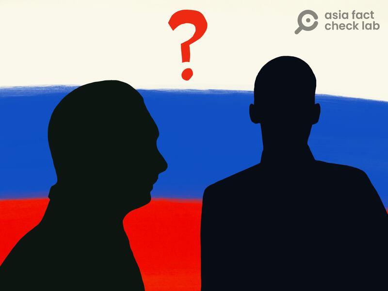

# Top 5 debunks of 2024 — Asia Fact Check Lab’s year in review

## Taylor Swift and Vladimir Putin weren’t spared from Chinese-language media’s disinformation campaigns.

By Asia Fact Check Lab

2024.12.24

The disputed South China Sea, Xinjiang in northwestern China and the Russia-Ukraine war were among the topics used in Chinese-language media disinformation campaigns in 2024.

Here are Asia Fact Check Lab’s top five fact checks of the year:

## Did Taiwan’s president complain about his predecessor in a leaked audio recording?

Verdict: False

asia-fact-check-lab-top-5-2024 Illustration (AFCL)

In January 2024, Taiwan held its presidential election, during which a significant amount of false information emerged before and after the voting.

Following the inauguration of Taiwanese President Lai Ching-te on May 20, [a claim emerged that Lai complained](https://www.rfa.org/english/news/afcl/afcl-lai-audio-06112024233916.html "https://www.rfa.org/english/news/afcl/afcl-lai-audio-06112024233916.html") about his predecessor, Tsai Ing-wen, in a leaked audio.

What makes this particular case noteworthy is that it likely involves the use of AI-generated human voices for deception, marking the first time AFCL has encountered such a case for fact-checking.

## Does a video show Putin sending his son to Ukraine?

Verdict: False

asia-fact-check-lab-top-5-2024 Illustration (AFCL)

A video emerged in Chinese-language social media posts that claimed it showed Russian President Vladimir Putin [sending off his son to fight in the war](https://www.rfa.org/english/factcheck/2024/12/06/afcl-putin-ukraine-son/ "https://www.rfa.org/english/factcheck/2024/12/06/afcl-putin-ukraine-son/") against Ukraine.

But the claim is false. The video shows Putin awarding a Gold Star to a Russian soldier named Stepan Belov. Details about Putin’s family remain largely private, but he has previously confirmed having two daughters from his first marriage, which ended in divorce in 2014.

The year 2024 is certainly not short of false narratives surrounding the Russia-Ukraine war, and this is a typical example.

## Taiwanese YouTubers’ visit to Xinjiang, genuine or propaganda?

asia-fact-check-lab-top-5-2024 Illustration (AFCL)

The Chinese government has invited Taiwanese influencers to travel to Xinjiang, home to 12 million Uyghurs who have been persecuted for years, and [create promotional videos](https://www.rfa.org/english/news/afcl/afcl-taiwan-youtuber-xinjiang-10082024000704.html "https://www.rfa.org/english/news/afcl/afcl-taiwan-youtuber-xinjiang-10082024000704.html").

The Taiwanese YouTubers have faced scrutiny for creating videos about Xinjiang that align with China’s official stance on the region, where the United States and other Western parliaments have declared China to be committing a genocide against the Uyghurs.

AFCL also found several YouTubers who promoted the message that Xinjiang was a safe place to travel and there were “no concentration camps” there because they didn’t see them.

## Did Taylor Swift say the US couldn’t prevent an invasion of Taiwan?

Verdict: False

A claim emerged in Chinese-language social media posts that Taylor Swift had recently said on a talk show [that the U.S. lacked the ability to prevent an invasion of Taiwan](https://www.rfa.org/english/news/afcl/fact-check-taylor-swift-taiwan-04032024103426.html "https://www.rfa.org/english/news/afcl/fact-check-taylor-swift-taiwan-04032024103426.html"). The posts cited several screenshots purportedly taken from the episode of the show.

But the claim is false. The screenshots were from an interview with Swift on “Late Night with Seth Meyers” that aired in 2021. During the show, she made no mention of the United States, Taiwan or an invasion.

Yet another instance of disinformation using AI-driven deepfake technology, with prominent figures being particularly susceptible as targets.

## Did a Chinese documentary prove China’s sovereignty over the South China Sea?

asia-fact-check-lab-top-5-2024 Illustration (AFCL)

The Chinese government produced a documentary, [broadcast in multiple languages](https://www.rfa.org/english/news/afcl/afcl-cctv-south-china-sea-07042024025123.html "https://www.rfa.org/english/news/afcl/afcl-cctv-south-china-sea-07042024025123.html"), presenting its historical claim to the South China Sea.

Titled “Sovereignty at Stake: A documentary on the South China Sea,” it has drawn criticism for potentially misrepresenting key aspects of the dispute between China and several of its Southeast Asian neighbors.

AFCL fact-checked the Chinese government’s claims one by one.

## *Edited by Charlie Dharapak*

## *Asia Fact Check Lab (AFCL) was established to counter disinformation in today’s complex media environment. AFCL publishes fact-checks, media-watches and in-depth reports that aim to sharpen and deepen our readers’ understanding of current affairs and public issues. Follow on* [*Facebook*](https：//www.facebook.com/asiafactchecklabcn "https：//www.facebook.com/asiafactchecklabcn")*,* [*Instagram*](https：//www.instagram.com/asiafactchecklab/ "https：//www.instagram.com/asiafactchecklab/") *and* [*X*](https：//x.com/AFCL_eng "https：//x.com/AFCL_eng") *.*

[Original Source](https://www.rfa.org/english/factcheck/2024/12/24/asia-fact-check-china-disinformation-best-2024/)