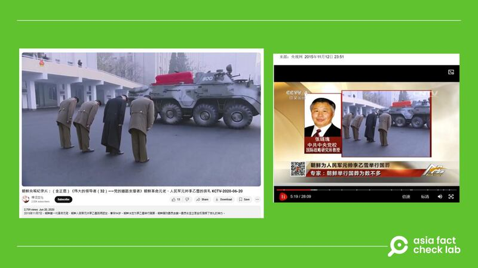

# Does a video show a funeral for a North Korean general killed in Ukraine war?

## Verdict: False

By Zhuang Jing for Asia Fact Check Lab

2024.12.27

## A video has been shared in Chinese-language social media posts that claim it shows a state funeral for North Korean general Kim Yong Bok who died while supporting Russia’s war in Ukraine.

## But the claim is false. The video shows a funeral of Ri Ul Sol, a close aide of the North Korean founder, who died in 2015 due to illness. The whereabouts of Kim Yong Bok, who was reportedly dispatched to Ukraine to help Russia’s war efforts, is unknown.

The video was [shared](https://x.com/DXDWX999/status/1871077884250706387) on X on Dec. 23.

“General Kim Yong Bok, the commander-in-chief of North Korean forces supporting Russia’s invasion of Ukraine, had his body returned to DPRK and received a state funeral from the Grand Marshal [Kim Jong Un],” the caption of the video reads.

The Democratic People’s Republic of Korea, or DPRK, is North Korea’s official name.

In the 30-second video, North Korean leader Kim Jong Un and officials around him can be seen bowing to a convoy of vehicles.

The same video and claim were [shared](https://www.douyin.com/user/MS4wLjABAAAA-qBiVyNzCS4UNxz5FX9qLQel3-VUDTIjOCdyN0ixlnE?from_tab_name=main) on Douyin, Chinese version of TikTok, as well as on the [website](https://archive.ph/I2dYd) of the Taiwanese online media outlet Newtalk News.

afcl-north-korean-general-funeral\_12272024\_1 Chinese online users and Taiwanese online media claimed that a video shows a state funeral being held for a high-level military official who died supporting Russia’s war in Ukraine. (DXDWX999 via X and Newtalk News)

But the claim is false.

## Funeral for North Korean founder’s aide

A reverse image search found that the clip shared on social media was taken from a [longer YouTube video](https://www.youtube.com/watch?v=OhvAkfBGPwQ) posted in June 2020.

“Ri Ul Sol, one of North Korea’s first-generation revolutionary founders and marshal of the Korean People’s Army, passed away on November 7, 2015 at age 94 due to an illness. The DPRK held a state funeral for Ri with Kim Jong Un in charge of arrangements,” the caption of the video reads.

A separate search found a [report](https://tv.cctv.com/2015/11/12/VIDE1447343477341532.shtml?spm=C52507945305.PwquEtqucIWR.0.0) published in 2015 by China’s state-run broadcaster CCTV carrying the same video that shows the funeral of Ri Ul Sol.

afcl-north-korean-general-funeral\_12272024\_2 The purported clip of Kim Yong Bok’s recent funeral was actually footage taken at a state funeral for Marshal Ri Ul Sol in 2015. (Zigui Culture via YouTube and CCTV)

Ri Ul Sol was a North Korean politician and military official, who played an important role in the administrations of North Korean founder Kim Il Sung and former leader Kim Jong Il.

Achieving the rank of marshal of the Korean People’s Army, he was responsible for the safety of top North Korean leaders and their families as Commander of the Guard.

## Kim Yong Bok

Japan’s *Kyodo News* [reported](https://www.rfa.org/english/korea/2024/10/28/north-korea-russia-ukraine-military-aide/) in October that Kim Yong Bok, deputy chief of the General Staff of the Korean People’s Army as well as a close aide to leader Kim Jong Un arrived in Russia to oversee North Korean troops there helping Russia in its war against Ukraine.

At that time, *Kyodo News* said it obtained a list of military officers in charge of the North Korean troops recently sent to Russia, and Kim Yong Bok was at the top.

AFCL has been unable to independently confirm Kim’s recent whereabouts or whether he was killed in combat in Russia.

*The Wall Street Journal* cited Western officials as saying that a North Korean general was wounded in the Ukraine war in late November, although the general’s identity was not given.

Kim Yong Bok’s profile has risen over the past year. His position as deputy chief of the army was confirmed when he was reported in state media as a member of Kim Jong Un’s entourage during a visit to a key operational training base in western North Korea in March.

Up to 12,000 North Korean soldiers are [reportedly in Russia](https://www.rfa.org/english/korea/2024/12/27/north-korea-captured-soldier-russia/) to support its war efforts against Ukraine in Kursk. Ukraine reports over 3,000 casualties among them, while South Korea estimates at least 1,100 have been killed or wounded.

Neither President Vladimir Putin nor North Korean leader Kim Jong Un has confirmed the North’s troop deployment to Russia

## *Translated by Shen Ke. Edited by Taejun Kang.*

*Asia Fact Check Lab (AFCL) was established to counter disinformation in today’s complex media environment. We publish fact-checks, media-watches and in-depth reports that aim to sharpen and deepen our readers’ understanding of current affairs and public issues. If you like our content, you can also follow us on* [*Facebook*](https://www.facebook.com/asiafactchecklabcn)*,* [*Instagram*](https://www.instagram.com/asiafactchecklab/) *and* [*X*](https://twitter.com/AFCL_eng)*.*

[Original Source](https://www.rfa.org/english/factcheck/2024/12/27/afcl-north-korean-general-funeral/)