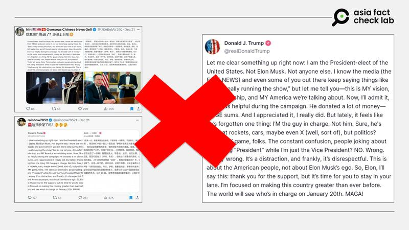
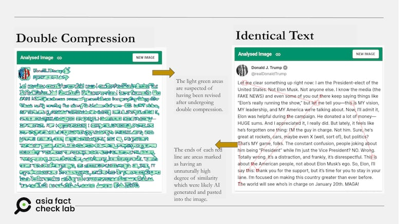

# Did Trump rebuke Musk on the Truth Social platform?

## Verdict: False

By Rita Cheng for Asia Fact Check Lab

2024.12.30

## An image of what appears to be a screenshot of a social media post by U.S. President-elect Donald Trump circulated among Chinese online users alongside a claim that it shows Trump’s post on the Truth Social platform rebuking Tesla CEO Elon Musk.

## But the claim is false. AFCL found no credible records showing that Trump uploaded such a post. An analysis of the image shows signs of digital manipulation.

The image was [shared](https://archive.ph/LVdIS) on X on Dec. 22.

It shows what appears to be a long post taken from Trump’s account on his self-owned [Truth Social](https://truthsocial.com/@realDonaldTrump) social media platform, alongside a Chinese translation.

“Let me clear something up right now: I am the President-elect of the United States. Not Elon Musk. Not anyone else. I know the media (the FAKE NEWS) and even some of you out there keep saying things like ‘Elon’s really running the show,’ but let me tell you—-this is MY vision, MY leadership, and MY America we’re talking about,” text in the purported post read.

afcl-trump-rebuke-musk\_12302024\_1 An image showing a purported post in which Trump rebuked Musk. (USABelAir2021 via X)

The same image had appeared earlier in pro-Democrat [posts](https://archive.ph/Be3VV) on [X](https://archive.ph/oFARp) and [Threads](https://archive.ph/pCXsO).

Trump plans to appoint Musk to head the Department of Government Efficiency, a presidential advisory commission charged with reducing federal spending.

After Musk [criticized](https://x.com/elonmusk/status/1869446782574645386) a temporary spending bill, Trump [asked](https://truthsocial.com/@realDonaldTrump/posts/113676124870048584?_nlid=8g39mdWhWF&_nhids=w92Of35JKM) Congressional Republicans in a Truth Social post to “pass a streamlined spending bill that doesn’t give Chuck Schumer and the Democrats everything they want.”

While the bill passed in time to avoid a government shutdown, some Democrat lawmakers [mocked](https://www.youtube.com/watch?v=wng9tyypnpY) Trump as taking orders from Musk.

In response, Trump said at an event in Phoenix on Dec. 22: “And all the different hoaxes and the new one is President Trump has ceded the Presidency to Elon Musk… He’s not going to be president that I can tell you. And I’m safe, you know why? He can’t be - he wasn’t born in this country.”

But the claim about Trump rebuking Must in a social media post is false.

Keyword searches found no credible records showing Trump uploaded such a post.

## Photo analysis

An analysis using the image verification tool InVID shows that the image circulated among Chinese-speaking online users was likely to have been digitally manipulated.

AFCL discovered that most of the image displayed clear signs of double-compression, while some sections of the text appeared unnaturally consistent, likely because they had been generated by AI and later pasted into the frame.

afcl-trump-rebuke-musk\_12302024\_2 InVID’s analysis shows a high likelihood that the screenshot was a composite image. (AFCL)

AFCL also found no reports to confirm any Trump rebuking of Musk publicly in the way described by Chinese social media users.

## *Translated by Shen Ke. Edited by Taejun Kang.*

*Asia Fact Check Lab (AFCL) was established to counter disinformation in today’s complex media environment. We publish fact-checks, media-watches and in-depth reports that aim to sharpen and deepen our readers’ understanding of current affairs and public issues. If you like our content, you can also follow us on* [*Facebook*](https://www.facebook.com/asiafactchecklabcn)*,* [*Instagram*](https://www.instagram.com/asiafactchecklab/) *and* [*X*](https://twitter.com/AFCL_eng)*.*

[Original Source](https://www.rfa.org/english/factcheck/2024/12/30/afcl-trump-rebuke-musk/)