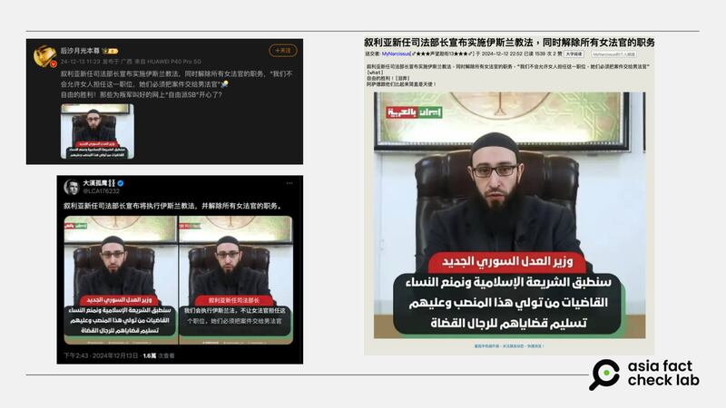

# Did Syria fire all female judges after Bashar al-Assad’s fall?

## Verdict: Lack of evidence

By Dong Zhe for Asia Fact Check Lab

2025.01.03

## A claim emerged in Chinese-language social media posts that the new Syrian government established after the fall of President Bashar al-Assad in December 2024 dismissed all female judges.

## But the claim lacks evidence. The Syrian Ministry of Justice, in separate Facebook posts on Dec. 8 and 12, assured employees of stability in their positions, while inviting former employees to return without indicating any plans to remove women judges from their roles.

The claim was [shared](https://archive.ph/wckxt#selection-1261.0-1265.31) on Weibo on Dec. 13, 2024.

“Syria’s new justice minister has announced the implementation of sharia law and the dismissal of all female judges,” the claim reads in part.

The claim began to circulate after Syria established a new transitional government following the fall of President Bashar al-Assad in December.

afcl-syria-female-judge\_01032025\_1 Some Chinese online users claimed that Syria’s Ministry of Justice announced the dismissal of female judges and a ban on them. (X, Weibo and 6park.com)

On Dec. 10, 2024, Mohammed al-Bashir, previously the prime minister of the Syrian Salvation Government, was appointed to lead the transitional government until March 1, 2025.

The new administration has initiated several changes, including suspending the constitution and parliament for a three-month transition period. They have also begun revising the national curriculum, removing references to the Assad regime and making other adjustments.

But the claim about Syria’s new government dismissing all female judges lacks evidence.

The Syrian Ministry of Justice under the interim government said on Dec. 8 that its employees would continue to work in their positions without changes to their workplace, salaries or benefits.

Separately, on Dec. 12, the ministry invited all of its former employees, including judges, to return to their workplaces. It made no mention of removing female judges from their posts.

The Syrian fact-checking organization Verify-sy debunked the claim, which had also circulated amongst the Arabic-speaking community.

Verify-sy cited a lawyer based in Aleppo named Mahmoud Hamam as saying that court staff and judiciary were working normally as of Dec. 12, adding that no dismissal or ban of women from the judiciary had occurred.

The Syrian Ministry of Justice has not responded to requests for comment as of press time.

## Rumors about death of Syrian scientists

Some Chinese-speaking online users also claimed that three prominent Syrian scientists were killed following the fall of Assad.

Keyword searches found the claim originated from a [post](https://archive.ph/ZGOX2) on X posted by the Iranian government-backed Islamic Republic News Agency on Dec. 10.

“Prominent Syrian scientist Dr. Hamdi Ismail Nada was assassinated in his home in Damascus by unknown people on Tuesday,” the post reads.

Some Weibo users also [claimed](https://archive.ph/mAIKU) that [Nada](https://archive.ph/FSMGO) was an organic chemist and [that two additional Syrian scientists](https://archive.ph/mRGma) – a microbiologist named Zahra al-Homsiyeh and a physicist named Shadia Habbal – had also been killed.

afcl-syria-female-judge\_01032025\_2 Some Chinese online users claimed that three Syrian scientists were killed after the fall of Assad's regime. (Weibo)

But this claim also lacks evidence.

Hamdi Ismail Nada is neither a Syrian nor a scientist but is actually a 74-year-old Egyptian physician.

When reached by the Palestinian fact-checking organization Tayqan, Nadi confirmed that the photo circulating with the claim was indeed of him. However, he clarified that he was still alive and had last visited Syria on a work trip more than nine years ago.

Nada also said on his Facebook page that his identity had been misused.

Meanwhile, Shadia Habbal is in fact a professor at the University of Hawaii’s Institute for Astronomy.

When questioned about the rumors of her death, she told AFCL: “I’m apparently still alive!”

Keyword searches found no information about “Zahra al-Homsiyeh”.

## *Translated by Shen Ke. Edited by Taejun Kang.*

*Asia Fact Check Lab (AFCL) was established to counter disinformation in today’s complex media environment. We publish fact-checks, media-watches and in-depth reports that aim to sharpen and deepen our readers’ understanding of current affairs and public issues. If you like our content, you can also follow us on* [*Facebook*](https://www.facebook.com/asiafactchecklabcn)*,* [*Instagram*](https://www.instagram.com/asiafactchecklab/) *and* [*X*](https://twitter.com/AFCL_eng)*.*

[Original Source](https://www.rfa.org/english/factcheck/2025/01/03/afcl-syria-female-judge/)