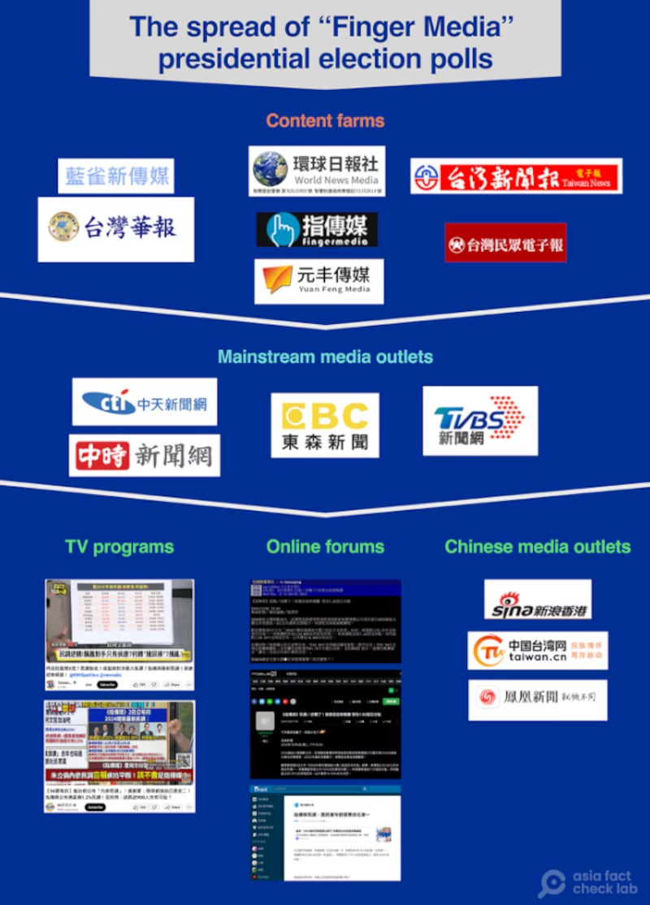
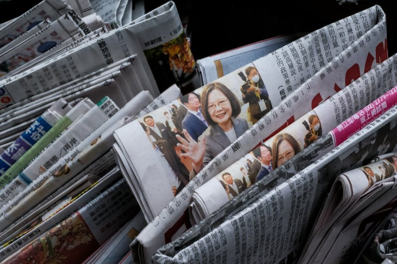

# Cross-strait shadows: Inside the Chinese influence campaign against Taiwan (Part I)

## A pre-2024 Taiwan election poll exposed a secret network with ties to mainland China.

By Zhuang Jing, Dong Zhe and Alan Lu for Asia Fact Check Lab

2025.01.06

TAEPEI, Taiwan – In the lead-up to Taiwan’s 2024 presidential election, an obscure news outlet called *Fingermedia* published what seemed like just another opinion poll.

The December 2023 poll claimed a stunning reversal: opposition Kuomintang candidates, Hou Yu-ih and Jaw Shaw-kong, had suddenly overtaken the ruling Democratic Progressive Party candidate Lai Ching-te in the presidential race.

Some suspected that something wasn’t quite right. For a start, the poll’s methods were unprofessional, but what they didn’t know was that the polling would unravel into a complex tale of cross-strait intrigue and attempted election manipulation.

## Poll-rigging case

Weeks later, Taiwanese police arrested two men: Su Yun-hwa, a retired professor who conducted the poll, and Lin Hsien-yuan, a reporter with extensive experience covering cross-strait relations. What followed was a gripping investigation that unraveled a clandestine network with direct links to mainland China.

The story began in April 2023, when Lin and Su traveled to the Chinese city of Xiamen at the invitation of Lin Jingdong, a committee member of a media outlet called *The Straits Herald*.

Upon returning, Lin Hsien-yuan established the news platform *Fingermedia* and arranged for Su to conduct polls during the presidential election race, officially for free although later an indictment showed that Lin had a secret arrangement to pay Su 1.5 million New Taiwanese dollars (US$46,186) in 10 installments, disguised as loan repayments.

What happened next was revealed through WeChat messages presented during a police investigation. Lin Hsien-yuan admitted to manipulating poll numbers multiple times, first on his own initiative and later at the encouragement of his mainland contacts.

“The first change was my own idea because the gap was relatively big, while Lin Jingdong asked me the second and third times,” Lin Hsien-yuan testified.

“I was pressured and encouraged to change and adjust the poll results … because Lin Jingdong and her colleagues also supported Hou and Jaw.”

afcl-china-influence-campaign-taiwan\_01062025\_1 This photo illustration taken on December 22, 2023 shows a user looking at news content on the social media site Facebook in Taipei. (I-Hwa Cheng/AFP)

In one exchange, Lin Hsien-yuan texted “+3,” referring to a polling tally. After the discussion, Lin Jingdong responded that they should “add 2 to Hou and Jaw” and shared the altered results.

“Good work,” Lin Jingdong said.

“Can I release it tomorrow?” Lin Hsien-yuan asked.

“Whenever you’re ready,” came the reply.

The prosecution uncovered that Chinese contacts had transferred more than 130,000 Chinese yuan (US$17,848) to Lin Hsien-yuan through the Chinese messenger WeChat and mainland bank accounts. While he claimed the money was for purchasing teapots, presenting receipts as evidence, the amounts didn’t match up.

## Prosecution ‘too lenient’

Though the poll came from an obscure outlet, it gained significant traction when reposted on Yahoo! News and in other mainstream Taiwanese media.

“Once the article hits Yahoo or LINE TODAY, you’ll trust it,” said Richy Li, a former journalist and professor at Taiwan’s National Chengchi University, referring to a news board on the LINE messaging app.

afcl-china-influence-campaign-taiwan\_01062025\_2 Illustration (AFCL)

The case concluded in August 2024 with prison sentences for both men: eight months for Lin Hsien-yuan and four months for Su, which can be converted into fines.

However, the judge’s ruling that they hadn’t worked under the direct guidance of a hostile government sparked controversy, with the prosecution appealing the verdict for being “too lenient.”

“How can this be indirect?” questioned Lo Cheng Chung, a law professor at the National Taiwan University of Science and Technology. “In China, direct or indirect doesn’t matter, it’s still influence.”

Chiu Chui-cheng, head of Taiwan’s Mainland Affairs Council, which oversees cross-strait affairs, sees the case as part of a broader strategy targeting specific demographics: malleable youth, disgruntled lower-middle-class citizens and slightly more conservative residents in the island’s south and center.

Taiwan said accepting funds or instructions from China to spread communist propaganda may violate national security laws, which prohibit establishing, funding or developing organizations on behalf of foreign countries and mainland China or any entities or individuals they may dispatch or control.

China regards Taiwan as a renegade province that must be united with the mainland, by force if necessary. The democratic island has been self-governing since it effectively separated from mainland China in 1949 after the Chinese Civil War.

Beijing has long faced accusations of using sophisticated propaganda to sway public opinion in the democratic island.

“I feel that [China’s] strategy against Taiwan here is trying to use a match to burn a house,” he told AFCL.

afcl-china-influence-campaign-taiwan\_01062025\_0 A photo illustration shows newspapers being delivered in the sidebag of a motorcycle with a front page photograph of Taiwan’s former president Tsai Ing-wen. (Yasuyoshi Chiba/AFP)

In the past, regional Taiwanese media outlets have frequently visited mainland China and engaged in “business collaboration.”

As Chiu noted, China knows well that running and sustaining regional media in Taiwan has been challenging, so it tends to target such small or regional media for its influence campaigns. Even though the outlets may typically attract little attention in Taiwan, they can play a significant role during critical moments like presidential elections.

“It’s important to keep exposing Chinese disinformation campaigns and ill intent toward Taiwan,” Chiu said. “Seeing how [Beijing] attempts to infiltrate and create chaos allows citizens to know their intent and prepare a counterattack.”

## *Translated by Shen Ke. Edited by Taejun Kang.*

*Asia Fact Check Lab (AFCL) was established to counter disinformation in today’s complex media environment. We publish fact-checks, media-watches and in-depth reports that aim to sharpen and deepen our readers’ understanding of current affairs and public issues. If you like our content, you can also follow us on* [*Facebook*](https://www.facebook.com/asiafactchecklabcn)*,* [*Instagram*](https://www.instagram.com/asiafactchecklab/) *and* [*X*](https://twitter.com/AFCL_eng)*.*

[Original Source](https://www.rfa.org/english/factcheck/2025/01/06/afcl-china-influence-campaign-taiwan/)