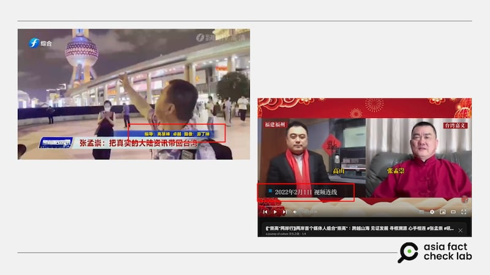
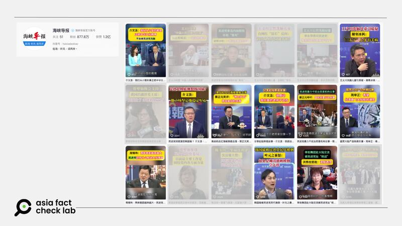

# Cross-strait shadows: Inside the Chinese influence campaign against Taiwan (Part II)

## A seemingly spontaneous political comment exposed a calculated move in China’s influence campaign on Taiwan.

By Dong Zhe, Alan Lu and Zhuang Jing for Asia Fact Check Lab

2025.01.08

TAIPEI, Taiwan – In January 2022, urgent messages lit up the phone of Chang Meng-tsung, a Taiwanese social media commentator known for promoting better relations across the Taiwan Strait.

“We’ve got to remove Lim!” insisted a Chinese reporter named Zhuo.

He was referring to Freddy Lim, a Taiwanese legislator known for his pro-independence stance whose seat was up for a recall vote after residents in his district petitioned for a snap election.

“Go after Lim today,” Zhuo urged.

Within hours, Chang was putting out a video attacking Lim.

Although to unsuspecting viewers, Chang’s video might have appeared to have been an unprompted political comment, but the target was clear.

Taiwan authorities revealed it was another calculated move in China’s intricate influence campaign targeting Taiwan when they arrested Chang and his wife in October last year on charges of colluding with a foreign government.

China officially denies conducting influence or propaganda campaigns against Taiwan, dismissing such accusations as unfounded and attributing them to Taiwan’s efforts to foster anti-China sentiment.

## Chang’s connection with China

Chang, a radio host, had built a significant following discussing cross-strait relations.

As a spokesperson for the Chinese Unification Promotion Party, he advocated for Taiwan’s immediate unification with Mainland China under Communist Party leadership.

China regards Taiwan as a renegade province that must be united with the mainland, by force if necessary.

The democratic island has been self-governing since it effectively separated from mainland China in 1949 after the Chinese Civil War. The island’s ruling Democratic Progressive Party, or DPP, firmly opposes unification with China and emphasizes Taiwan’s sovereignty, democracy, and the right to self-determination.

But behind Chang’s passionate political commentary lay a secret: he was being paid by China’s state media to spread its narratives about Taiwanese politics.

An investigation uncovered that Chang had received some 840,000 New Taiwan dollars (US$25,500) from the Beijing-controlled Fujian Radio Film and TV Group, or FJTV, between 2020 and 2023.

The workflow was simple but effective. Zhuo, working for FJTV’s online show EBC Apocalypse, would provide scripts. Chang would record videos following these scripts, and after FJTV’s review and approval, the money would flow into his bank account.

afcl-china-influence-taiwan-fujian\_01082025\_1 Chang appeared in a video call on a program with an anchor from Fujian TV in 2022. (Fujian TV)

Chang initially claimed his collaboration with FJTV began “by accident” during a COVID-19 quarantine stay in Shanghai, but digital breadcrumbs told a different story.

Facebook posts from as early as July 2021 showed Chang proudly attributing his 360 million views on Douyin, the Chinese version of TikTok, to his connection with EBC Apocalypse. A video from that period even captured him introducing “Little Zhuo” at a Fujian restaurant.

Their relationship deepened through WeChat conversations, where Zhuo celebrated Chang’s millions of views.

## The role of Fujian province

The work with Chang wasn’t isolated. It was part of China’s broader strategy to influence Taiwanese public opinion through shaping what appears to be ordinary, ever-day media content.

Fujian province serves as the headquarters for these efforts, with China’s State Council explicitly acknowledging in 2023 that “Fujian plays a unique role in the grand strategy towards Taiwan.”

The province’s government openly admits to funding FJTV specifically to “subsidize the production and broadcasting of programs for Taiwan to strengthen propaganda efforts against the island.”

When Taiwan opened its doors to Chinese journalists in 2000, strict regulations made it difficult for mainland media outlets to establish a presence on the island. Everything changed in 2008 under President Ma Ying-jeou’s administration, which relaxed these rules – particularly benefiting media outlets from Fujian province.

afcl-china-influence-taiwan-fujian\_01082025\_2 Several Fujian outlets such as the Straits Herald edit and report large amounts of content from Taiwanese political talk shows (highlighted above) whose positions overlap with Beijing. (Douyin. Highlighting by AFCL)

While the policy aimed to normalize cross-strait media relations and promote press freedom, Chiu Chui-cheng, minister of Taiwan’s Mainland Affairs Council, which oversees cross-strait issues, paints a different picture today.

“[Fujian outlets] are a base for United Front media against Taiwan,” said Chiu, referring to the Chinese Communist Party organization tasked with spreading its influence, often abroad.

Chiu noted the Fujian outlets’ frequent violations of island regulations, from unauthorized street interviews to illegal studio operations.

Chiu is particularly concerned about how the Fujian networks’ talk shows exclusively feature pro-Beijing Taiwanese commentators who criticize U.S.-Taiwan relations and the ruling DPP.

“Fujian media have had a much higher rate of violations than other outlets,” he added.

## Small-scale, large impact

But beyond traditional media, Beijing has developed a more subtle strategy: funding small-scale social media influencers like Chang Meng-tsung. Why would China invest in these seemingly minor players?

A veteran cross-strait media worker, speaking anonymously for security reasons, suggested this approach stems from China’s inability to control mainstream Taiwanese media, even those traditionally sympathetic to unification.

“My guess is that they also need to meet internal key performance indicators,” the source explained, referring to mainland officials.

Huang Jaw-nian, a professor at Taiwan’s National Chengchi University who studies Chinese media influence, said that while these influencers may have limited impact on public opinion, they serve two crucial purposes – producing content aligned with Beijing’s ideology and gathering intelligence about events in Taiwan.

More significantly, Huang said, maintaining a constant stream of pro-Beijing content could trigger developments favorable to China.

David Bandurski, director of the China Media Project, sees a less strategic explanation.

He said the grassroots approach might simply reflect poor coordination among Chinese regional media outlets, despite President Xi Jinping’s push for more consolidated propaganda efforts.

“They don’t always have a strategy .... It’s all lying and exaggerating. Subordinates have to tell their superiors they’re working hard and making progress,” said Bandurski.

“When Xi Jinping catches a cold, the whole province sneezes.”

---

## RELATED STORIES

[Cross-strait shadows: Inside the Chinese influence campaign against Taiwan (Part II)](2025-01-06_Cross-strait shadows： Inside the Chinese influence campaign against Taiwan (Part I).md)

[Taiwan warns internet celebrities on collusion after video uproar](https://www.rfa.org/english/china/2024/12/11/china-taiwan-united-front-influencer/)

[Media Watch: Taiwanese YouTubers’ visit to Xinjiang, genuine or propaganda?](2024-10-08_Media Watch： Taiwanese YouTubers’ visit to Xinjiang, genuine or propaganda?.md)

---

Chinese officials assert that their actions are aimed at promoting peaceful reunification and strengthening cross-strait relations.

China’s Foreign Ministry has labeled Taiwan’s accusations of interference as “groundless” and has accused Taiwan’s leadership of trying to stir up hostility and gain domestic support.

## *Translated by Shen Ke. Edited by Taejun Kang.*

*Asia Fact Check Lab (AFCL) was established to counter disinformation in today’s complex media environment. We publish fact-checks, media-watches and in-depth reports that aim to sharpen and deepen our readers’ understanding of current affairs and public issues. If you like our content, you can also follow us on* [*Facebook*](https://www.facebook.com/asiafactchecklabcn)*,* [*Instagram*](https://www.instagram.com/asiafactchecklab/) *and* [*X*](https://twitter.com/AFCL_eng)*.*

[Original Source](https://www.rfa.org/english/factcheck/2025/01/08/afcl-china-influene-taiwan-fujian/)