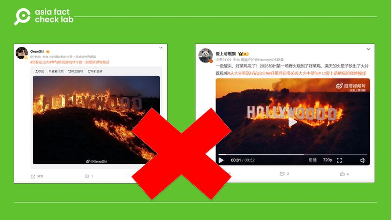
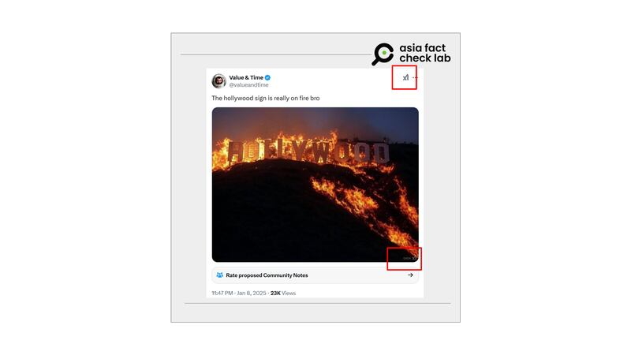
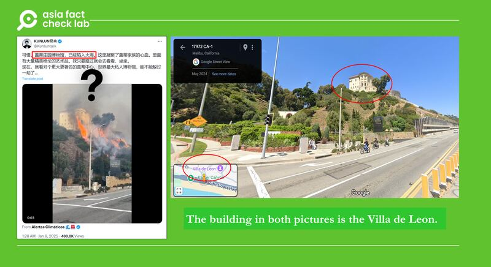
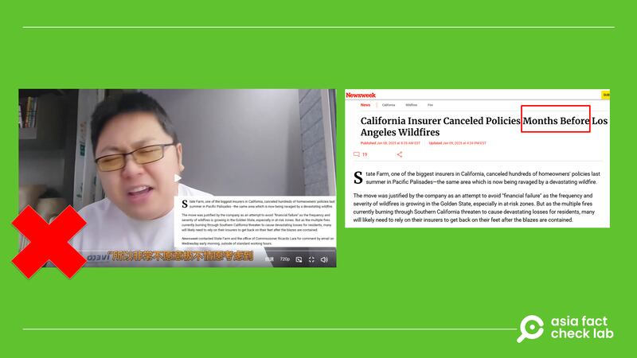

# Have California wildfires engulfed the iconic ‘Hollywood’ sign?

## Verdict: False

By Rita Cheng

2025.01.10

## A video clip circulating on Chinese social media site [Weibo](https：//archive.ph/lFBFa) shows the iconic “Hollywood” sign going up in flames – one of several fake or misleading posts that have emerged as wildfires burn vast swaths of Los Angeles.

## “Wake up and Hollywood’s gone! California’s first wildfire in 2025 scorched Hollywood, all the sparks in the sky looked like a blockbuster,” one post reads.

## But the video is fake – apparently generated by Artificial Intelligence.

hollywood-sign-burning-california-wildfires-fact-check-02 Several users on Weibo claimed that the Hollywood sign had been caught in the wildfires. (Weibo)

Recent footage from a 24/7 official [live broadcast](https://www.hollywoodsign.org/webcam) of the Hollywood sign shows no flames engulfing it and no official notice of damage by wildfire to the structure has been released as of press time.

Other fact-checking organizations including Snopes debunked similar rumors in English that appeared earlier on [X](https://archive.is/us32N) and [TikTok](https://archive.is/7i6Si), attaching similar images and videos as seen on Weibo.

A careful look reveals the text “Grok xAI” imprinted in the lower right corner of the image on X, a watermark for the [AI Grok](https://x.ai/grok) founded by Elon Musk and used as an electronic assistant on X.

The post itself had also been marked with an “xAI” across from the profile name at least in the afternoon of Jan. 9, signaling that it contains AI-generated content.

hollywood-sign-burning-california-wildfires-fact-check-03 The watermark in the lower right corner of the image and across from the profile name in the post indicates that the content was generated by Grok. (X)

AFCL found that X’s AI assistant Grok generated an image similar to the above in about 10 seconds after being given the command “create +image+hollywood+sign+on+fire.” However, if asked whether the actual sign had caught fire recently, (AI?) Grok replied “no.”

## Was the Getty Villa Museum destroyed?

[Chinese](https://archive.ph/IOaEf) and [English](https://archive.ph/tcoeC) posts on X also claimed that the [Getty Villa Museum](https://www.getty.edu/visit/villa/) in the Palisades was severely damaged by the wildfires, attaching a video of a building atop a hill on fire in front of a sign for the villa.

“The Getty Villa is currently on fire as the Pacific Palisades fire spreads to over 1,200 acres,” one post reads.

The museum houses tens of thousands of relics from ancient Rome and Greece, serving as both an art gallery and an educational center.

hollywood-sign-burning-california-wildfires-fact-check-04 A video claiming to show the Getty Villa Museum on fire, left, was actually footage of a neighboring mansion named the Villa de Leon, right. (X & Google Maps)

**This is misleading.** While the video is real, the building atop the hill is not the museum, but rather the Villa de Leon, a neighboring mansion overlooking the Pacific Coast Highway.

A check using Google Maps’ street view found that the terrain around the Villa de Leon matches that found in the video, complete with the museum sign in front.

An official press release from the museum on Jan. 8 clarified that while fires had reached the outskirts of the property, pre-emptive fire prevention measures such as brush clearing, reserve irrigation systems and air sealing technology had saved the museum’s building and contents from any serious damage.

“While trees and vegetation on the property have burned, Getty structures have been unaffected, and thankfully, both staff and the collections are safe,” the press release reads.

The museum will be closed until at least Jan. 16 due to the fire.

## Did insurance companies cancel thousands of homeowner policies after the fires broke out?

A user on Weibo [claimed](https://archive.ph/mGSur) in a video that profit-hungry insurance companies canceled many local coverage plans as soon as the wildfire began, citing a report from Newsweek as evidence.

**This is misleading.** The [cited report](https://www.newsweek.com/california-insurer-canceled-policies-months-before-los-angeles-wildfires-2011521) does detail how large insurance companies such as State Farm canceled many California homeowners’ plans due to more frequent wildfires across the state in recent years, including around 1,600 homes in the Palisades.

However, the headline clearly states that the cancellation occurred months before the current wildfires. The lead paragraph further clarifies that the policies were canceled in the summer of 2024.

hollywood-sign-burning-california-wildfires-fact-check-05 A Weibo user claims insurance companies canceled homeowners’ contracts in droves as soon as the wildfires began, left, while the Newsweek report cited by him states that the contracts were canceled in 2024. (Weibo & Newsweek)

## *Translated by Shen Ke. Edited by Malcolm Foster.*

*Asia Fact Check Lab (AFCL) was established to counter disinformation in today’s complex media environment. We publish fact-checks, media-watches and in-depth reports that aim to sharpen and deepen our readers’ understanding of current affairs and public issues. If you like our content, you can also follow us on* [*Facebook*](https://www.facebook.com/asiafactchecklabcn)*,* [*Instagram*](https://www.instagram.com/asiafactchecklab/) *and* [*X*](https://twitter.com/AFCL_eng)*.*

[Original Source](https://www.rfa.org/english/factcheck/2025/01/10/hollywood-sign-burning-california-wildfires-fact-check/)