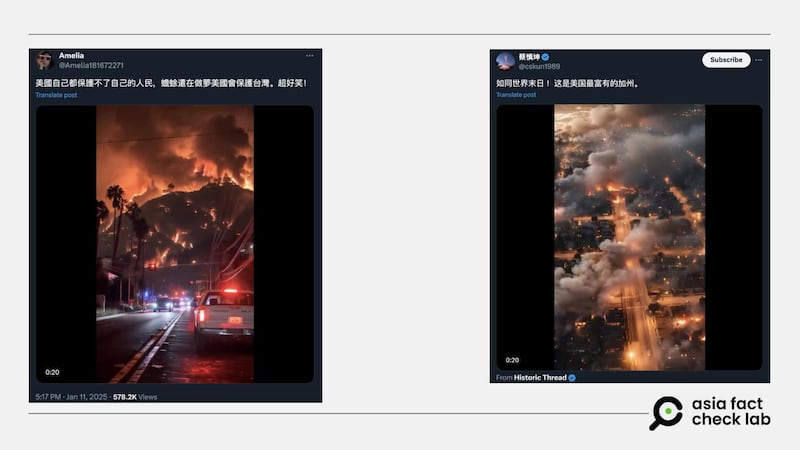
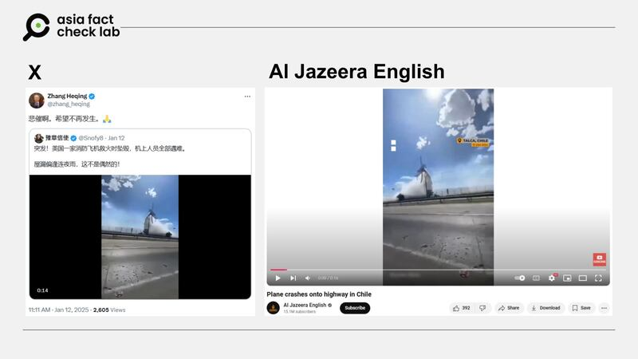

# Does a video show California engulfed by wildfires?

## Verdict: False

By Zhuang Jing and Alan Lu for Asia Fact Check Lab

2025.01.16

## A video has been shared in Chinese-language social media posts that claim it shows scenes of California consumed by wildfires.

## But the claim is false. According to an AI analysis tool and expert, the video is not footage of the real wildfire but instead AI-generated.

The video was [shared](https://x.com/Amelia181672271/status/1878008391957901377) on X on Jan. 11.

“This looks like the end of the world! This is California, the wealthiest state in the U.S.,” the claim reads.

The 31-second clip consists of multiple scenes showing what appears to be a large city engulfed in flames.

afcl-california-wildfire\_01162025\_1 A purported live video of the California wildfires circulated on social media. (X)

California has been grappling with severe wildfires, with dry conditions, rising temperatures and strong winds fueling the spread of fires across vast areas.

Communities are facing devastating losses, including homes, wildlife, and natural habitats and 25 people have been killed.

Firefighters are working to contain the blazes, but the challenges are immense due to the unpredictable nature of the fires and difficult terrain. Many residents have been evacuated, and air quality has deteriorated due to heavy smoke.

Authorities are urging caution and preparedness as the state navigates this crisis.

But the claim about the video is false.

## AI-generated

A test using an AI-generated content detection tool from Hive found that the video was more than 97% likely to be AI-generated.

Hive is an AI company providing an AI-generated content detection tool and browser extension to identify and moderate AI-generated content across text, images, videos, and audio.

The video was also [posted](https://www.instagram.com/p/DEoJC4HP6e5/) by “@ai\_creatiions” an Instagram account that often shares AI mapping and animations.

afcl-california-wildfire\_01162025\_1 Results from the detection tool Hive show a more than 90% probability that the video was AI-generated. (Hive AI)

Taiwanese information security expert Paul Liu told AFCL that the rhythm of the flames and smoke in the video was too stable to be from a real fire.

Liu added fuzzy license plates seen on police cars was a giveaway that the video was fake because current generative AI still has difficulty producing text and numbers. These will usually be blurred out in such videos unless they have been edited into the frame through post-processing.

afcl-california-wildfire\_01162025\_3 Fuzzy details such as the license plate numbers on police cars confirm that the image is AI-generated. (X via AFCL)

Chih-Chung Hsu, a professor at Taiwan-based National Cheng Kung University’s Institute of Data Science, also pointed to inconsistencies in multiple moving objects in a given frame as a noticeable flaw in current generative AI models.

He cited power lines seen in the upper-left frame of the video unnaturally swaying as the police cars pass under it as one example of this.

He added that the Cheng Kung University’s in-house AI detection system also found an 85.5% probability that the video was fake.

## Does a video show a U.S. plane crashing while putting out the wildfires?

As the wildfire crisis in California persists, it is fueling a surge of misinformation on social media, with false claims and manipulated images spreading rapidly.

A video showing a plane crash was [shared](https://x.com/Snofy8/status/1878244586050502703) on X on Jan. 12 alongside a claim that it showed a U.S. plane that crashed while helping fight the fires.

The 16-second video, shot from within a car, shows a plane crashing into the road in front of the vehicle.

The video was viewed 200,000 times in two days after it was posted and it was reposted by hundreds of people including Chinese diplomat [Zhang Heqing](https://x.com/zhang_heqing/status/1878278573246820735).

But the claim is false.

A reverse image search found that the same scene appeared in the video published by [Al Jazeera English](https://youtube.com/watch?v=kDpiTmfN9MA), [Nextapple News](https://tw.nextapple.com/international/20240117/E034427D87A20F4F3B1EFE6DE356B5AE), and [Sing Tao Daily](https://www.singtaousa.com/2024-01-16/%e9%a3%9b%e6%a9%9f%e6%92%9e%e9%9b%bb%e7%b7%9a%e6%a1%bf%e7%88%86%e7%82%b8%e6%a9%9f%e5%b8%ab%e6%85%98%e6%ad%bb-%e5%a6%82%e7%81%ab%e7%90%83%e7%9b%b4%e5%a2%ae%e5%85%ac%e8%b7%af%e9%a9%9a%e6%82%9a30/4731351#page8) in January 2024.

The reports explain that the plane crashed onto a highway in Chile after the low-flying aircraft grazed a telegraph pole. The resulting explosion killed the pilot and injured four people.

afcl-california-wildfire\_01162025\_2 Rumors of a US plane crashing while helping put out the wildfires around California (left) turned out to be footage of a plane accident in Chile from January 2024 (right). (X and YouTube)

A comparison shows that the recent clip spread on X flipped the direction of the original footage. Whereas the plane was originally shown crashing onto the road from the left of the frame, the clip on X shows it crashing from the right.

## *Translated by Shen Ke. Edited by Taejun Kang.*

*Asia Fact Check Lab (AFCL) was established to counter disinformation in today’s complex media environment. We publish fact-checks, media-watches and in-depth reports that aim to sharpen and deepen our readers’ understanding of current affairs and public issues. If you like our content, you can also follow us on* [*Facebook*](https://www.facebook.com/asiafactchecklabcn)*,* [*Instagram*](https://www.instagram.com/asiafactchecklab/) *and* [*X*](https://twitter.com/AFCL_eng)*.*

[Original Source](https://www.rfa.org/english/factcheck/2025/01/16/afcl-california-wildfire-video/)