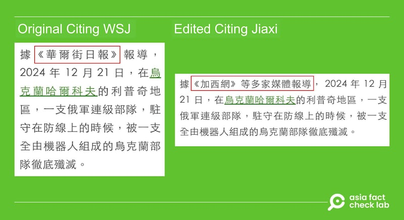

# Did an all-robot Ukrainian unit destroy a Russian company of soldiers in December?

## Verdict: False

By Alan Lu and Zhuang Jing for Asia Fact Check Lab

2025.01.20

## A Taiwanese media outlet reported that Ukraine’s all-robot unit destroyed a Russian company of soldiers near the city of Kharkiv in eastern Ukraine in December, citing American daily *The Wall Street Journal*.

## But the claim is false. The Wall Street Journal did not publish such a report. The Taiwanese media later issued a correction, saying that the news was an “allegation.”

The report was [published](https://archive.ph/gf7ld#selection-1891.0-1891.30) by the Taiwanese media outlet Newtalk News on Jan. 2.

The report originally claimed that Ukraine’s all-robot combined-arms unit “wiped out” a Russian company of soldiers on Dec. 21, 2024, near the Kharkiv city in eastern Ukraine, citing *The Wall Street Journal* as its source.

The news was later reposted by the news aggregate sites [LINE Today](https://today.line.me/tw/v2/article/aGz5J03) and [Yahoo News](https://tw.news.yahoo.com/%E4%BF%84%E9%80%A3%E7%B4%9A%E9%83%A8%E9%9A%8A%E6%85%98%E9%81%AD%E6%A9%9F%E5%99%A8%E4%BA%BA%E5%85%A8%E6%AE%B2-%E5%93%88%E7%88%BE%E7%A7%91%E5%A4%AB%E5%A4%A7%E9%9C%87%E6%92%BC-%E5%BE%B9%E5%BA%95%E6%94%B9%E8%AE%8A%E6%88%B0%E5%A0%B4%E8%A6%8F%E5%89%87-061928722.html) as well as some [Chinese social media users](https://x.com/zhihui999/status/1875038779158986913).

afcl-ukraine-robot-unit-russia\_01202025\_1 Chinese news sites and social media relayed the news that a Russian company-size unit was wiped out by Ukrainian robot units. (Newtalk News and zhihui999 via X)

But the claim is false.

Keyword searches found no reports published by *The Wall Street Journa*l on Ukraine’s all-robot unit destroying a Russian company of soldiers in December.

The newspaper also told AFCL that it had not published such a report.

## Newtalk’s report

In response to AFCL’s inquiries, Newtalk said the information came from Chinese-language news sites [Popyard News](https://news.popyard.space/cgi-mod/newscroll.cgi?lan=tw&r=0&sid=16&rid=891641&v=0) and [Jiaxi Net](https://www.westca.com/News/article/sid=1062913/lang=tchinese.html) and it had updated its report by replacing its citation from *The Wall Street Journa*l to Jaxi Net.

In its [updated version](https://newtalk.tw/news/view/2025-01-02/951402) of the report, Newtalk added the claim was an “allegation.”

afcl-ukraine-robot-unit-russia\_01202025\_2 Newtalk changed the original report after being notified of the inconsistency. (Newtalk News)

Jiaxi Net said that it had sourced the news from *The Wall Street Journal*, but it did not include a link to the original article or other credible sources.

A keyword search found reports published by [*Forbes*](https://www.forbes.com/sites/davidaxe/2024/12/21/ukraines-first-all-robot-assault-force-just-won-its-first-battle/) and [*The Telegraph*](https://www.telegraph.co.uk/world-news/2024/12/24/ukraine-launches-robot-only-assault-against-russian-troops/) about Ukraine’s use of an “all-robot combined-arms operation” that utilized “crawling and flying drones” to attack Russian units on a stretch of the front line near Kharkiv.

*The Telegraph* quotes Volodymyr Dehtiarov, a representative of Ukraine’s Khartiia Brigade, as calling the attack a “success.”

However, Dehtiarov did not claim the robots “wiped out a Russian company” and the publication emphasized the claim was unverified.

## *Translated by Shen Ke. Edited by Taejun Kang.*

*Asia Fact Check Lab (AFCL) was established to counter disinformation in today’s complex media environment. We publish fact-checks, media-watches and in-depth reports that aim to sharpen and deepen our readers’ understanding of current affairs and public issues. If you like our content, you can also follow us on* [*Facebook*](https://www.facebook.com/asiafactchecklabcn)*,* [*Instagram*](https://www.instagram.com/asiafactchecklab/) *and* [*X*](https://twitter.com/AFCL_eng)*.*

[Original Source](https://www.rfa.org/english/factcheck/2025/01/20/afcl-ukraine-robot-unit-russia/)