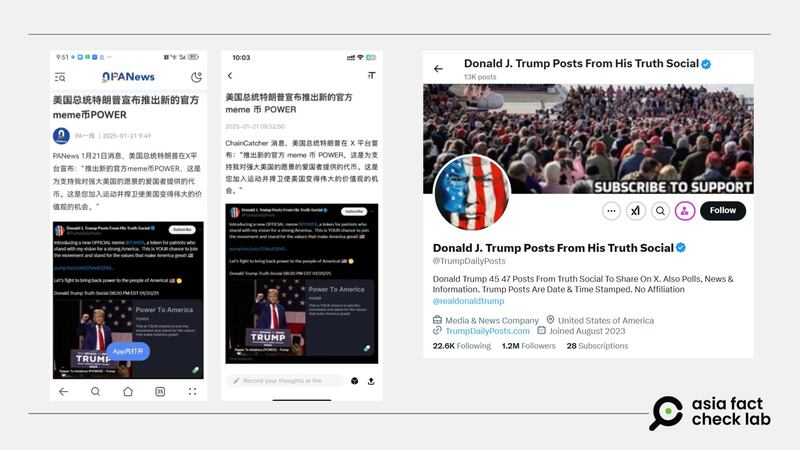
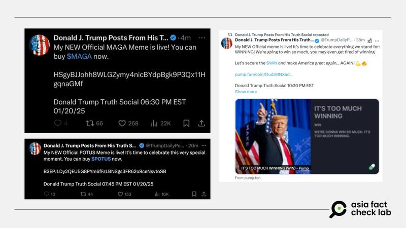

# Did Trump launch a cryptocurrency called ‘$POWER’?

## Verdict: False

By Zhuang Jing for Asia Fact Check Lab

2025.01.22

## A claim emerged in Chinese-language social media posts that U.S. President Donald Trump launched a cryptocurrency called “$POWER” following his inauguration on Jan. 20.

## But the claim is false. The announcement about the cryptocurrency launch was made by a Trump fan account. Trump did launch a cryptocurrency called “$TRUMP” days before his inauguration.

The claim was shared in a report [published](https://archive.ph/r0OQq) by Chinese-language media outlet PANews on Jan. 21.

“President Donald Trump announced new official meme coin $POWER,” PANews reported, citing an X account.

A meme coin is a cryptocurrency that originated from an internet meme or has some other humorous characteristic.

Trump was inaugurated as the 47th U.S. president on Jan. 20, marking the beginning of his second term.

But the claim about the “$POWER” cryptocurrency is false.

The X account [cited](https://x.com/trumpdailyposts) by PANews is in fact a Trump fan account.

The account’s description states it is unaffiliated with Trump’s official account and that it is sharing posts and media related to the president.

afcl-trump-fake-crypto-currency\_01222025\_1 Rumors spread by an unofficial Trump fan account claim that the U.S. president launched a new official meme coin called ‘$POWER.’ (X)

Both Trump and First Lady Melania Trump [launched](https://apnews.com/article/trump-crypto-meme-coin-token-75bf67ef9e6e54bf455f2f9f03470be3) their crypto meme coins – named “$[TRUMP](https://www.binance.com/en/price/official-trump)” and “$MELANIA,” respectively, not “$POWER” – days before the inauguration.

## Fake ‘official’ coins

In addition to “$POWER,” Trump’s fan account was found promoting fake “official coins” supposedly launched by the U.S. president, such as “$POTUS” and “$WIN” – both of which are also false claims.

afcl-trump-fake-crypto-currency\_01222025\_2 Trump’s fan account made posts about the launch of various crypto coins, all of which were soon deleted. (X)

Some users on X have stated that they had been scammed in connection with these fake coins.

## *Translated by Shen Ke. Edited by Taejun Kang.*

*Asia Fact Check Lab (AFCL) was established to counter disinformation in today’s complex media environment. We publish fact-checks, media-watches and in-depth reports that aim to sharpen and deepen our readers’ understanding of current affairs and public issues. If you like our content, you can also follow us on* [*Facebook*](https://www.facebook.com/asiafactchecklabcn)*,* [*Instagram*](https://www.instagram.com/asiafactchecklab/) *and* [*X*](https://twitter.com/AFCL_eng)*.*

[Original Source](https://www.rfa.org/english/factcheck/2025/01/22/afcl-trump-fake-crypto-currency/)