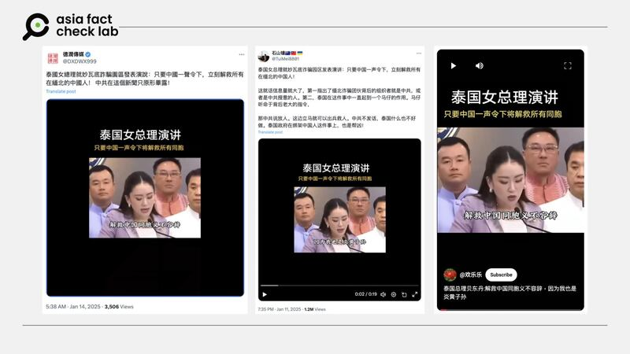

# Did the Thai PM promise to rescue Chinese citizens from Myanmar on Beijing’s order?

## Verdict: False

By Zhuang Jing for Asia Fact Check Lab

2025.01.21

## A video of Thailand’s Prime Minister Paetongtarn Shinawatra has been shared in Chinese-language social media posts that claim it shows Paetongtarn saying she is ready to rescue Chinese citizens from Myanmar if Beijing gives the order.

## But the claim is false. Paetongtarn was in fact discussing the latest trafficking case that happened at the Thai-Myanmar border and how Thailand would handle the situation with care to avoid damaging its tourism industry.

The video was [shared](https://x.com/DXDWX999/status/1878919575347347623) on X on Jan. 14.

“The female Prime Minister of Thailand gave a speech … As long as China gives the order, all Chinese in northern Myanmar will be rescued immediately!” the post reads in part.

The 19-second clip shows what appears to be a speech from Thailand’s Prime Minister Paetongtarn Shinawatra.

The Chinese-language subtitles, attributed to Paetongtarn, read: “If China gives the order, we will rescue all Chinese compatriots. It’s my duty to do so because my ancestors were from China’s Guangdong province. After rescuing Wang Xing, it’s come to our attention that many Chinese have been abducted by online scammers in Myawaddy.”

afcl-thai-prime-minister-china\_01212025\_1 Some Chinese online users claimed that Thailand’s prime minister promised to rescue Chinese citizens on China’s order. (X and YouTube)

The claim began to circulate online after the high-profile disappearance and subsequent rescue of Chinese actor Wang Xing by Thai officials from online human trafficking scammers operating out of Myanmar.

Several areas in eastern Myanmar regions on the Thai border, such as the town of Myawaddy, have become key transit hubs for these traffickers due to a relative lack of policing.

Wang [disappeared](https://www.bbc.com/zhongwen/articles/c9d51p355jdo/trad) near the Thai-Myanmar border on Jan. 3 and was rescued four days later, raising concerns among many Chinese citizens over the safety of travel to Thailand.

But the claim about Paetongtarn’s speech is false.

A review of the clip by a Thai-speaking journalist from Radio Free Asia shows that Paetongtarn was in fact discussing Wang’s case and how Thailand would handle the situation with care to avoid damaging its tourism industry.

“[Someone] was ready to be sent to Mae Sot,” the prime minister said

in the clip, referring to the Thai town opposite Myanmar’s Myadaddy.

“The 6th regional police bureau is waiting to receive [sic]. Now we found ... [sic]. We have to handle it right to mitigate the impact in Thailand,” Paetongtarn said.

## Original clip

A reverse image search of screenshots from the video [found matching footage](https://x.com/ThaiEnquirer/status/1876523303671910821) on X posted by Thailand’s English news website Thai Enquirer on Jan. 7.

“Prime Minister Paetongtarn emphasized the importance of addressing this issue carefully to avoid damaging tourism, amid online rumors suggesting Thailand is unsafe for Chinese tourists,” the caption of the video reads in part.

“When asked about measures against Chinese criminal networks operating in Thailand, the Prime Minister said discussions have been held with the Chinese ambassador, and the issue has been raised at international meetings.”

AFCL found no mention of the Thai prime minister promising to rescue Chinese from Myanmar at Beijing’s order.

Keyword searches found no credible reports or statements to support the claim.

## *Translated by Shen Ke. Edited by Taejun Kang.*

## *Pimuk Rakkanam from RFA contributed to this report.*

*Asia Fact Check Lab (AFCL) was established to counter disinformation in today’s complex media environment. We publish fact-checks, media-watches and in-depth reports that aim to sharpen and deepen our readers’ understanding of current affairs and public issues. If you like our content, you can also follow us on* [*Facebook*](https://www.facebook.com/asiafactchecklabcn)*,* [*Instagram*](https://www.instagram.com/asiafactchecklab/) *and* [*X*](https://twitter.com/AFCL_eng)*.*

[Original Source](https://www.rfa.org/english/factcheck/2025/01/22/afcl-thai-pm-myanmar-china/)