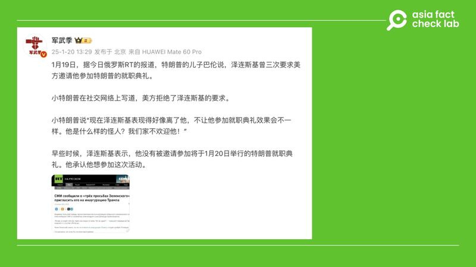
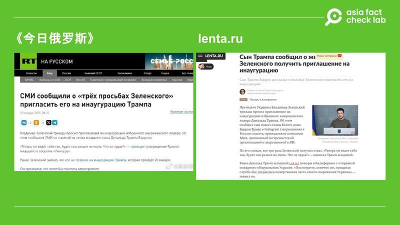
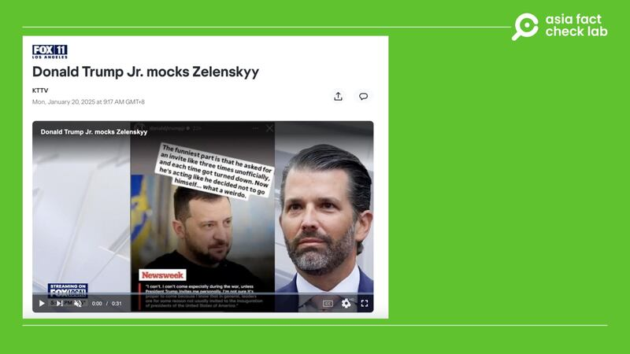

# Did US President Trump’s son Barron mock Zelenskyy on social media?

## Verdict: Misleading

By Alan Lu for RFA

2025.01.24

## A claim emerged in Chinese-language social media posts that U.S. President Donald Trump’s youngest son Barron mocked Ukrainian leader Volodymyr Zelenskyy by calling him a “weirdo” on social media.

## But the claim is misleading. It was Donald Trump Jr., not Barron, who called Zelenskyy a weirdo on social media. Barron has not made any social media comments on the Ukrainian leader.

The claim was [shared](https://weibo.com/2178514797/Parl8BaRm) by a Weibo user with more than three million followers on Jan. 20.

The Weibo post cited Barron as saying: “Zelenskyy seems out of his mind, like the inauguration will be different even though he’s not allowed to attend. What kind of a weirdo is he? He’s not welcome to attend.”

afcl-trump-barron-mock-zelenskyy\_01242025\_1 A recent post claimed that Barron Trump mocked Zelenskyy on social media. (Weibo)

Trump was inaugurated as the 47th President of the United States on Jan. 20, 2025, at a ceremony in the U.S. Capitol Rotunda due to extreme cold weather.

The event was attended by former U.S. presidents, including Joe Biden, and tech industry leaders such as Elon Musk and Mark Zuckerberg, but Zelenskyy was not present.

But the claim about Barron mocking Zelenskyy is misleading.

## Origin of the claim

The Weibo post featured an image of a report from Russia’s state-run broadcaster RT, which in turn cited an article from the Russian online news outlet Lenta. Lenta claimed that Barron had made a mocking comment on Instagram.

afcl-trump-barron-mock-zelenskyy\_01242025\_2 The claim originated from Russian media outlets. (RT and Lenta)

But a keyword search on Instagram found no posts published by Barron mocking Zelenskyy.

Barron, in fact, maintains a low-profile online presence without any accounts on major social media platforms, according to media reports.

## Trump Jr., not Barron

Los Angeles-based broadcaster FOX 11 [reported](https://www.yahoo.com/news/donald-trump-jr-mocks-zelenskyy-011748458.html) on Jan. 20 that Trump’s oldest son, Donald Trump Jr., had uploaded a post on an Instagram Story mocking Zelenskyy.

afcl-trump-barron-mock-zelenskyy\_01242025\_3 Donald Trump Jr. mocked Zelensky on social media. (FOX 11 Los Angeles)

An Instagram Story is a feature on Instagram that allows users to share photos, videos, or text in posts that disappear after 24 hours.

The post by Donald Trump Jr., therefore, had also disappeared and was not available to check.

“The funniest part is that he asked for an invite like three times unofficially, and each time got turned down. Now he’s acting like he decided not to go himself … what a weirdo,” media reported, citing the post.

In an interview with podcaster Lex Fridman, Zelenskyy expressed a willingness to attend if invited, stating, “I can’t come, especially during the war, unless President Trump invites me personally.”

Trump, during a press conference on Dec. 16, 2024, mentioned that he had not invited Zelenskyy but added: “If he’d like to come, I’d like to have him.”

There is no substantial evidence to suggest that Zelenskyy repeatedly requested an invitation to Trump’s inauguration.

## *Translated by Shen Ke. Edited by Taejun Kang.*

*Asia Fact Check Lab (AFCL) was established to counter disinformation in today’s complex media environment. We publish fact-checks, media-watches and in-depth reports that aim to sharpen and deepen our readers’ understanding of current affairs and public issues. If you like our content, you can also follow us on* [*Facebook*](https://www.facebook.com/asiafactchecklabcn)*,* [*Instagram*](https://www.instagram.com/asiafactchecklab/) *and* [*X*](https://twitter.com/AFCL_eng)*.*

[Original Source](https://www.rfa.org/english/factcheck/2025/01/24/afcl-trump-barro-mock-zelenskyy/)