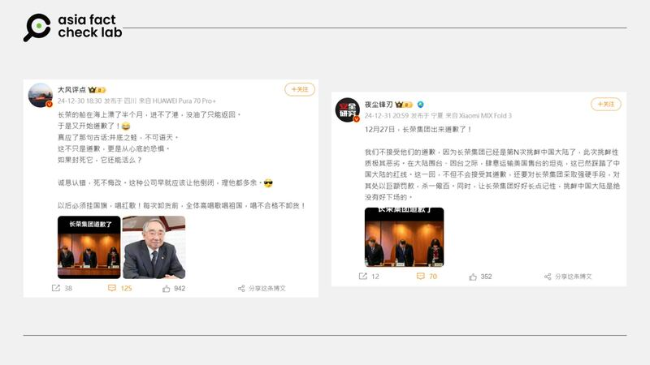
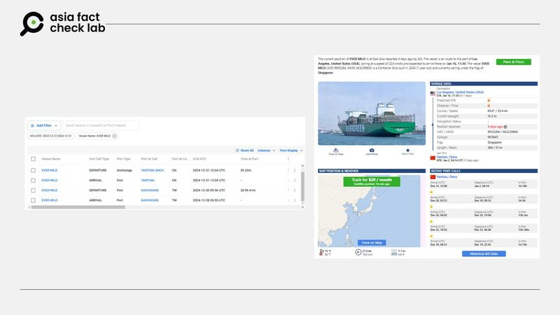

# Does a photo show Taiwan cargo officials apologizing to China for shipping US tanks?

## Verdict: False

By Zhuang Jing and Dong Zhe for Asia Fact Check Lab

2025.01.29

## A photo emerged in Chinese-language social media posts that users claim shows officials from Taiwan’s shipping company Evergreen apologizing to China in December for shipping tanks from the United States to the democratic island.

## But the claim is false. The photo was taken from a press conference by EVA Air regarding an incident when an overweight passenger asked a flight attendant to help him use the toilet in January 2019.

The photo was [shared](https://weibo.com/6811672042/P7rJKlA6v) on Weibo on Dec. 31, 2024.

“On Dec. 27, Evergreen Group came out to apologize!” the claim reads. “We do not accept their apology because Evergreen Group has provoked mainland China numerous times, and the nature of this provocation is extremely bad … Its transportation of tanks sold by the United States to Taiwan has already trampled on the red line set by mainland China.”

Evergreen Group is a Taiwanese conglomerate known for its diverse business operations, including shipping, aviation and logistics.

taiwan-evergreen-cargo-ship-tanks-china-fact-check-02 Some Chinese social media users claimed that the Taiwanese shipping company Evergreen publicly apologized for shipping U.S. tanks to Taiwan. (Weibo)

The claim began to circulate online after Taiwan [confirmed](https://www.rfa.org/english/china/2024/12/20/china-taiwan-new-tank/) in December that it had received 38 M1A2T tanks from the United States, the American U.S. tanks for the island in 23 years, and the first batch of an expected 122 due to arrive over the next two years.

The EVER MILD, Evergreen’s Singapore-flagged cargo ship, [reportedly](https://tw.nextapple.com/politics/20241215/A512280E152C4DD70A74B79055817899) shipped the tanks to Taiwan in mid-December 2024.

At that time, China’s Ministry of Foreign Affairs reaffirmed its opposition to U.S.-Taiwan military ties, saying the Taiwan authorities’ attempts to achieve independence through military reliance on external forces are doomed to fail.

Beijing regards Taiwan as its territory and has never ruled out the use of force to take it, although the democratic island has been self-governing since it split from mainland China in 1949 amid civil war.

However, the claim about the photo is false.

A reverse image search found the same photo published in media [reports](https://news.pts.org.tw/article/421561) by [different](https://news.ltn.com.tw/news/life/breakingnews/2689860) [Taiwanese](https://www.ettoday.net/news/20190201/1371162.htm) news outlets in 2019.

The image was taken from a press conference by EVA Air – a subsidiary of the Evergreen Group conglomerate – in response to an incident when an overweight passenger requested a flight attendant to help him use the toilet in January 2019, including undressing him and cleaning him up.

After the flight attendant spoke out about it, generating a public outcry, company officials apologized to the flight attendant at the conference, rising to give a symbolic bow of apology to the humiliated employee and public at one point in the proceedings.

## The EVER MILD

Separately, some Chinese social media users claimed that the EVER MILD was denied port entry at China’s Tianjin port in December, with media reports suggesting that it was because of “improper documentation” required by Chinese authorities and the ship refusing to fly China’s national flag.

However, the claim lacks evidence.

Searches for the ship’s course from late December 2024 using the online ship tracking services Marine Traffic and Vessel Finder show that the ship did not dock at Tianjin.

taiwan-evergreen-cargo-ship-tanks-china-fact-check-03 Results from the ship tracking service Marine Traffic (left) and Vessel Finder (right) showed that the EVER MILD did not enter port at Tianjin. (Marine Traffic and Vessel Finder)

After brief stays at the Taiwanese city of Kaohsiung and the Chinese city of Shenzhen near the end of December 2024, the freighter began sailing to the U.S. west coast on Jan. 2.

The [route log](https://www.containerlink.com.tw/cl/CLINK_QueryShip) of the ship provided by Evergreen also doesn’t show any stop at Tianjin.

Keyword searches found no credible reports or announcements that the entry of the EVER MILD was denied at Tianjin.

## *Translated by Shen Ke. Edited by Taejun Kang.*

*Asia Fact Check Lab (AFCL) was established to counter disinformation in today’s complex media environment. We publish fact-checks, media-watches and in-depth reports that aim to sharpen and deepen our readers’ understanding of current affairs and public issues. If you like our content, you can also follow us on* [*Facebook*](https://www.facebook.com/asiafactchecklabcn)*,* [*Instagram*](https://www.instagram.com/asiafactchecklab/) *and* [*X*](https://twitter.com/AFCL_eng)*.*

[Original Source](https://www.rfa.org/english/factcheck/2025/01/30/taiwan-evergreen-cargo-ship-tanks-china-fact-check/)