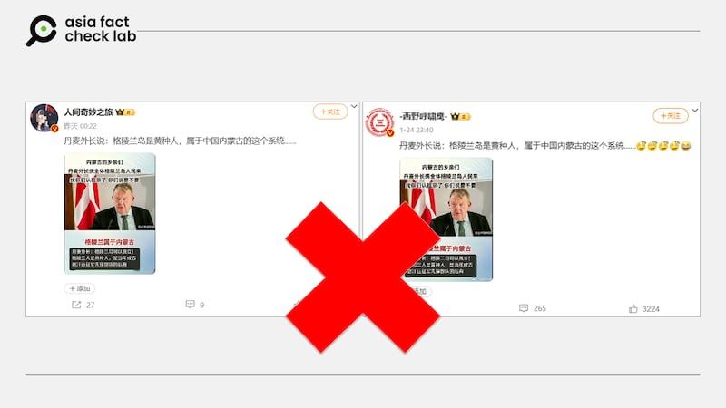

# Did Denmark claim Greenland’s inhabitants were Mongolians?

## Verdict: False

By Rita Cheng for Asia Fact Check Lab

2025.02.03

## A claim emerged in Chinese-language social media posts that Denmark’s government said Greenland’s indigenous inhabitants were of Mongolian descent.

## But the claim is false. The Danish foreign ministry dismissed the claim. AFCL found no credible reports that back the claim.

The claim was [shared](https://archive.ph/0cNWu) on Weibo on Jan. 25.

“The Danish foreign minister says: Greenlanders are Mongoloid people from the same type as those in China’s Inner Mongolia,” the claim reads.

The posts include a photo of Denmark’s Minister of Foreign Affairs Lars Løkke Rasmussen with the caption: “Danish Foreign Minister: Greenland can be independent! Greenland is Asiatic and descended from the vanguard of Genghis Khan’s expeditionary force.”

Similar claims later spread on [X](https://archive.ph/FeRn5), with some claiming that the island ought to “be returned to China.”

afcl-denmark-greenland-mongolian\_02032025\_1 Some Chinese users on Weibo and X claimed that Greenland’s indigenous population were descended from Ghenghis Khan and the Mongols. (Weibo)

Greenland is an autonomous territory within the Kingdom of Denmark. While it has its own government, parliament, and control over most domestic affairs, Denmark remains responsible for its defense, foreign policy, and monetary policy. Greenland is not an independent country but has the right to seek full independence in the future if its people choose to do so.

The claim began to circulate online after the U.S. President Donald Trump revived in late 2024, his interest in acquiring Greenland, describing its ownership as “an absolute necessity” for U.S. national security. He did not rule out the use of military or economic measures to achieve this goal.

In response, Greenland’s prime minister, Múte Egede, said: “We are Greenlanders. We don’t want to be Americans. We don’t want to be Danish either. Greenland’s future will be decided by Greenland.”

Danish Prime Minister Mette Frederiksen reiterated that Greenland is not for sale and emphasized the importance of European unity in response to Trump’s renewed interest.

But the claim about Denmark saying Greenland’s indigenous inhabitants were of Mongolian descent is false.

The Danish Foreign Minister’s office dismissed the claim.

“The Foreign Minister of Denmark has not made the alleged statement,” the office told AFCL.

AFCL found no credible reports that back the claim.

## Origin of Greenland’s native Inuit population

AFCL has not been able to confirm or disprove the exact origins of Greenland’s native Inuit population, which is still disputed amongst scholars.

A prevailing view amongst North American anthropologists holds that they are descended from Siberian immigrants and genetically more closely related to Asians than to native North Americans.

## Chinese bases in the Arctic

China [has](https://features.csis.org/hiddenreach/china-polar-research-facility/) two permanent research stations in the Arctic: one in Iceland and one on Norway’s Svalbard archipelago, both adjacent to Greenland.

A third research station intended to be opened in Sweden in 2019 has faced delays due to questions about the facility’s potential connections with the People’s Liberation Army.

China, in an [official white paper](https://www.gov.cn/zhengce/2018-01/26/content_5260891.htm) published in 2018, describes itself as a “near-Arctic country” that wants to build a “Silk Road on ice” by developing Arctic shipping lanes and natural resources extraction.

## *Translated by Shen Ke. Edited by Malcolm Foster and Taejun Kang.*

*Asia Fact Check Lab (AFCL) was established to counter disinformation in today’s complex media environment. We publish fact-checks, media-watches and in-depth reports that aim to sharpen and deepen our readers’ understanding of current affairs and public issues. If you like our content, you can also follow us on* [*Facebook*](https://www.facebook.com/asiafactchecklabcn)*,* [*Instagram*](https://www.instagram.com/asiafactchecklab/) *and* [*X*](https://twitter.com/AFCL_eng)*.*

[Original Source](https://www.rfa.org/english/factcheck/2025/02/03/afcl-denmark-greenland-mongolia-fact-check/)