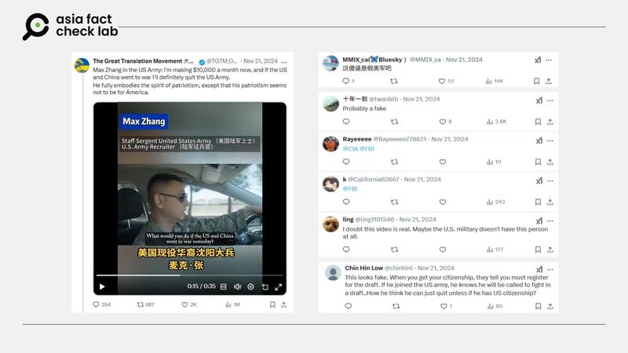

# Is a man in a viral video really a US army recruiter?

## Verdict: True

By Zhuang Jing for Asia Fact Check Lab

2025.02.04

## As a video of a man who claims to be a U.S. arm recruiter has gone viral online, some online users questioned his identity.

## But a spokeswoman for the U.S. Army Recruiting Command told AFCL that the man in the video is an active U.S. army recruiter.

The video was [shared](https://x.com/TGTM_Official/status/1859410556081545616) on X in November 2024.

The 35-second video shows a man who claims that he is a Chinese-American U.S. army recruiter saying he would not fight against China if a war broke out between the two countries.

The video’s subtitles identify the man as Max Zhang. In the clip, he is seen wearing a U.S. military uniform while introducing himself in Mandarin as a native of the Chinese town of Shenyang.

At one point in the video, Zhang can be heard saying: “If war did break out, I would certainly quit the U.S. military. I wouldn’t join the Chinese army because I’m a US national. I would stay neutral.”

The video went viral online, especially among Chinese social media users, but some questioned the video’s authenticity and claimed that Zhang was not actually in the U.S. army.

afcl-us-army-recruiter\_video\_01242025\_1 Some online users doubted the authenticity of an online video of a Chinese-American soldier talking about his reaction to a hypothetical war between China and the U.S. (X)

But according to the U.S. Department of Defense, the man in the video is a U.S. army recruiter.

“Staff Sgt. Zhang is an Army recruiter. The video you are referencing is not an official U.S. Army multi-media product,” Madison Bonzo, a spokeswoman for the U.S. Army Recruiting Command told AFCL.

The possibility of a U.S.-China conflict is widely debated. Some argue China’s growing power may escalate tensions in the Indo-Pacific. Others believe war is avoidable due to economic interdependence, nuclear deterrence, and the catastrophic risks of modern warfare, emphasizing the need for careful diplomacy.

Recent U.S. export controls on China’s tech sector and China’s assertiveness in the South China Sea have raised tensions, prompting the U.S. to strengthen alliances and its military presence.

Public opinion in the United States is divided: 60% see war as unlikely, 26% consider it likely, and 11% view it as inevitable.

## *Translated by Shen Ke. Edited by Taejun Kang.*

*Asia Fact Check Lab (AFCL) was established to counter disinformation in today’s complex media environment. We publish fact-checks, media-watches and in-depth reports that aim to sharpen and deepen our readers’ understanding of current affairs and public issues. If you like our content, you can also follow us on* [*Facebook*](https://www.facebook.com/asiafactchecklabcn)*,* [*Instagram*](https://www.instagram.com/asiafactchecklab/) *and* [*X*](https://twitter.com/AFCL_eng)*.*

[Original Source](https://www.rfa.org/english/factcheck/2025/02/04/afcl-us-army-recruiter-video/)