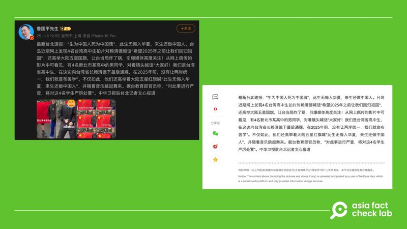

# Did Taiwan ‘severely punish’ students for supporting unification with China?

## Verdict: False

By Dong Zhe for Asia Fact Check Lab

2025.02.06

## Some Chinese social media users claimed that Taiwan “severely punished” students for posting a video online supporting unification with China.

## But the claim is false. Taiwan’s education authorities dismissed the claim. The students were reprimanded by the school they attended through a verbal warning.

The claim began to circulate after three Taiwanese high school students from New Taipei City posted a video, calling on the island’s president, Lai Ching-te, to “reunite with China” after 2025.

In the video, the students can be seen holding up a Chinese flag, while referring to themselves as “high school students of Taiwan province” and the president as “Governor Lai.”

afcl-taiwan-students-china-unification\_02062025\_0 Some Chinese social media users claimed that Taiwan’s Ministry of Education plans to severely punish several high school students who claimed the island is a province of China. (Weibo and NetEase)

The video sparked online debate as the students’ use of such terms aligns with Beijing’s narrative, which denies Taiwan’s independence.

Taiwan considers itself a sovereign nation with its own government, while Beijing views it as a breakaway province that must eventually reunite with China, by force if necessary.

But the claim that Taiwan punished the students is false.

Officials from New Taipei City Department of Education [dismissed](https://www.cna.com.tw/news/aipl/202501050171.aspx) the claim, adding that the students made the video to gain peer appeal without any specific political agenda.

Officials said Taiwan respected various political stances, but also reminded students to pay attention to their words and behavior while wearing their school uniforms.

Officials also said they would ask schools to step up their efforts to educate students about responsible internet use.

The principal of the students’ school [said](https://www.youtube.com/watch?v=aUvGyq3ZJ5A&ab_channel=TVBSNEWS) that they were unaware of the gravity of the subject and had been verbally reprimanded.

## Anti-Infiltration Act

In Taiwan, expressing support for China is not inherently illegal, as freedom of speech is protected.

However, actions that are perceived as compromising national security or involving foreign interference can lead to legal consequences.

The Anti-Infiltration Act, enacted in 2020, prohibits people from accepting directives or funding from foreign hostile forces, including China, to influence political activities, elections, or social order.

Violations can result in fines up to $10 million New Taiwan dollars (US$305,000) or up to five years in prison.

## *Translated by Shen Ke. Edited by Taejun Kang.*

*Asia Fact Check Lab (AFCL) was established to counter disinformation in today’s complex media environment. We publish fact-checks, media-watches and in-depth reports that aim to sharpen and deepen our readers’ understanding of current affairs and public issues. If you like our content, you can also follow us on* [*Facebook*](https://www.facebook.com/asiafactchecklabcn)*,* [*Instagram*](https://www.instagram.com/asiafactchecklab/) *and* [*X*](https://twitter.com/AFCL_eng)*.*

[Original Source](https://www.rfa.org/english/factcheck/2025/02/06/afcl-taiwan-student-china-unification/)