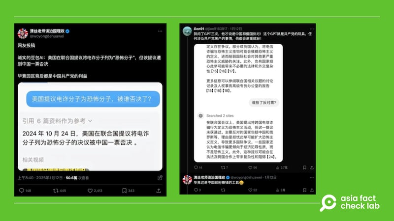
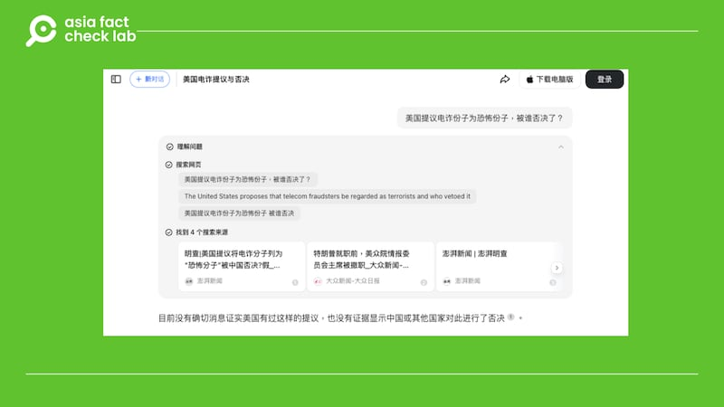

# Did the US propose that scammers in Myanmar be called terrorists?

## Verdict: False

By Dong Zhe for Asia Fact Check Lab

2025.02.07

## Some Chinese social media users claimed that the United States proposed scammers in Myanmar be called “terrorists” at the United Nations, which was vetoed by China, citing information provided by Chinese AI chatbot Doubao.

## But the claim is false. The U.S. has never made such a proposal. Experts warn that AI responses are not always accurate.

The claim was shared by an X user on Jan. 12 who said China rejected a U.S. proposal at the U.N. to label scammers in Myanmar as terrorists, following the recent high-profile abduction and subsequent rescue of Chinese actor Wang Xing.

Wang was rescued after being lured to Thailand under the pretense of a film role and subsequently trafficked to a scam center in Myanmar. Following his return to China on Jan. 11, Wang revealed in a live stream that approximately 50 other Chinese victims were freed from the same facility.

The X user cited a response from AI chatbot “Duobao” as evidence that the U.S. has proposed calling the scam operators “terrorists.”

Duobao is an advanced artificial intelligence chatbot developed by ByteDance, the parent company of TikTok.

Launched in August 2024, Doubao has rapidly become China’s most popular AI application, boasting 51 million monthly active users as of November 2024.

afcl-us-myanmar-scammer-terrorist\_02072025\_1 An AI response was used as evidence that the U.S. had proposed at the U.N. to classify scammers in Myanmar as terrorists (X)

But the claim is false.

Keyword searches found no official or credible reports to show that the U.S. made such a proposal at the U.N.

A review of [minutes](https://research.un.org/en/docs/sc/quick/meetings/2024) of the U.N. Security Council meetings in 2024 also found no such discussion.

## Duobao response

AFCL asked Doubao a question about the purported U.S. proposal.

The AI chatbot responded: “There is currently no firm information confirming the U.S. made such a proposal nor that China or any other country vetoed it.”

afcl-us-myanmar-scammer-terrorist\_02072025\_2 Doubao said there was no evidence that the U.S. had proposed designating the scammers in Myanmar as terrorists. (Duobao)

AI systems reflect the material used to “train” them, experts say.

“Doubao is a large-scale language model trained using similar methods and facing similar problems as ChatGPT,” said [Hsin-Min Wang](https://homepage.iis.sinica.edu.tw/pages/whm/vita_zh.html), an information science researcher at Taiwan’s Academia Sinica.

AFCL has [previously](2023-03-12_What happens when ChatGPT meets censorship?.md) reported that Chat GPT is not always credible, as it responds to prompts based on probability calculations after being trained with large amounts of online text.

[Ethan Tu](https://www.tatlerasia.com/people/%E6%9D%9C%E5%A5%95%E7%91%BE-ethan-tu), the founder of [Taiwan AI Labs](https://www.ailabs.tw/zh/home/), previously told AFCL that AI learns the bias and ideas from the assorted texts of the collected corpus it is being fed for language training.

“Its output reflects the cultural ideas found in the market it was trained in.”

## *Translated by Shen Ke. Edited by Taejun Kang.*

*Asia Fact Check Lab (AFCL) was established to counter disinformation in today’s complex media environment. We publish fact-checks, media-watches and in-depth reports that aim to sharpen and deepen our readers’ understanding of current affairs and public issues. If you like our content, you can also follow us on* [*Facebook*](https://www.facebook.com/asiafactchecklabcn)*,* [*Instagram*](https://www.instagram.com/asiafactchecklab/) *and* [*X*](https://twitter.com/AFCL_eng)*.*

[Original Source](https://www.rfa.org/english/factcheck/2025/02/07/afcl-us-myanmar-scammer-terrorist/)