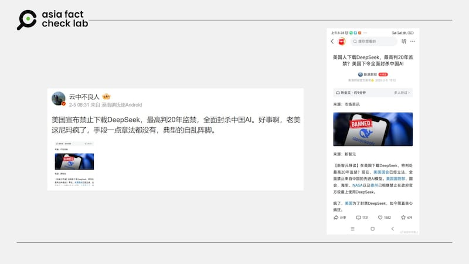

# Has the US imposed nation-wide ban on DeepSeek?

## Verdict: False

By Zhuang Jing for Asia Fact Check Lab

2025.02.10

## A claim began to circulate among Chinese-language social media users that the United States banned the use of Chinese AI chatbot service DeepSeek.

## But the claim is false. Although some U.S. government agencies introduced a ban on the use of DeepSeek, the government has not introduced a nation-wide ban on the Chinese application.

The claim was [shared](https://m.weibo.cn/detail/5130606883112147) on Weibo on Feb. 5.

“The United States has announced a ban on downloading DeepSeek, with a maximum sentence of 20 years in prison,” the claim reads in part, purportedly revealing the punishment for those who break the ban.

The claim was shared alongside an image that shows an article published by the Chinese finance news outlet *Sina Finance*.

“The U.S. Congress had already enacted legislation comprehensively banning AI models from China,” the article reads in part.

afcl-us-deep-seek-ban\_02102025\_0 Some Chinese social media users say the U.S. introduced a nation-wide ban on DeepSeek. (Weibo)

DeepSeek is a Chinese AI startup known for its chatbot service, with its app becoming the most downloaded on Apple’s iPhone, surpassing ChatGPT. While praised for efficiency, it faces concerns over censorship of [sensitive topics](https://www.rfa.org/english/china/2025/01/31/china-deepseek-sensitive-questions/) and data privacy, with some governments banning it due to [ties](https://www.rfa.org/english/china/2025/01/28/china-usa-ai-deepseek-government-backing/) with Chinese telecom firms.

But the claim is false. As of Feb. 10, the U.S. has not introduced a nation-wide ban on DeekSeep.

The U.S. introduced a bipartisan bill, the “No DeepSeek on Government Devices Act,” in its Congress to ban federal employees from using the app on government-issued devices, citing potential risks of data access by the Chinese government.

At the state level, Texas became the first to prohibit DeepSeek on government devices. Governor Greg Abbott issued this directive, emphasizing the need to protect sensitive information from potential foreign interference.

Additionally, some government organizations, such as the U.S. Navy and NASA, banned their personnel from using the Chinese AI app, citing security and ethical concerns.

## Prohibiting Americans from assisting Chinese AI development

The bill mentioned by *Sina Finance* is one [introduced](https://www.hawley.senate.gov/wp-content/uploads/2025/01/Hawley-Decoupling-Americas-Artificial-Intelligence-Capabilities-from-China-Act.pdf) by Iowa Senator Josh Hawley in January 2025 seeking to prohibit Americans from assisting Chinese AI development.

The bill proposed to prohibit U.S. companies from supporting Chinese AI research and buying any AI technology developed in China. It did not specifically mention DeepSeek.

Hawley’s bill has [not passed](https://www.congress.gov/bill/119th-congress/senate-bill/321/text) a confirmation vote by either the Senate or the House of Representatives.

## *Translated by Shen Ke. Edited by Taejun Kang.*

*Asia Fact Check Lab (AFCL) was established to counter disinformation in today’s complex media environment. We publish fact-checks, media-watches and in-depth reports that aim to sharpen and deepen our readers’ understanding of current affairs and public issues. If you like our content, you can also follow us on* [*Facebook*](https://www.facebook.com/asiafactchecklabcn)*,* [*Instagram*](https://www.instagram.com/asiafactchecklab/) *and* [*X*](https://twitter.com/AFCL_eng)*.*

[Original Source](https://www.rfa.org/english/factcheck/2025/02/10/afcl-us-deep-seek-ban/)