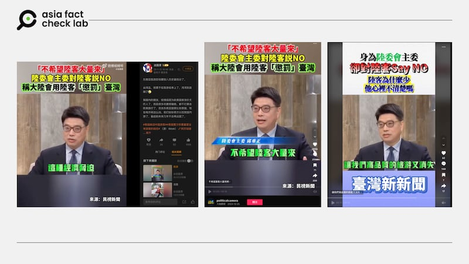

# Did a Taiwan official say he didn’t want Chinese tourists coming in bulk?

## Verdict: Misleading

By Dong Zhe for Asia Fact Check Lab

2025.02.11

## A claim began to circulate online that Taiwan’s minister of the Mainland Affairs Council Chiu Chui-cheng said in a media interview he didn’t want a large number of mainland Chinese tourists coming to the island.

## But the claim is misleading. Chiu’s statement was a paraphrase of feedback received by his ministry from the Taiwanese public, not a statement of his own views.

The claim was [shared](https://archive.ph/zSJhg) on Weibo on Jan. 13.

A Weibo user said on Jan. 13 that although there was a decrease in mainland Chinese tourists visiting Southeast Asia, Taiwan shouldn’t be excited about receiving them since Taiwan was not the option for them because Taiwan said it didn’t want Chinese tourists.

The user attached a media interview of Chiu Chui-cheng, the minister of Taiwan’s Mainland Affairs Council, which oversees cross-strait relations, as evidence, claiming that Chiu publicly said he didn’t want Chinese tourists coming to the island in bulk since it would harm the island’s tourism industry.

afcl-taiwan-china-tourist-ban\_02112025\_1 Some Chinese users on Weibo spread a video of the minister of Taiwan’s Mainland Affairs Council, saying the island did not want to accept many tourists from the Mainland. (Weibo and TikTok)

Taiwan has long welcomed tourists from mainland China, viewing such visits as a means to foster cross-strait exchanges. In 2008, agreements were established to facilitate group tourism from mainland China to Taiwan. By 2015, mainland Chinese tourists comprised approximately 40.54% of Taiwan’s total tourist arrivals.

However, in August 2019, Beijing suspended individual travel permits for mainland residents visiting Taiwan, leading to a significant decline in tourist numbers. The COVID-19 pandemic further disrupted cross-strait tourism.

In August 2023, Taiwan announced plans to relax restrictions on Chinese business and group travelers, aiming to resume tourism exchanges.

Despite these efforts, as of early 2025, comprehensive tourism exchanges have not fully resumed. In January 2025, China announced preparations to resume group tours to Taiwan for residents of Shanghai and Fujian province, signaling a potential thaw in tourism relations.

But the claim about Chiu is misleading. Chiu’s statement was a paraphrase of feedback received by his ministry from the Taiwanese public, not a statement of his own views.

## Chiu’s statement

A reverse image search on Google found the clip on Weibo was taken from Chiu’s [interview](https://www.youtube.com/watch?v=HDkhwAkZ47M) with Taiwanese broadcaster FTV News aired on Jan. 4.

At the interview’s five-minute and 35-second mark, Chiu can be heard discussing the Taiwanese public’s negative reaction to a recent announcement by Chinese officials.

“Shanghai’s vice mayor announced that the city will actively promote tourist groups to come to Taiwan. The following day, the Mainland Affairs Council received more than 100 calls and media voicing opposition against this proposal, stating their reason as not wanting large numbers of tourists to lower the quality of Taiwan’s tourism,” Chiu said.

A close look at the video shows Chiu made no mention that he didn’t want Chinese tourists coming to the island in bulk since it would harm the island’s tourism industry.

At the video’s six-minute and 24-second mark, Chiu said that his ministry was focused on ensuring that Chinese tourists visit Taiwan in a healthy and orderly way.

He pointed out that tourism from China was not entirely market-driven, as travelers must apply for a permit from Chinese authorities, adding that this meant that China could use policy measures to influence cross-strait tourism.

If Taiwan implements policies that China disapproves of, Beijing may reduce the number of Chinese tourists as a form of pressure, impacting Taiwan’s tourism industry and even compelling businesses to express support for China, Chiu noted.

“This is something we must closely monitor,” the minister added.

## *Translated by Shen Ke. Edited by Taejun Kang.*

*Asia Fact Check Lab (AFCL) was established to counter disinformation in today’s complex media environment. We publish fact-checks, media-watches and in-depth reports that aim to sharpen and deepen our readers’ understanding of current affairs and public issues. If you like our content, you can also follow us on* [*Facebook*](https://www.facebook.com/asiafactchecklabcn)*,* [*Instagram*](https://www.instagram.com/asiafactchecklab/) *and* [*X*](https://twitter.com/AFCL_eng)*.*

[Original Source](https://www.rfa.org/english/factcheck/2025/02/11/afcl-taiwan-china-tourist-ban-02112025/)