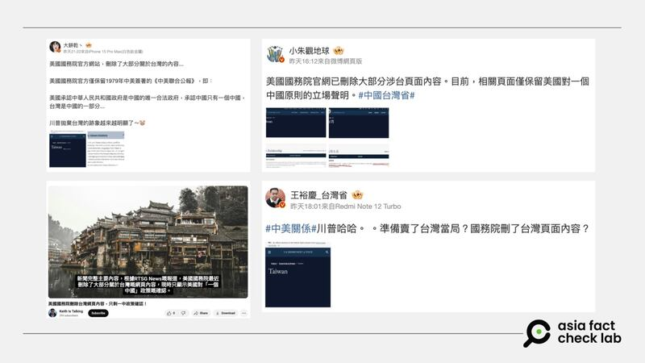
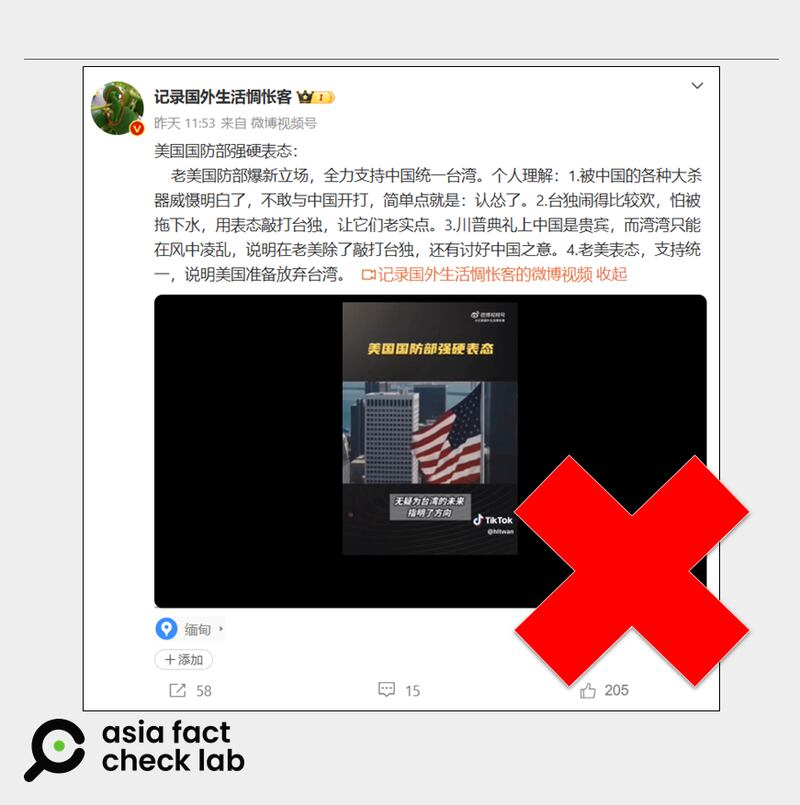
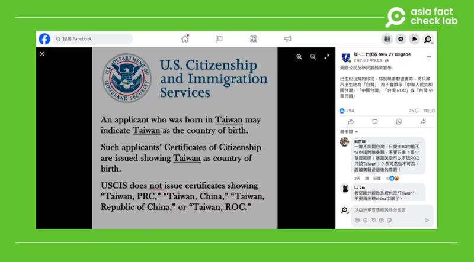

# Has the US changed its official policy towards Taiwan under new government?

## Some Chinese online users targeted Taiwan with false claims as the new U.S. administration began its term.

By Rita Cheng, Zhuang Jing and Alan Lu for Asia Fact Check Lab

2025.02.14

Since the second term of U.S. President Donald Trump began, multiple claims have circulated online suggesting that the U.S. has changed its policy toward Taiwan.

Given Taiwan’s role in U.S.-China relations, any perceived policy shift can fuel uncertainty, influence public opinion, and escalate regional tensions. Misinterpretations or deliberate misinformation could shape global narratives, making such rumors highly significant.

China views Taiwan as a breakaway province that must be reunified. The U.S. acknowledges China’s claim but supports Taiwan militarily without recognizing it as a sovereign state. Taiwan sees itself as de facto independent, with most citizens favoring the status quo or formal independence.

Below is what AFCL found.

## Did the U.S. State Department remove Taiwan from its website?

Some Chinese online users [claimed](https://m.weibo.cn/detail/5130076260401783) that the U.S. Department of State removed a page dedicated to Taiwan from its website, citing an image as evidence.

Some users said it reflected a decision by President Donald Trump to “abandon” Taiwan.

afcl-us-taiwan-rumors\_02142024\_0 Some Chinese-language social media posts claim that the U.S. State Department deleted content about Taiwan from its official website. (Weibo and YouTube)

But the claim is false. As of Feb. 14, the webpage for Taiwan on the department’s website was live.

A review of archived webpages shows that the last major revision of the page occurred during the former administration of President Joe Biden.

afcl-us-taiwan-rumors\_02142024\_2 An archived version of the State Department’s page on Taiwan during the Biden administration from February 2024 (left and top right) matches the department’s current information about the island. Slight changes were found in the archived site from February 2023 (bottom right). (Department of State website and Internet Archive)

## Does the US Defense Department support China annexing Taiwan?

A Weibo user [claimed](https://archive.ph/N6WeR) that the U.S. Department of Defense, or DOD, now supports the annexation of Taiwan by China.

A video attached to the post as evidence specifies that the DOD “suddenly changed its stance” on Jan. 30.

afcl-us-taiwan-rumors\_02142024\_3 A Weibo user claimed the DOD now supports China’s annexation of Taiwan. (Weibo)

However, AFCL found no evidence to support this claim.

Keyword searches found no credible reports or official statement regarding the claim.

AFCL found that incoming Secretary of Defense Pete Hegseth answered a question about a U.S. response to Chinese threats against Taiwan during his [Congressional nomination hearing](https://www.armed-services.senate.gov/hearings/to-conduct-a-confirmation-hearing-on-the-expected-nomination-of-mr-peter-b-hegseth-to-be-secretary-of-defense) on Jan. 13, before he took office, by reiterating past U.S. commitments to the island.

He did not express support for Beijing annexing Taiwan.

## Has the Trump administration decided to recognize Taiwan as a country?

Some Chinese-speaking online users said the U.S. Citizenship and Immigration Services, or USCIS, added “Taiwan” as a nationality option and this reflected a Trump administration policy shift to recognize Taiwan as a country.

afcl-us-taiwan-rumors\_02142024\_4 Some Chinese-speaking online users said the U.S. Citizenship and Immigration Services, or USCIS, added “Taiwan” as a nationality option and this reflected a Trump administration policy shift to recognize Taiwan as a country. (Facebook)

But the claim is misleading.

A review of USCIS’s website found that the claim about listing “Taiwan” as a nationality on USCIS forms is accurate. However, this policy did not start under Trump’s current term.

A review using the Wayback Machine shows that the same rule was in place in 2019, and the wording remained unchanged after former US President Joe Biden took office in 2020.

Taiwan is not widely recognized as a country. Only a few countries maintain formal diplomatic ties with it, while most, including the U.S., following a One-China Policy and recognizing Beijing but engaging with Taiwan unofficially.

As for the U.S. it is required by its Taiwan Relations Act to provide the island with the means to defend itself, but it has long followed a policy of “strategic ambiguity” on whether it would intervene militarily to protect it in the event of a Chinese attack.

U.S. diplomatic engagement with the island is conducted through the American Institute in Taiwan, which is the de facto U.S. embassy, providing support to counter Chinese pressure while balancing deterrence and stability in the region.

Taiwan is excluded from the U.N. and major global organizations due to China’s insistence that it not be recognized as a country but it operates as a de facto independent nation with its own government, military, and economy.

## *Translated by Shen Ke. Edited by Taejun Kang.*

*Asia Fact Check Lab (AFCL) was established to counter disinformation in today’s complex media environment. We publish fact-checks, media-watches and in-depth reports that aim to sharpen and deepen our readers’ understanding of current affairs and public issues. If you like our content, you can also follow us on Facebook, Instagram and X.*

[Original Source](https://www.rfa.org/english/factcheck/2025/02/14/afcl-us-taiwan-rumors/)