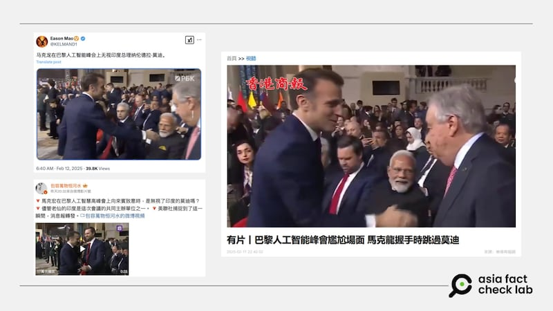
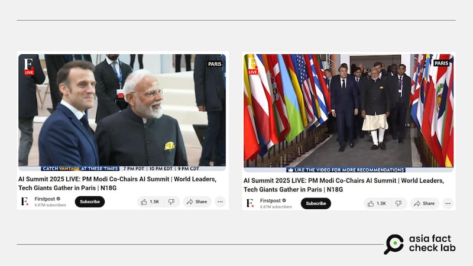

# Does a video show France’s Macron snubbing the Indian leader at Paris AI summit?

## Verdict: Misleading

By Zhuang Jing for Asia Fact Check Lab

2025.02.19

## A video circulated in Chinese-language social media posts that claim it shows French President Emmanuel Macron snubbing Indian Prime Minister Narendra Modi at an AI summit in Paris in February.

## But the claim is misleading. The video, taken out of context, ignores interactions between the two leaders earlier in the event.

The 22-second video was [shared](https://x.com/KELMAND1/status/1889444404894867593) on X on Feb. 11.

“Macron ignores Indian Prime Minister Narendra Modi at Paris AI summit,” the caption of the post reads.

In the clip, Macron is seen greeting and shaking hands with summit participants, including U.S. Vice President J.D. Vance. However, as he passed by Modi, Macron appeared to skip him and moved on to the next participant.

The Paris AI Action Summit, held on Feb. 10-11 in Paris, was a significant international gathering focusing on the future of AI. Co-chaired by Macron and Modi, the summit was attended by more than 1,000 participants from over 100 countries.

The same video with similar claims was shared on Weibo [here](https://m.weibo.cn/detail/5132962686833263) and [here](https://m.weibo.cn/detail/5132998418632042). Some media outlets, including the *Hong Kong Commercial Daily,* echoed the claim.

afcl-macron-modi-ai-summit\_02192025\_1 Some social media users claimed that French President Macron ignored India’s Prime Minister Modi at an AI summit in Paris. (Weibo, X and Hong Kong Commercial Daily)

But the claim is misleading. The footage was taken out of context.

A review of live [footage](https://www.youtube.com/watch?v=RGJMUYJ4OcU) of the event published by the Indian media outlet *Firstpost* shows that Macron interacted with Modi throughout the event.

For instance, at the video’s six-minute and 38-second mark, both leaders can be seen walking together towards the venue, chatting, shaking hands and posing together for photos.

afcl-macron-modi-ai-summit\_02192025\_2 Live footage shows Macron and Modi interacting as they walk together to the summit. (YouTube)

At the eight-minute and 30-second mark, Macron and Modi can be seen entering the venue together, individually greeting other leaders before taking their seats.

## *Translated by Shen Ke. Edited by Taejun Kang.*

*Asia Fact Check Lab (AFCL) was established to counter disinformation in today’s complex media environment. We publish fact-checks, media-watches and in-depth reports that aim to sharpen and deepen our readers’ understanding of current affairs and public issues. If you like our content, you can also follow us on Facebook, Instagram and X.*

[Original Source](https://www.rfa.org/english/factcheck/2025/02/19/afcl-macron-modi-ai-summit/)